# EMTPicco Engine(Base On Piccolo Engine)

**EMTPicco Engine**是基于Piccolo引擎0.08版本的Vulkan API及二次元渲染的实践项目，非常感谢小引擎成员们的倾心教学，原项目地址：[BoomingTech/Piccolo: Piccolo (formerly Pilot) – mini game engine for games104](https://github.com/BoomingTech/Piccolo)，同时，非常感谢B站UP主[[给你柠檬椰果养乐多你会跟我玩吗](https://space.bilibili.com/32704665)](https://space.bilibili.com/32704665/dynamic?spm_id_from=333.1365.list.card_title.click)的二次元渲染教程。本项目内同时附上了学习笔记，再次感谢各位大佬们的辛勤付出(●'◡'●)。

另外，用于实践的模型来自: miHoYo ｜ 神帝宇，贴图来自[umaichanuwu/StarRailTextures: All extracted textures from honkai star rail at different versions](https://github.com/umaichanuwu/StarRailTextures)，仅用作学习交流目的。

## 具体修改文件及实践

主要修改了渲染功能，包括渲染管线优化，效果增加以及支持大数量顶点和带有顶点色模型的读入

### 效果展示

**二次元渲染**

整体效果

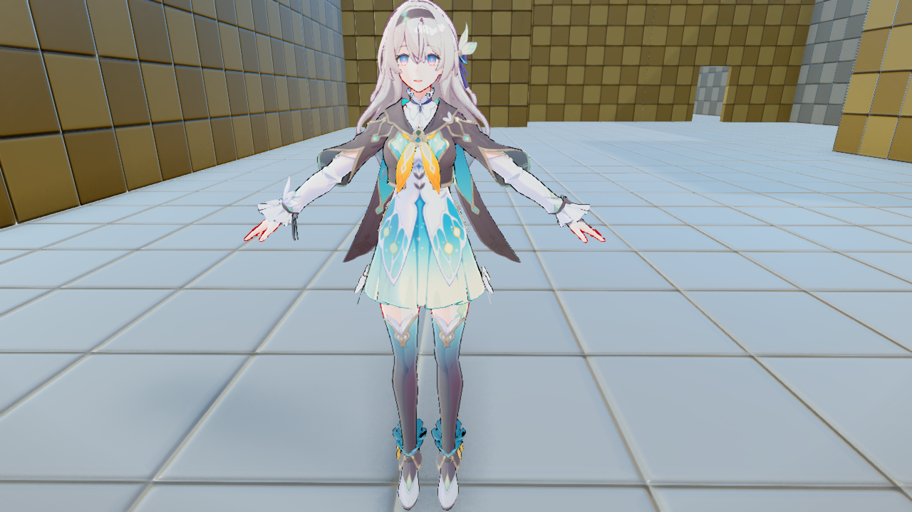

透眉效果以及面部的SDF阴影

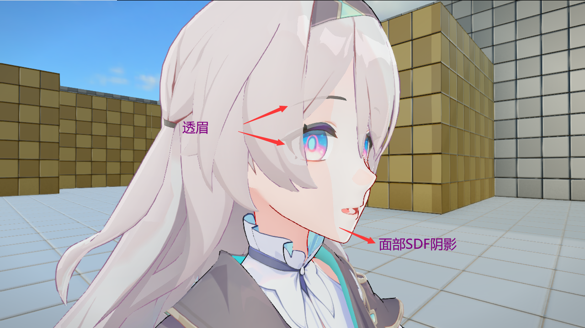

金属高光及非金属高光

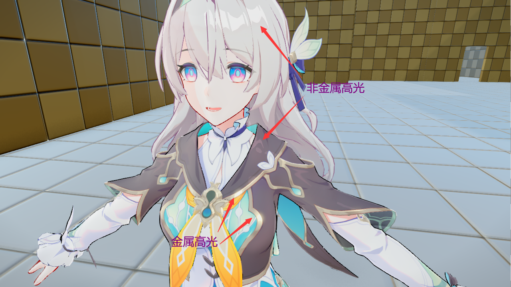

Ramp光影效果

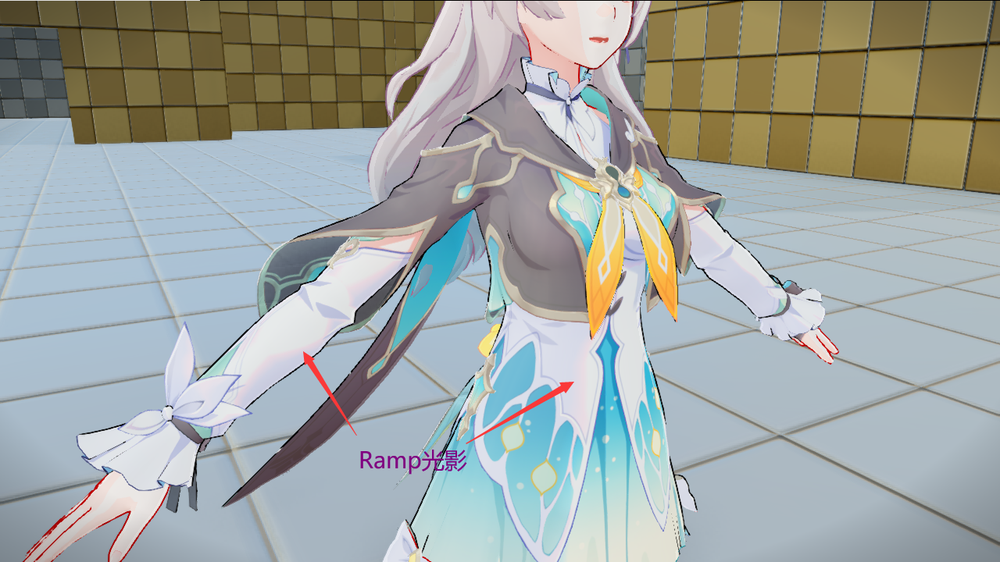

平滑法线描边

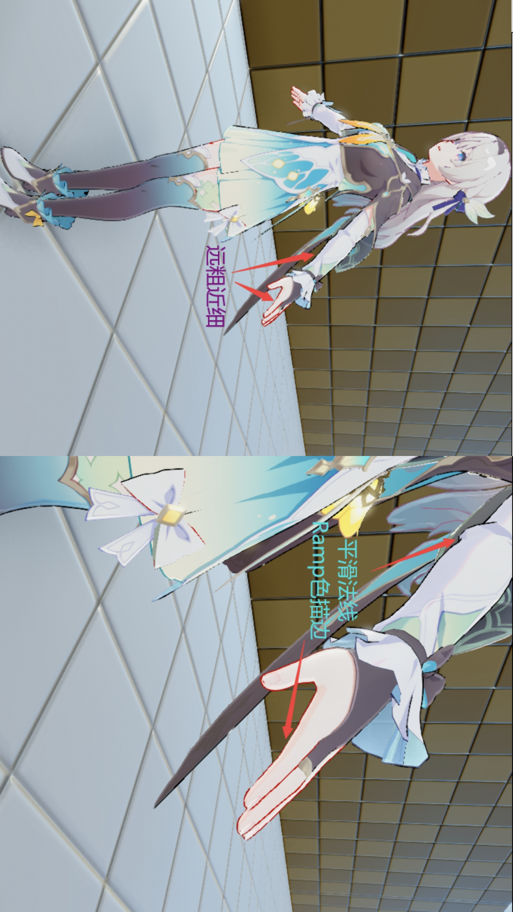

边缘光效果

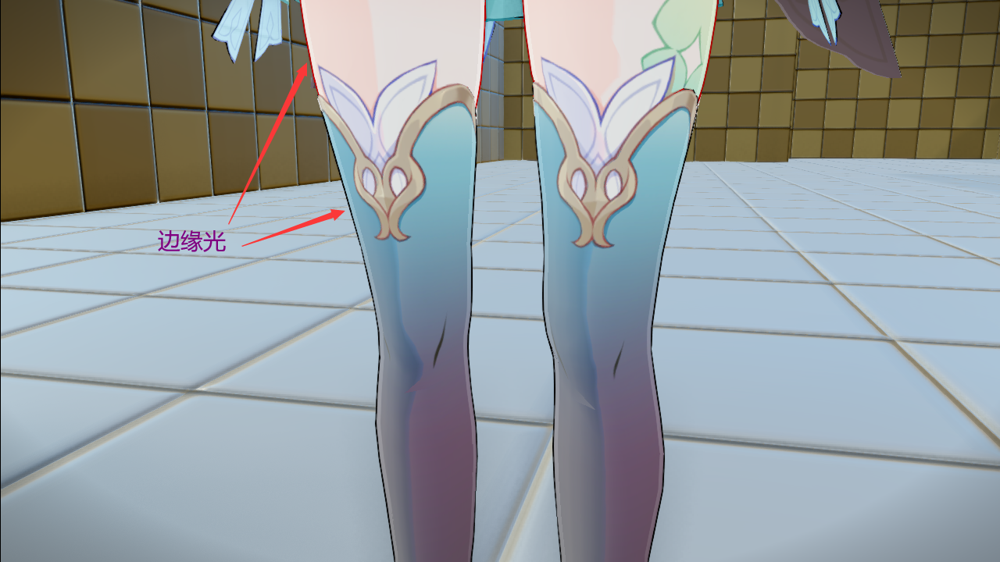

自发光及眩光效果

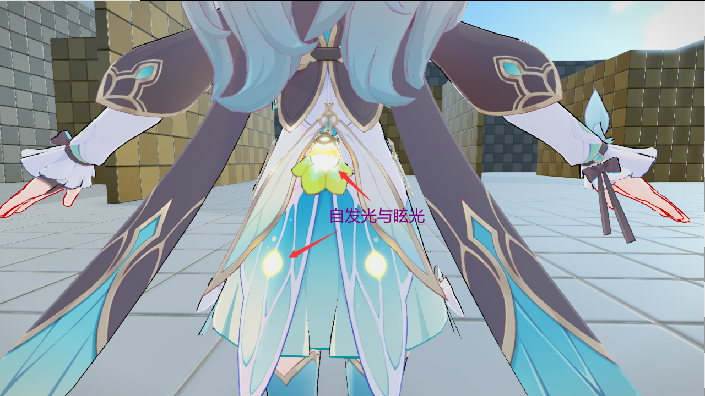

**PCFMask**

通过方向光ShadowMap和PreDepth计算半影区，降为原来分辨率的1/4 * 1/4

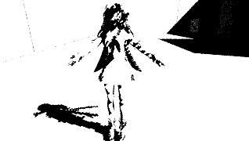

blur后，半影区就是[0.01,0.99]的区域

不开PCF软阴影

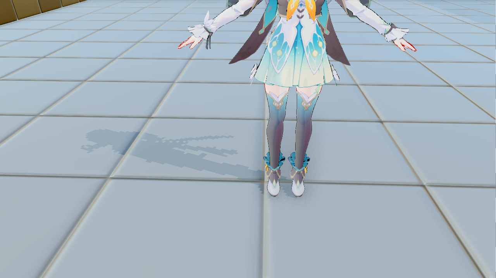

用PCFMask的软阴影（模糊力度开大了点），RenderDoc测了下比不用Mask贴图要快30%左右

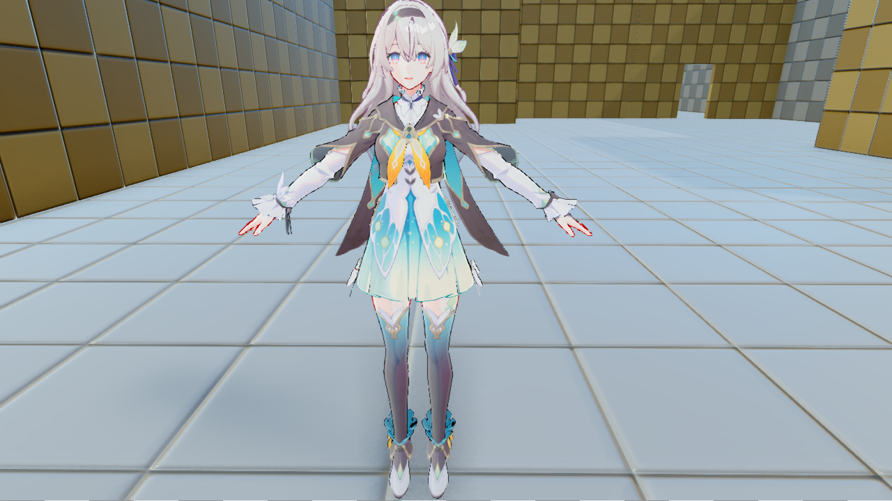

**HBAO**

抓帧的未blur之前的效果

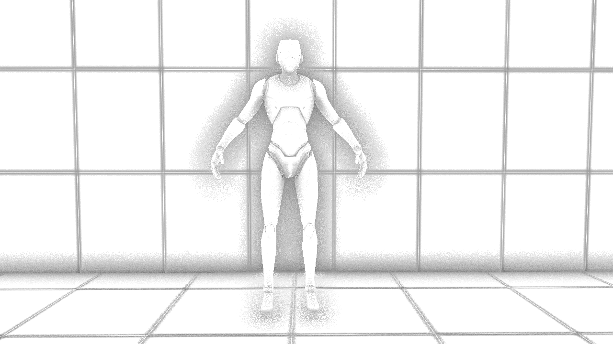

在场景里开启的时候长这样，看不太清（这张天空球太亮了阴影都有些不明显），但是关掉就会觉得不对

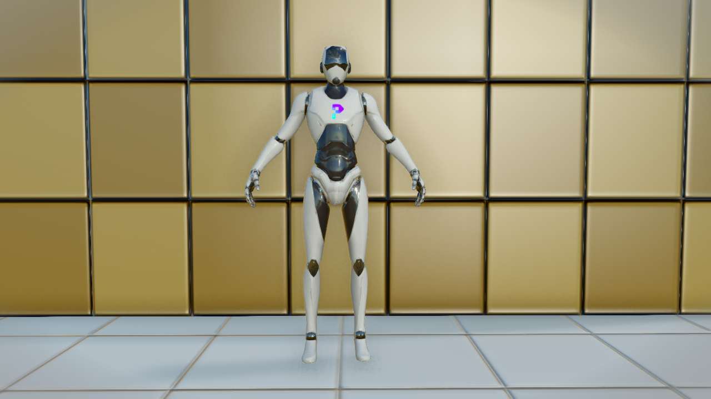

**Vignette**

根据像素离屏幕中心的距离产生暗角效果，拉高一点长这样

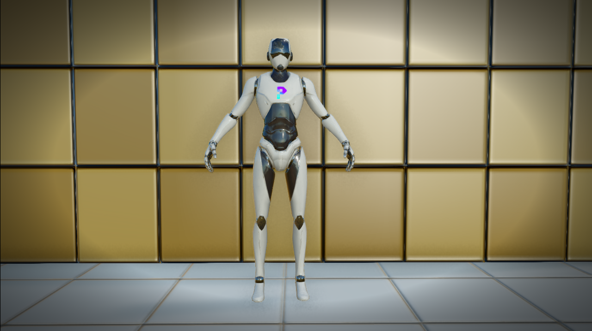

**ColorGrading**

拉满Usage，整个暖色滤镜

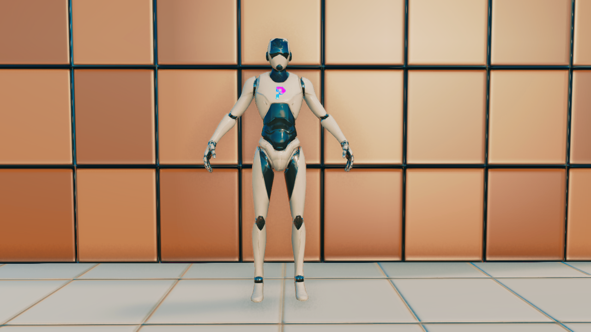

### 修改文件

**render_common.h**

- 新增NBRPass，OutlinePass等Pass所需SBO结构体
- 新增NBR材质UBO结构体，用以传递NBR材质参数给GPU
- 新增全局渲染效果设定结构体，维护该对象在render_resource对象里，暴露给UI以实时调整全局效果参数
- 新增VulkanMesh里的顶点色相关vertex_buffer
- 新增VulkanNBRMaterial，并设置VulkanMaterial为其和VulkanPBRMaterial的父类，以兼容新的材质
- 修改RenderMeshNode，使其能够携带包括NBR材质在内的更多材质信息
- 新增TextureDataToUpdateNBR，用以更新NBR材质的描述符

**render_entity.h**

- 修改RenderEntity，使其能携带NBR材质数据信息

**render_helper.h**

- 同步0.09版本“修复直接光照下阴影显示不全”的修复：[修复直接光照下阴影显示不全 by luxiaodong · Pull Request #360 · BoomingTech/Piccolo](https://github.com/BoomingTech/Piccolo/pull/360)

**render_mesh.h**

- 新增顶点色数据结构体，以支持读入顶点色数据
- 新增getBindingDescriptionsWithVertexColor等两个获取带有顶点色信息的InputAttribute和InputBinding方法

**render_pass.h/cpp**

- 修改MainCameraPass的枚举，使其符合该Pass只做片元光照计算的职责
- 新增PostProcessPass的枚举，使其符合该Pass只做画面后处理的职责

**render_pipeline.cpp**

- 新增m_nbr_pass、m_pre_depth_pass在内的十余个新Pass的初始化逻辑
- 修改延迟渲染函数，整个渲染逻辑分三次命令缓冲区做提交，并使用信号量进行跨队列同步
- 新的渲染逻辑为：第一个渲染缓冲里记录，方向光点光ShawdowMap生成、预深度渲染、PCFMask生成、主相机Pass光照计算的渲染命令，提交给图形队列，第二个渲染缓冲区记录泛光的两步高斯模糊的计算命令，提交给计算队列，第三个渲染缓冲区记录画面后处理的渲染命令，提交给图形队列

**render_resource.h/cpp**

- 维护新Pass所需的UBO，并在uploadGlobalRenderResource中逐帧更新
- 修改getOrCreateVulkanMaterial函数，使其支持NBR材质的创建与返回
- 修改updateVertexBuffer函数，使其支持顶点色的读入与buffer生成
- 修改updateMeshData函数，使其支持超过65536顶点数目的模型读入

**render_resource_base.h/cpp**

- 修改loadStaticMesh函数新增顶点色支持
- 修改loadMaterialData函数支持NBR材质贴图读入

**render_scene.cpp**

- 修改updateVisibleObjectsMainCamera以支持NBR材质绑定

**render_system.cpp**

- 修改processSwapData函数以支持NBR材质的加载以及顶点色数据的加载
- 暴露Render_Resource给UI，以支持修改全局渲染效果参数

**render_type.cpp**

- 修改MeshVertexDataDefinition结构体，新增顶点色属性
- 修改MaterialSourceDesc，新增NBR材质的描述，同时更改其哈希函数

- 修改RenderMaterialData以兼容NBR材质

**mesh_component.cpp**

- 修改postLoadResource函数，现在可以支持NBR材质参数的读入

**axis.cpp**

- 修改数据类型，以匹配当前更大的顶点数容量

**editor_ui.h/cpp**

- 新增showEditorRenderSettingsWindow函数，以支持开启全局渲染设定窗口
- 修改showEditorUI等参数使得全局渲染设定窗口和其他窗口有相同的开闭逻辑

**color_grading_pass.cpp**

- 通过推送常数，合并了ColorAjustment的效果
- 现在可以在全局渲染设定窗口实时控制画面的对比度、饱和度、色温等

**color_grading.frag**

- 完善shader，并增加ColorAjustment的控制逻辑

**main_camera_pass.h/cpp**

- 将各后处理Pass从中剥离，现在该Pass只进行延迟、前向渲染的光照，以及SSAO效果的计算
- 现在该Pass的输出为场景光照结果以及泛光高光遮罩

**tone_mapping_pass.h/cpp**

- 新增了叠加泛光效果的逻辑

### 新增文件

**blur_pass.h/cpp**

- 接收待高斯模糊的图像视图，新建图像以支持乒乓处理
- 通过推送常数配合计算着色器进行水平、竖直模糊交替进行
- 支持外部设置循环模糊次数

**nbr_pass.h/cpp**

- 在MainCameraPass延迟渲染光照结束后，基于PreDepthPass的深度缓冲进行前向渲染
- 以特定顺序及渲染管线，进行NBR材质的网格渲染
- 实现了Irradiance间接光照，LightMap光照细节，Ramp光影，透眉，平滑法线描边，半透明目黑等渲染效果

**pcf_mask_gen_pass.h/cpp**

- 降分辨率（1/4*1/4）的方式处理，生成一张半影区Mask
- 方法为在单个Block范围内随机采样5次判断Block是否在阴影内决定Block的值，具体方法参见[米哈游技术总监弋振中分享：《原神》主机版渲染技术要点和解决方案 - 知乎](https://zhuanlan.zhihu.com/p/316138540)

**pcf_mask_blur_pass.h/cpp**

- 通过一遍后处理直接生成一遍高斯模糊后的半影区Mask，用于扩散半影区，降低随机采样带来的噪音问题

**post_process_pass.h/cpp**

- 整合了ToneMapping、ColorGrading、Vignette、FXAA等后处理效果的渲染逻辑
- 使用RemapPass将窗口分辨率（在此之前，修改了所有Pass的视口和裁剪范围为全窗口大小即1280*720）的渲染结果重新映射到特定范围内，匹配UI界面

**pre_depth_pass.h/cpp**

- 预深度Pass，用于给后续所有Pass提供深度贴图及缓冲
- 输出颜色附件和深度附件，允许NBRPass在将其作为深度缓冲的同时又对其采样的情况

**remap_pass.h/cpp**

- 一遍的后处理Pass，重映射结果到指定范围内

**ssao_generate_pass.h/cpp**

- 在MainCameraPass前向光照结束后，基于深度和法线gbuffer统计遮蔽结果作为综合AO值
- 方法为在单个像素上选取N个方向进行M步的RayMatching（一开始写的SSAO，不过后来改为了HBAO，具体方法见：[写写简单的HBAO - 知乎](https://zhuanlan.zhihu.com/p/549146091)

**ssao_blur_pass.h/cpp**

- 一遍的后处理直接对SSAO的结果做一遍高斯模糊，同时根据给定的高光阈值生成高光区域

**vignette_pass.h/cpp**

- 一遍的后处理，生成暗角效果，通过cutoff和exponent参数实时调整效果

## 未解决的已知BUG

- 只修改了延迟渲染管线，启用前向渲染会失败
- 包括pre_depth_pass、nbr_pass在内的一些pass没有完善重建交换链时的更新逻辑，运行时修改窗口大小会直接失败"# EMTPicco" 
