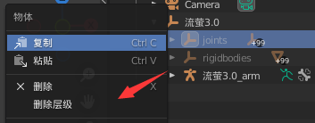

# Unity 二次元渲染实践

## 1.素材处理

### 【1】模型处理

- 说明

  - 模型下载通常是官方放出的MMD模型即.pmx文件，通常在[模之屋](https://www.aplaybox.com/)可以下载
  - 渲染用贴图需要一点反向工程手段或者截帧工具如（Ninja Ripper，Asset Manager等）
  - 模型通过Blender进行处理，主要工作为，合并大量相同的材质，删除背面顶点，为模型生成平滑法线存至顶点色

- 主要步骤

  - 删除MMD骨骼和刚体层级

    

  - 转到Shading界面，选中mesh的材质面板

    

  - TAB键切换至编辑模式，删除内侧顶点（不删会导致描边效果有问题）

    

    

  - 根据shaderGraph的贴图选中所有使用相同BaseTexture的顶点，重新指定一个材质槽，最后基本就三大类：身体（上衣+下衣或者就一个整体的），头发，脸相关（眼睛，眼白，眼透明，表情，齿舌口等），切换回物体模式，删除多余插槽

    

  - 单独拆出脸部，删除身体mesh的形态键，可减少Unity渲染开销，分离开后分别删除两边mesh不需要的材质槽

    

  - 为两个mesh生成平滑法线，切换至Scripting界面，创建一个py脚本

    - 脚本代码（from 佬[给你柠檬椰果养乐多你会跟我玩吗](https://space.bilibili.com/32704665)）

      ```python
      from mathutils import *
      from math import *
      import numpy as np
      import bpy
      
      me = (bpy.data.meshes["流萤3.001"])#bpy.data.meshes[x]获取网格名填入XXX处
      
      me.calc_tangents(uvmap = "UVMap")
      
      uv_layer = me.uv_layers.active.data
      
      dict = {}
      
      def vec2str(vec):
      
        return "x=" + str(vec.x) + ",y=" + str(vec.y) + ",z=" + str(vec.z)
      
      
      def cross_product(v1,v2):
      
        return Vector((v1.y*v2.z-v2.y*v1.z,v1.z*v2.x-v2.z*v1.x,v1.x*v2.y-v2.x*v1.y))
      
      
      def vector_length(v):
      
        return sqrt(v.x*v.x+v.y*v.y+v.z*v.z) + 0.000001#避免零除警告ZeroDivisionError: Vector division: divide by zero error
      
      
      def normalize(v):
      
        return v/vector_length(v)
      
      
      def dot_product(v1, v2):
      
        return v1.x*v2.x+v1.y*v2.y+v1.z*v2.z
      
      
      def included_angle(v1,v2):
      
        return np.arccos(dot_product(v1, v2)/(vector_length(v1) * vector_length(v2)))
      
      
      def need_outline(vertex):
      
        need = True
      
        return need
      
      for v in me.vertices:
      
        co = v.co
      
        co_str = vec2str(co)
      
        dict[co_str] = []
      
      
      
      for poly in me.polygons:
      
        l0 = me.loops[poly.loop_start]
      
        l1 = me.loops[poly.loop_start + 1]
      
        l2 = me.loops[poly.loop_start + 2]
      
        v0 = me.vertices[l0.vertex_index]
      
        v1 = me.vertices[l1.vertex_index]
      
        v2 = me.vertices[l2.vertex_index]
      
      
        n = cross_product(v1.co - v0.co, v2.co - v0.co)
      
        n = normalize(n)
      
        co0_str = vec2str(v0.co)
      
        co1_str = vec2str(v1.co)
      
        co2_str = vec2str(v2.co)
      
      
        if co0_str in dict and need_outline(v0):
      
          w = included_angle(v2.co - v0.co , v1.co - v0.co)
      
          dict[co0_str].append({"n":n,"w":w,"l":l0})
      
        if co1_str in dict and need_outline(v1):
      
          w = included_angle(v0.co - v1.co , v2.co - v1.co)
      
          dict[co1_str].append({"n":n,"w":w,"l":l1})
      
        if co2_str in dict and need_outline(v2):
      
          w = included_angle(v1.co - v2.co , v0.co - v2.co)
      
          dict[co2_str].append({"n":n,"w":w,"l":l2})
      
      
      
      for poly in me.polygons:
      
        for loop_index in range(poly.loop_start, poly.loop_start + poly.loop_total):
      
          vertex_index = me.loops[loop_index].vertex_index
      
          v = me.vertices[vertex_index]
      
          smoothnormal = Vector((0,0,0))
      
          weightsum = 0
      
          if need_outline(v):
      
            costr = vec2str(v.co)
      
            if costr in dict:
      
              a = dict[costr]
      
              for d in a:
      
               n = d['n']
      
               w = d['w']
      
               smoothnormal += n * w
      
               weightsum += w
      
          if smoothnormal != Vector((0,0,0)):
      
            smoothnormal /= weightsum
      
            smoothnormal = normalize(smoothnormal)
      
      
      
          normal = me.loops[loop_index].normal
      
          tangent = me.loops[loop_index].tangent
      
          bitangent =me.loops[loop_index].bitangent
      
      
          normalTSX = dot_product(tangent, smoothnormal)
      
          normalTSY = dot_product(bitangent, smoothnormal)
      
          normalTSZ = dot_product(normal, smoothnormal)
      
          normalTS = Vector((normalTSX, normalTSY, normalTSZ))
      
      
          color = [normalTS.x * 0.5 + 0.5, normalTS.y * 0.5 + 0.5, normalTS.z * 0.5 + 0.5, 1]
      
          me.vertex_colors.active.data[loop_index].color = color
      ```

  - 这个脚本需要选中网格，在脚本中输入它的名称，然后切换到顶点绘制模式方可运行

    


### 【2】贴图处理

- 说明
  - 贴图共有以下几种
    - 基础贴图：脸、头发、身体的基础颜色
    - LightMap：R、G通道是AO细节，可能是一样的，B通道是高光阈值，A是灰度划分用于采样Ramp图
    - Ramp：分冷暖两种用于决定模型在光影下的颜色，通常是256*n的尺寸，取决于网格上有多少种颜色的阴影
    - 脸部遮罩：R通道决定受AO的区域，G通道是AO的颜色，B通道是鼻线的位置，A通道是面部SDF
  - 具体操作
    - 所有贴图关闭压缩
    - LightMap和脸部遮罩去掉SRGB标记
    - ramp图关闭Mipmap，包裹方式为钳制，插值方式为不插值


## 2.间接光照

### 【1】球谐环境光

- 说明

  - Unity中支持在球谐环境光照，可以在顶点着色器中根据法线获取到顶点的球谐光结果

- 具体操作

  - 顶点着色器

    ````cpp
    struct Varyings {
        float2 uv                       : TEXCOORD0;
        float4 positionWSAndFogFactor   : TEXCOORD1; // 世界坐标+雾因子
        float3 normalWS                 : TEXCOORD2;
        float3 viewDirectionWS          : TEXCOORD3;
        float3 SH                       : TEXCOORD4; // 球谐光照结果
        float4 positionCS               : SV_POSITION;
    };
    
    Varyings vert(Attributes input) {
        Varyings output = (Varyings)0;
        VertexPositionInputs vertexInput = GetVertexPositionInputs(input.positionOS);
        VertexNormalInputs vertexNormalInput = GetVertexNormalInputs(input.normalOS, input.tangentOS);
    
        output.uv = input.uv;
        output.positionCS = vertexInput.positionCS;
        // ComputeFogFactor 是一个 Unity 的内置函数，用于计算雾效因子
        // 它根据顶点到摄像机的距离计算雾效权重，用于在片段着色器中混合雾颜色和物体颜色。
        output.positionWSAndFogFactor = float4(vertexInput.positionWS, ComputeFogFactor(vertexInput.positionCS.z));
        output.normalWS = vertexNormalInput.normalWS;
        // 正交投影的话，View矩阵的第三行就是视线方向的反方向，也就是出射方向
        output.viewDirectionWS = unity_OrthoParams.w == 0 ? GetCameraPositionWS() - vertexInput.positionWS : GetWorldToViewMatrix()[2].xyz;
    
        // 利用_IndirectLightFlattenNormal控制用于采样球谐光照的法线的长短，法线越短球谐光照的细节越少
        output.SH = SampleSH(lerp(vertexNormalInput.normalWS, float3(0,0,0), _IndirectLightFlattenNormal));
    
        return output;
    }
    
    ````

  - 片元着色器

    ```cpp
    // -------------------------------
    // 间接光部分
    // 球谐光当主要的间接光，用_IndirectLightUsage控制光的强度
    float3 indirectLightColor = input.SH.rgb * _IndirectLightUsage;
    
    ```

    

### 【2】LightMap固定阴影

- 说明

  - LightMap的R/G通道里有AO细节，采样出来叠加到间接光照中

- 具体操作

  - 片元着色器

    ```cpp
    // 光照贴图里有画好的AO细节
    #if _AREA_HAIR || _AREA_UPPERBODY 
    // 用_IndirectLightOcclusionUsage控制AO的影响
    indirectLightColor *= lerp(1, lightMap.r, _IndirectLightOcclusionUsage);
    #else
    // 面部贴图里r通道是遮罩，白的地方（值为1）代表受AO影响
    // 白的地方step结果是0，会被lerp到g通道的结果
    // _IndirectLightOcclusionUsage控制AO强度
    indirectLightColor *= lerp(1, lerp(faceMap.g, 1, step(faceMap.r,0.2)), _IndirectLightOcclusionUsage);
    #endif
    
    // 用_IndirectLightMixBaseColor控制间接光对基础颜色的影响
    indirectLightColor *= lerp(1, baseColor, _IndirectLightMixBaseColor);
    // -------------------------------
    ```

    

## 3.直接光照

### 【1】半兰伯特模型与SDF阴影

- 说明

  - 身体和头发部分的光照用伪半兰伯特模型

  - 脸部用SDF阴影，SDF的原理可以看[Signed Distance Field - 知乎](https://zhuanlan.zhihu.com/p/337944099)

    - 简单来说，艺术家需要先画出光照从正后方，绕着某一方向到正前方的多张阴影距离场图，然后将它们通过blur或者smooth操作叠加到一张图上

    - 在读取SDF图时，通过前向量与光线水平方向向量投影的结果（映射到0-1）作为阈值二分化SDF图即可获得该角度下的面部阴影

    - 这是SDF图

      

    - 当光照在正左方时，dot(forward, lightdir) = 0，被映射到0.5，效果会是这样（加了一点点偏移，使得阴影变软一些）

       

- 具体操作

  - 片元着色器

    ```cpp
    	// -------------------------------
        // 直接光部分
        float3 mainLightColor = mainLight.color;
        float3 mainLightShadow = 1;
    	// 用来计算rampUV的
        int rampRowCount = 1;
        int rampRowIndex = 0;
    
        #if _AREA_HAIR || _AREA_LOWERBODY || _AREA_UPPERBODY || _AREA_UPPERBODY_1
            float NdotL = dot(normalWS,lightDirWS); // NoL就是最简单的兰伯特
            float remappedNdotL = NdotL * 0.5 + 0.5; // 半兰伯特还要平个方，但这里我感觉够了
            // 用LightMap的G通道控制下阴影细节，值为0越黑的地方，越难被点亮，将1-g通道作为阈值
    		// smoothstep(l,r,x)是将x平滑地映射到0-1，[-∞,l]->0, [l,r]->[0,1], [r,+∞]->1
            mainLightShadow = smoothstep(1 - lightMap.g + _ShadowThresholdCenter - _ShadowThresholdSoftness, 1 - lightMap.g + _ShadowThresholdCenter + _ShadowThresholdSoftness, remappedNdotL);
    
            #if _AREA_HAIR
                rampRowCount = 1;
                rampRowIndex = 0;
            #else 
    			// 这里要自己根据角色的lightMap的a通道的灰度值以及ramp颜色找到映射关系
                int rowIndex = round(lightMap.a * 7 * 1.053);
                rampRowCount = 8;
                rampRowIndex = rowIndex < 4 ? rowIndex : (11 - rowIndex);
            #endif
    
        #elif _AREA_FACE
            float3 headForward = normalize(_HeadForward);
            float3 headRight = normalize(_HeadRight);
            float3 headUp = cross(headForward, headRight); // Unity是左手坐标系
    
            float3 fixedLightDirWS = normalize(lightDirWS - dot(lightDirWS, headUp) * headUp); // 计算光线方向在头坐标系的水平面上的投影
            // 通过光投影向量点乘头右方向判断光照在脸左还是脸右，如果是正数说明照在脸右，那么直接采样，否则镜像翻转采样
            float2 sdfUV = float2(sign(dot(fixedLightDirWS, headRight)), 1) * input.uv * float2(-1, 1);
            float sdfValue = tex2D(_FaceMap, sdfUV).a;
            sdfValue += _FaceShadowOffset; // 加一个偏移值，以防光照在正背面时sdf采样到边界值1，通过step使得脸全亮
            
            // dot(headForward, fixedLightDirWS)越大说明光和前方越重合，越不应该有阴影，所以用1-，阈值会很小
            float sdfThreshold = 1 - (dot(headForward, fixedLightDirWS) * 0.5 + 0.5);
            
            float sdf = smoothstep(sdfThreshold - _FaceShadowTransitionSoftness, sdfThreshold + _FaceShadowTransitionSoftness, sdfValue);
            mainLightShadow = lerp(faceMap.g, sdf, step(faceMap.r, 0.5));
    
            rampRowCount = 8;
            rampRowIndex = 0;
    
        #endif
    ```

    

### 【2】Ramp采样阴影

- 说明

  - 半兰伯特和LightMap决定哪里明，哪里暗
  - Ramp贴图决定明的地方阴影是什么颜色，暗的地方阴影是什么颜色
  - 用日光的垂直分量y决定用冷ramp的颜色还是暖ramp的颜色

- 具体操作

  - 片元着色器

    ```cpp
    	// 因为颜色变化都集中在右半区，所以将半兰伯特再映射到0.75-1
    	float rampUVx = mainLightShadow * (1 - _ShadowRampOffset) + _ShadowRampOffset;
        float rampUVy = (2.0 * rampRowIndex + 1.0) / (rampRowCount * 2.0);
        float2 rampUV = float2(rampUVx, rampUVy);
        float3 rampWarm = 1;
        float3 rampCool = 1;
    
        #if _AREA_LOWERBODY || _AREA_UPPERBODY || _AREA_UPPERBODY_1 || _AREA_FACE
            rampWarm = tex2D(_BodyWarmRamp, rampUV).rgb;
            rampCool = tex2D(_BodyCoolRamp, rampUV).rgb;
        #elif _AREA_HAIR
            rampWarm = tex2D(_HairWarmRamp, rampUV).rgb;
            rampCool = tex2D(_HairCoolRamp, rampUV).rgb;
        #endif
    	// y决定用冷ramp的颜色还是暖ramp的颜色
        float isDay = lightDirWS.y * 0.5 + 0.5;
        float3 rampColor = lerp(rampCool, rampWarm, isDay);
        mainLightColor *= rampColor * baseColor;
    ```

    

## 4.高光部分

### 【1】非金属与金属高光

- 说明

  - 角色身上有高光区域和非高光区域，由LightMap的B通道划分，值为0的地方不产生高光
  - LightMap的B通道同时也是高光阈值，表示布林冯高光值大于多少才会产生高光
  - 高光区域的高光又分为两部分，一是大部分物体的非金属高光，二是金属才有的金属高光
  - 非金属高光是固定的反射率，只会提高区域亮度
  - 金属高光反射率由B通道控制，同时会反射自身的颜色

- 具体操作

  - 片元着色器

    ```cpp
        // -------------------------------
        // 高光部分
        float3 specularLightColor = 0;
        #if _AREA_HAIR || _AREA_UPPERBODY
            float3 H = normalize(lightDirWS + viewDirWS);
            float NoH = saturate(dot(normalWS,H));
            float blinnPhong = pow(NoH, _SpecularExpon);
    
            // LightMap里b通道是金属高光阈值，说明了布林冯高光值大于多少才会产生高光
            // 非金属高光部分，将布林冯反向作为阶梯，越产生高光的地方阶梯越矮，阈值再小也能通过
            // 用1.04减是防止布林冯为1时阈值为0的（非高光）区域也反光
            float nonMetalSpecular = step(1.04 - blinnPhong, lightMap.b) * _SpecularKsNonMetal;
    
            float metalSpecular = blinnPhong * _SpecularKsMetal * lightMap.b;
    
            // 区分金属和非金属，lightMap的a通道里金属被标记为大约0.686的值
            float metallic = 0;
            #if _AREA_UPPERBODY
                metallic = saturate((abs(lightMap.a - 0.686) - 0.1) / (0.0 - 0.1)); // 在0-0.1的误差范围内则将其映射到0，1
            #endif
    
            specularLightColor = lerp(nonMetalSpecular,metalSpecular * baseColor, metallic);
            specularLightColor *= mainLightColor;
            specularLightColor *= _SpecularBrightness;
    
        #endif
    ```


## 5.描边效果

### 【1】描边宽度控制与屏幕空间偏移

- 说明

  - 描边效果本质是通过再绘制一遍物体，并将其顶点沿着法线方向作偏移
  - 开启正面剔除我们就只能在边缘地方看到这个物体，再将这个物体按照一定规则染色，就可以实现不同颜色的描边
  - 雾效我暂时也不是很懂，感觉加不加都差不多

- 具体操作

  - 搬运几个工具函数

    - GetOutlineCameraFovAndDistanceFixMultiplier用来根据相机与模型的距离控制描边宽度
    - NiloGetNewClipPosWithZOffset用来根据片元离屏幕的距离沿着z方向做偏移，减少一些异常的描边

    ```cpp
    // If your project has a faster way to get camera fov in shader, you can replace this slow function to your method.
    // For example, you write cmd.SetGlobalFloat("_CurrentCameraFOV",cameraFOV) using a new RendererFeature in C#.
    // For this tutorial shader, we will keep things simple and use this slower but convenient method to get camera fov
    float GetCameraFOV()
    {
        //https://answers.unity.com/questions/770838/how-can-i-extract-the-fov-information-from-the-pro.html
        float t = unity_CameraProjection._m11;
        float Rad2Deg = 180 / 3.1415;
        float fov = atan(1.0f / t) * 2.0 * Rad2Deg;
        return fov;
    }
    float ApplyOutlineDistanceFadeOut(float inputMulFix)
    {
        //make outline "fadeout" if character is too small in camera's view
        return saturate(inputMulFix);
    }
    float GetOutlineCameraFovAndDistanceFixMultiplier(float positionVS_Z)
    {
        float cameraMulFix;
        if(unity_OrthoParams.w == 0)
        {
            ////////////////////////////////
            // Perspective camera case
            ////////////////////////////////
    
            // keep outline similar width on screen accoss all camera distance       
            cameraMulFix = abs(positionVS_Z);
    
            // can replace to a tonemap function if a smooth stop is needed
            cameraMulFix = ApplyOutlineDistanceFadeOut(cameraMulFix);
    
            // keep outline similar width on screen accoss all camera fov
            cameraMulFix *= GetCameraFOV();       
        }
        else
        {
            ////////////////////////////////
            // Orthographic camera case
            ////////////////////////////////
            float orthoSize = abs(unity_OrthoParams.y);
            orthoSize = ApplyOutlineDistanceFadeOut(orthoSize);
            cameraMulFix = orthoSize * 50; // 50 is a magic number to match perspective camera's outline width
        }
    
        return cameraMulFix * 0.00005; // mul a const to make return result = default normal expand amount WS
    }
    
    // Push an imaginary vertex towards camera in view space (linear, view space unit), 
    // then only overwrite original positionCS.z using imaginary vertex's result positionCS.z value
    // Will only affect ZTest ZWrite's depth value of vertex shader
    
    // Useful for:
    // -Hide ugly outline on face/eye
    // -Make eyebrow render on top of hair
    // -Solve ZFighting issue without moving geometry
    float4 NiloGetNewClipPosWithZOffset(float4 originalPositionCS, float viewSpaceZOffsetAmount)
    {
        if(unity_OrthoParams.w == 0)
        {
            ////////////////////////////////
            //Perspective camera case
            ////////////////////////////////
            float2 ProjM_ZRow_ZW = UNITY_MATRIX_P[2].zw;
            float modifiedPositionVS_Z = -originalPositionCS.w + -viewSpaceZOffsetAmount; // push imaginary vertex
            float modifiedPositionCS_Z = modifiedPositionVS_Z * ProjM_ZRow_ZW[0] + ProjM_ZRow_ZW[1];
            originalPositionCS.z = modifiedPositionCS_Z * originalPositionCS.w / (-modifiedPositionVS_Z); // overwrite positionCS.z
            return originalPositionCS;    
        }
        else
        {
            ////////////////////////////////
            //Orthographic camera case
            ////////////////////////////////
            originalPositionCS.z += -viewSpaceZOffsetAmount / _ProjectionParams.z; // push imaginary vertex and overwrite positionCS.z
            return originalPositionCS;
        }
    }
    
    ```

  - 顶点着色器

    ```cpp
    struct Attributes {
        float3 positionOS   : POSITION;
        float3 normalOS     : NORMAL;
        float4 tangentOS    : TANGENT;
        float4 color        : COLOR;	// 顶点色里有平滑法线信息
        float4 uv           : TEXCOORD0;
    };
    
    struct Varyings {
        float4 positionCS   : SV_POSITION;
        float2 uv           : TEXCOORD0;
        float  fogFactor    : TEXCOORD1;
        float4 color        : TEXCOORD2;
    };
    
    Varyings vert(Attributes input) {
        Varyings output = (Varyings)0;
        VertexPositionInputs vertexPositionInput = GetVertexPositionInputs(input.positionOS);
        VertexNormalInputs vertexNormalInput = GetVertexNormalInputs(input.normalOS, input.tangentOS);
    
        float width = _OutlineWidth;		// 手动调整的描边宽
        float zOffset = _OutlineZOffset;	// 沿z轴的偏移，配合NiloGetNewClipPosWithZOffset用的
        width *= GetOutlineCameraFovAndDistanceFixMultiplier(vertexPositionInput.positionVS.z);
    
        float3 positionWS = vertexPositionInput.positionWS;
        #if _OUTLINE_VERTEX_COLOR_SMOOTH_NORMAL
        	// 取出平滑法线（切线空间），转换到世界空间
            float3x3 tbn = float3x3(vertexNormalInput.tangentWS, vertexNormalInput.bitangentWS, vertexNormalInput.normalWS);
            float3 smoothNormalTS = mul(input.color.rgb * 2 - 1, tbn);
            positionWS += smoothNormalTS * width;
        #else
            positionWS += vertexNormalInput.normalWS * width;
        #endif
        output.positionCS = NiloGetNewClipPosWithZOffset(TransformWorldToHClip(positionWS),zOffset);
        output.uv = input.uv;
        output.fogFactor = ComputeFogFactor(vertexPositionInput.positionCS.z);
        return output;
    }
    ```

    

### 【2】Ramp采样描边颜色

- 说明

  - 描边颜色采用ramp颜色作为基础颜色，再加深一点就能用了

- 具体操作

  - 片元着色器

    ``` cpp
    float4 frag(Varyings input) : SV_TARGET {
        int rampRowCount = 1;
        int rampRowIndex = 0;
    
        #if _AREA_HAIR || _AREA_UPPERBODY
            #if _AREA_HAIR
                rampRowCount = 1;
                rampRowIndex = 0;
            #else 
                int rowIndex = round(tex2D(_upperBodyLightMap,input.uv).a * 7 * 1.053);
                rampRowCount = 8;
                rampRowIndex = rowIndex < 4 ? rowIndex : (11 - rowIndex);
            #endif
    
        #elif _AREA_FACE
            rampRowCount = 8;
            rampRowIndex = 0;
        #endif
        float rampUVx = 0;
        float rampUVy = (2.0 * rampRowIndex + 1.0) / (rampRowCount * 2.0);
        float2 rampUV = float2(rampUVx, rampUVy);
        
        float3 rampWarm = 1;
        float3 rampCool = 1;
    
        #if _AREA_UPPERBODY || _AREA_FACE
            rampWarm = tex2D(_BodyWarmRamp, rampUV).rgb;
            rampCool = tex2D(_BodyCoolRamp, rampUV).rgb;
        #elif _AREA_HAIR
            rampWarm = tex2D(_HairWarmRamp, rampUV).rgb;
            rampCool = tex2D(_HairCoolRamp, rampUV).rgb;
        #endif
    
        float3 rampColor = lerp(rampCool, rampWarm, 0.5);
        float3 color = pow(saturate(rampColor), _OutlineGamma);
        color = MixFog(color.rgb, input.fogFactor);
    
        return float4(color, 1);
    }
    ```

    

## 6.边缘光与自发光

### 【1】屏幕空间边缘光

- 说明

  - 边缘光可以用菲涅尔来做，但它基本上忠实与片元法线与视线的夹角，会在很多地方意外生成
  - 利用屏幕空间边缘检测来做边缘光会使效果更克制一些，看起来更自然
  - 边缘检测是通过对比原坐标和根据视线方向做了偏移的片元坐标的深度贴图深度来实现的

- 具体操作

  - 片元着色器(计算效果)

    ```cpp
        // ------------------------------
        // 屏幕空间边缘光部分，注意positionCS已经被GPU转换成屏幕空间坐标了，不是裁剪空间
        // 计算当前片元的观察空间深度
    	float linearEyeDepth = LinearEyeDepth(input.positionCS.z, _ZBufferParams);  
        // 计算当前片元的观察空间法线方向
    	float3 normalVS = mul((float3x3)UNITY_MATRIX_V, normalWS);                  
    	// 根据法线向左还是向右生成微小的偏移，除以1 + linearEyeDepth实现近大远小的效果
        float2 uvOffset = float2(sign(normalVS.x),0) * _RimLightwidth / (1 + linearEyeDepth) / 100; 
    	// 计算偏移后的屏幕空间坐标
        int2 loadTexPos = input.positionCS.xy + uvOffset * _ScaledScreenParams.xy; 
        loadTexPos = min(loadTexPos, _ScaledScreenParams.xy - 1);
        loadTexPos = max(loadTexPos, 0);
    	// 查询偏移点处的z值
        float offsetSceneDepth = LoadSceneDepth(loadTexPos);              
    	// 计算偏移点处观察空间深度
        float offsetLinearEyeDepth = LinearEyeDepth(offsetSceneDepth, _ZBufferParams); 
        float rimLight = saturate(offsetLinearEyeDepth - (linearEyeDepth + _RimLightThreshold)) / _RimLightFadeout; // 根据观察空间深度差计算边缘光的亮度
        float3 rimLightColor = rimLight * mainLight.color;
        rimLightColor *= _RimLightTintColor;
        rimLightColor *= _RimLightBrightness;
        // ------------------------------
    ```

  - 片元着色器(混入最终颜色里)

    ```cpp
    // 利用_RimLightMixAlbedo可以控制边缘光是纯叠加还是加强原始颜色
    albedo += rimLightColor * lerp(1, albedo, _RimLightMixAlbedo);
    ```

    

### 【2】自发光效果

- 说明

  - 如果有自发光遮罩，将其叠加到最终颜色中

- 具体操作

  - 片元着色器

    ```cpp
    	// ------------------------------
        // 自发光部分
        float3 emissionColor = 0;
        #if _EMISSION_ON
            emissionColor = areaMap.a;
            emissionColor *= lerp(1, baseColor, _EmissionMixBasecolor);
            emissionColor *= _EmissionTintColor;
            emissionColor *= _EmissionIntensity;
        #endif
    ```

    

### 【3】鼻线效果

- 说明

  - 鼻线在面部遮罩的B通道中，要将其读出来并根据视线与头前向量控制其可视范围

- 具体操作

  - 片元着色器（计算部分）

    ```cpp
        // -------------------------------
        // 鼻线部分
        float fakeOutlineEffect = 0;
        float3 fakeOutlineColor = 0;
    
        #if _AREA_FACE && _OUTLINE_ON
            // 鼻线部分是1，其他地方都是0
            float fakeOutline = faceMap.b;
            // 视角与头前向量越贴近，显示越清晰，没有鼻线的地方这里始终是0
            fakeOutlineEffect = smoothstep(0.0, 0.25, saturate(pow(dot(normalize(_HeadForward), viewDirWS), 10)) * fakeOutline);
    
    		// 用皮肤ramp的颜色深化后做鼻线颜色
            float2 outlineUV = (0, 0.0625);
            rampWarm = tex2D(_BodyWarmRamp, outlineUV).rgb;
            rampCool = tex2D(_BodyCoolRamp, outlineUV).rgb;
            rampColor = lerp(rampCool, rampWarm, 0.5);
            fakeOutlineColor = pow(rampColor, _OutlineGamma);
        #endif
    ```

  - 片元着色器（混入最终颜色里）

    ```cpp
    // 有鼻线并可视的地方会被覆盖为鼻线颜色
    albedo = lerp(albedo, fakeOutlineColor, fakeOutlineEffect);
    ```

    

## 7.透眉效果

### 【1】模板测试眉毛穿透

- 说明
  - 原理就是控制眉毛（+眼睛），头发，其他部分的渲染顺序，以及它们的模板值和模板通过方式
  - 眉毛最先渲染，模板值为2，模板值大于等于缓冲区时通过，渲染过的地方模板缓冲改为2
  - 然后其他部分渲染，模板值为6（大于2即可），模板值大于等于缓冲区时通过，如果深度测试也通过，那就将模板缓冲改为0（说明其他部分挡住了眉毛）
  - 也就是说，如果其他部分没挡住眉毛，那么缓冲区里，有眉毛的地方模板值是2，其他地方都是0，如果其他部分挡住了眉毛，那么缓冲区就全是0了
  - 头发最后渲染，模板值为1，模板值小于缓冲区时会被丢弃，这样眉毛就会“浮”到头发上


### 【2】重复渲染颜色混合

- 说明

  - 为了最终将眉毛（+眼睛）半透明出头发，需要再渲染一遍头发，并且将其设置为半透明，使得在透出来的地方使用眉毛（+眼睛）原本的颜色

  - Unity的混合公式

    

  - Unity的混合模式

    

  - 这里使用的混合操作

    