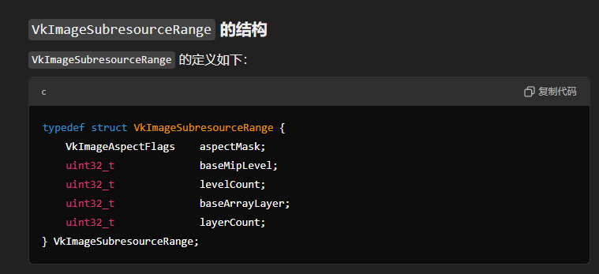
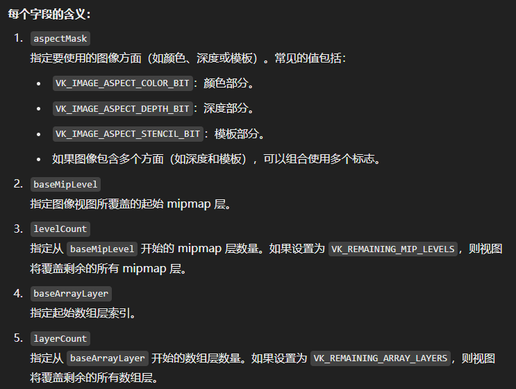
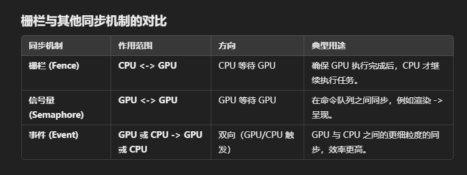
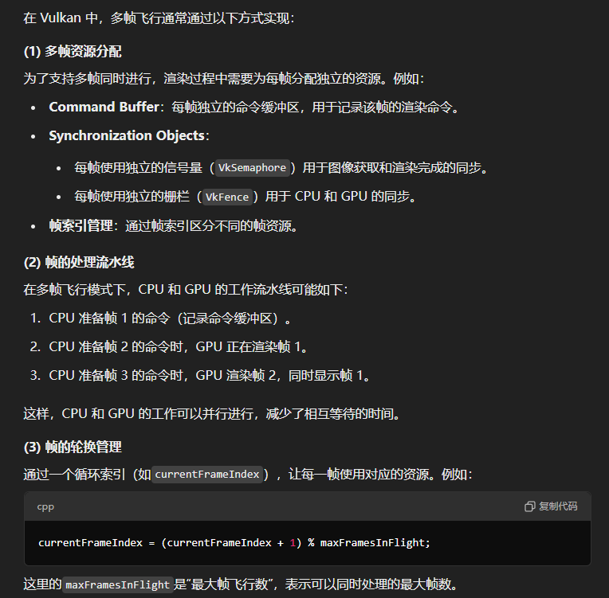

# Vulkan学习笔记（参考Piccolo小引擎）

## 一、渲染准备

### 1.Vulkan实例创建与物理设备握手

#### 【1】Vulkan实例创建

- 步骤描述

  - 设置实例相关的层和扩展
  - 创建VkApplicationInfo设置实例信息
  - 检查设置的层和扩展是否可用
  - 使用vkCreateInstance创建Vulkan实例

- 代码示例

  - **createInstance**函数（创建Instance的主要逻辑函数）

  ```cpp
  void VulkanRHI::createInstance() {
      // 检查是否开启了验证层但宿主机不支持
      if (m_enable_validation_Layers && !checkValidationLayerSupport())
      {
          throw std::runtime_error("validation layers requested, but not available!");
      }
  
      m_vulkan_api_version = VK_API_VERSION_1_0;
  
      // app info
      VkApplicationInfo appInfo {};
      appInfo.sType              = VK_STRUCTURE_TYPE_APPLICATION_INFO;
      appInfo.pApplicationName   = "pilot_renderer";
      appInfo.applicationVersion = VK_MAKE_VERSION(1, 0, 0);
      appInfo.pEngineName        = "Piccolo";
      appInfo.engineVersion      = VK_MAKE_VERSION(1, 0, 0);
      appInfo.apiVersion         = m_vulkan_api_version;
  
      // create info
      VkInstanceCreateInfo instance_create_info {};
      instance_create_info.sType            = VK_STRUCTURE_TYPE_INSTANCE_CREATE_INFO;
      instance_create_info.pApplicationInfo = &appInfo; // the appInfo is stored here
  
      auto extensions                              = getRequiredExtensions();
      instance_create_info.enabledExtensionCount   = static_cast<uint32_t>(extensions.size());
      instance_create_info.ppEnabledExtensionNames = extensions.data();
  
      VkDebugUtilsMessengerCreateInfoEXT debugCreateInfo {};
      if (m_enable_validation_Layers)
      {
          instance_create_info.enabledLayerCount   = static_cast<uint32_t>(m_validation_layers.size());
          instance_create_info.ppEnabledLayerNames = m_validation_layers.data();
  
          populateDebugMessengerCreateInfo(debugCreateInfo);
          instance_create_info.pNext = (VkDebugUtilsMessengerCreateInfoEXT*)&debugCreateInfo;
      }
      else
      {
          instance_create_info.enabledLayerCount = 0;
          instance_create_info.pNext             = nullptr;
      }
  
      // create m_vulkan_context._instance
      if (vkCreateInstance(&instance_create_info, nullptr, &m_instance) != VK_SUCCESS)
      {
          throw std::runtime_error("vk create instance");
      }
  }
  ```

  - **checkValidationLayerSupport**（检查宿主机是否支持开启验证层）

   ```cpp
   bool VulkanRHI::checkValidationLayerSupport() {
       uint32_t layerCount;
       // 获取可用的实例层层数
       vkEnumerateInstanceLayerProperties(&layerCount, nullptr);
   
       // 保存可用的实例层信息
       std::vector<VkLayerProperties> availableLayers(layerCount);
       vkEnumerateInstanceLayerProperties(&layerCount, availableLayers.data());
   
       // 查询需要开启的验证层是否在这些可用实例层里
       // const std::vector<char const*> m_validation_layers {"VK_LAYER_KHRONOS_validation"};
       for (const char* layerName : m_validation_layers)
       {
           bool layerFound = false;
   
           for (const auto& layerProperties : availableLayers)
           {
               if (strcmp(layerName, layerProperties.layerName) == 0)
               {
                   layerFound = true;
                   break;
               }
           }
   
           if (!layerFound)
           {
               return false;
           }
       }
   
       return true;
   }
   ```

  - **getRequiredExtensions**（查询需要打开的扩展：GLFW、Debug功能等）

  ```cpp
  std::vector<const char*> VulkanRHI::getRequiredExtensions()
  {
      uint32_t     glfwExtensionCount = 0;
      const char** glfwExtensions;
      glfwExtensions = glfwGetRequiredInstanceExtensions(&glfwExtensionCount);
  
      std::vector<const char*> extensions(glfwExtensions, glfwExtensions + glfwExtensionCount);
  
      if (m_enable_validation_Layers || m_enable_debug_utils_label)
      {
          extensions.push_back(VK_EXT_DEBUG_UTILS_EXTENSION_NAME);
      }
  
  #if defined(__MACH__)
      extensions.push_back(VK_KHR_GET_PHYSICAL_DEVICE_PROPERTIES_2_EXTENSION_NAME);
  #endif
  
      return extensions;
  }
  ```


#### 【2】初始化物理设备

- 步骤描述

  - 遍历可用物理设备
  - 给可用物理设备按得分排序
  - 遍历每个可用物理设备，检查是否合适
    - 检查需求扩展是否可用
    - 检查交换链支持是否足够
    - 检查渲染特性是否被支持

- 代码示例与分析

  - **initializePhysicalDevice**（初始化物理设备）

  ```cpp
  void VulkanRHI::initializePhysicalDevice() {
      // 查询宿主机有多少个物理设备
      uint32_t physical_device_count;
      vkEnumeratePhysicalDevices(m_instance, &physical_device_count, nullptr);
      if (physical_device_count == 0)
      {
          throw std::runtime_error("enumerate physical devices");// 如果没有，寄
      }
      else
      {
          // 如果有一个或多个，那给它排下序，用最好的那个物理设备（一般是独显）
          std::vector<VkPhysicalDevice> physical_devices(physical_device_count);
          vkEnumeratePhysicalDevices(m_instance, &physical_device_count, physical_devices.data());
  		
          // 排序用，pair第一个元素是分数
          std::vector<std::pair<int, VkPhysicalDevice>> ranked_physical_devices;
          // 遍历每一个物理设备
          for (const auto& device : physical_devices)
          {
              VkPhysicalDeviceProperties physical_device_properties;
              vkGetPhysicalDeviceProperties(device, &physical_device_properties);
              int score = 0;
  
              if (physical_device_properties.deviceType == VK_PHYSICAL_DEVICE_TYPE_DISCRETE_GPU)
              {
                  score += 1000; // 如果是独显，+1000分
              }
              else if (physical_device_properties.deviceType == VK_PHYSICAL_DEVICE_TYPE_INTEGRATED_GPU)
              {
                  score += 100; // 核显+100分
              }
  
              ranked_physical_devices.push_back({score, device});
          }
          
  		// 按分数给物理设备排序
          std::sort(ranked_physical_devices.begin(),
                    ranked_physical_devices.end(),
                    [](const std::pair<int, VkPhysicalDevice>& p1, const std::pair<int, VkPhysicalDevice>& p2) {
                        return p1 > p2;
                    });
  
          for (const auto& device : ranked_physical_devices)
          {
              // 从头开始（分数最高的设备）检查物理设备是否合适（支持图形，计算，表面显示）
              if (isDeviceSuitable(device.second))
              {
                  m_physical_device = device.second;
                  break;
              }
          }
  
          if (m_physical_device == VK_NULL_HANDLE)
          {
              throw std::runtime_error("failed to find suitable physical device");
          }
      }
  }
  ```

  - **isDeviceSuitable**（判断物理设备是否合适）

  ```cpp
  bool VulkanRHI::isDeviceSuitable(VkPhysicalDevice physical_device) {
      // 查询所需队列族的下标数组
      auto queue_indices           = findQueueFamilies(physical_device);
      // 检查设备扩展是否可用
      bool is_extensions_supported = checkDeviceExtensionSupport(physical_device);
      
      // 检查交换链支持是否足够
      bool is_swapchain_adequate   = false;
      if (is_extensions_supported)
      {
          SwapChainSupportDetails swapchain_support_details = querySwapChainSupport(physical_device);
          // 物理设备不能没有支持的图像格式或者没有支持的显示模式，否则它是不合适的
          is_swapchain_adequate =
              !swapchain_support_details.m_formats.empty() && !swapchain_support_details.m_presentModes.empty();
      }
  
      // 检查物理设备支持的特性
      VkPhysicalDeviceFeatures physical_device_features;
      vkGetPhysicalDeviceFeatures(physical_device, &physical_device_features);
  
      // 如果下标数组没找满，或者交换链支持不足够，或者不支持各向异性过滤，那滚蛋
      if (!queue_indices.isComplete() || !is_swapchain_adequate || !physical_device_features.samplerAnisotropy)
      {
          return false;
      }
  
      return true;
  }
  ```

  - **findQueueFamilies**（寻找需要用的队列族下标数组）

  ```cpp
  // 所需的队列族下标数组结构体（存了三个下标）
  struct QueueFamilyIndices
  {
      // optional是C++17引入的，允许表示一个值有效（有值）或无效（null）
      std::optional<uint32_t> m_graphics_family;
      std::optional<uint32_t> m_present_family;
      std::optional<uint32_t> m_compute_family;
  
      bool isComplete() const
      {
          return m_graphics_family.has_value() && m_present_family.has_value() && m_compute_family.has_value();
      }
  };
  
  Piccolo::QueueFamilyIndices VulkanRHI::findQueueFamilies(VkPhysicalDevice physical_device){
      QueueFamilyIndices indices; // 下标（数组）结构体
      uint32_t           queue_family_count = 0;
      vkGetPhysicalDeviceQueueFamilyProperties(physical_device, &queue_family_count, nullptr);
      std::vector<VkQueueFamilyProperties> queue_families(queue_family_count);
      vkGetPhysicalDeviceQueueFamilyProperties(physical_device, &queue_family_count, queue_families.data());
  
      int i = 0;
      for (const auto& queue_family : queue_families)
      {
          if (queue_family.queueFlags & VK_QUEUE_GRAPHICS_BIT) // 这个队列族支持图形队列吗？
          {
              indices.m_graphics_family = i;
          }
  
          if (queue_family.queueFlags & VK_QUEUE_COMPUTE_BIT) // 这个队列族支持计算队列吗？
          {
              indices.m_compute_family = i;
          }
  
          VkBool32 is_present_support = false;
          vkGetPhysicalDeviceSurfaceSupportKHR(physical_device,
                                               i,
                                               m_surface,
                                               &is_present_support); // 这个队列族支持表面显示吗？
          if (is_present_support)
          {
              indices.m_present_family = i;
          }
  
          // 如果下标结构体对象里的下标都有值的话，那就走了
          if (indices.isComplete())
          {
              break;
          }
          i++;
      }
      return indices;
  }
  ```

  - **checkDeviceExtensionSupport**（检查设备扩展是否可用，不可用就不开了）

  ```cpp
  bool VulkanRHI::checkDeviceExtensionSupport(VkPhysicalDevice physical_device) {
      // 获取设备可用扩展信息
      uint32_t extension_count;
      vkEnumerateDeviceExtensionProperties(physical_device, nullptr, &extension_count, nullptr);
  
      std::vector<VkExtensionProperties> available_extensions(extension_count);
      vkEnumerateDeviceExtensionProperties(physical_device, nullptr, &extension_count, available_extensions.data());
  
      // 目前就开了交换链扩展
      // 👉std::vector<char const*> m_device_extensions = {VK_KHR_SWAPCHAIN_EXTENSION_NAME};
      std::set<std::string> required_extensions(m_device_extensions.begin(), m_device_extensions.end());
      // 遍历可用扩展，如果它是被需要开启的扩展，那么从requried_extensions里删除
      for (const auto& extension : available_extensions)
      {
          required_extensions.erase(extension.extensionName);
      }
  	// 如果required_extensions空了，说明需要开启的扩展都可以被开启
      return required_extensions.empty();
  }
  ```

  - **querySwapChainSupport**（查询物理设备支持的表面相关信息(对交换链的支持)，交换链创建需要用）

  ````cpp
  // 交换链创建时，能用的选项
  struct SwapChainSupportDetails {
      VkSurfaceCapabilitiesKHR        m_capabilities {}; 	// 图像表面（图像群）属性
      std::vector<VkSurfaceFormatKHR> m_formats;			// 表面格式
      std::vector<VkPresentModeKHR>   m_presentModes;		// 表面显示模式
  };
  
  Piccolo::SwapChainSupportDetails VulkanRHI::querySwapChainSupport(VkPhysicalDevice physical_device) {
      SwapChainSupportDetails details_result;
  
      // 查询物理设备支持的图像表面属性（如图像表面的最小/大数量，图像的尺寸范围，表面支持的变换类型（旋转，翻转等））
      vkGetPhysicalDeviceSurfaceCapabilitiesKHR(physical_device, m_surface, &details_result.m_capabilities);
  
      // 查询物理设备支持的表面格式，如VK_FORMAT_R8G8B8A8_UNORM
      uint32_t format_count;
      vkGetPhysicalDeviceSurfaceFormatsKHR(physical_device, m_surface, &format_count, nullptr);
      if (format_count != 0)
      {
          details_result.m_formats.resize(format_count);
          vkGetPhysicalDeviceSurfaceFormatsKHR(
              physical_device, m_surface, &format_count, details_result.m_formats.data());
      }
  
      // 查询物理设备支持的表面显示模式，如VK_PRESENT_MODE_IMMEADIATE_KHR（不开垂直同步，立即渲染）
      uint32_t presentmode_count;
      vkGetPhysicalDeviceSurfacePresentModesKHR(physical_device, m_surface, &presentmode_count, nullptr);
      if (presentmode_count != 0)
      {
          details_result.m_presentModes.resize(presentmode_count);
          vkGetPhysicalDeviceSurfacePresentModesKHR(
              physical_device, m_surface, &presentmode_count, details_result.m_presentModes.data());
      }
  
      return details_result;
  }
  ````


#### 【3】创建逻辑设备

- 步骤描述

  - 设置队列创建属性结构体
  - 设置需要开启的渲染特性
  - 创建逻辑设备
  - 保存有用的设备级函数指针（什么作用？没明白暂时）
  - 设置深度图像的格式

- 代码示例

  - **createLogicalDevice**（创建逻辑设备，保存函数指针，设置深度图像格式）

  ```cpp
  void VulkanRHI::createLogicalDevice() {
      m_queue_indices = findQueueFamilies(m_physical_device);
  
      std::vector<VkDeviceQueueCreateInfo> queue_create_infos; // all queues that need to be created
      // set保证元素不重复（有些队列族可以干很多事）
      std::set<uint32_t>                   queue_families = {m_queue_indices.m_graphics_family.value(),
                                                             m_queue_indices.m_present_family.value(),
                                                             m_queue_indices.m_compute_family.value()};
  
      float queue_priority = 1.0f;
      // 遍历每个队列族下标（不重复的）
      for (uint32_t queue_family : queue_families)
      {
          // 设置队列创建属性
          VkDeviceQueueCreateInfo queue_create_info {};
          queue_create_info.sType            = VK_STRUCTURE_TYPE_DEVICE_QUEUE_CREATE_INFO;
          queue_create_info.queueFamilyIndex = queue_family;
          queue_create_info.queueCount       = 1;
          queue_create_info.pQueuePriorities = &queue_priority;
          queue_create_infos.push_back(queue_create_info);
      }
  
      // 设置需要开启的物理设备渲染特性
      VkPhysicalDeviceFeatures physical_device_features = {};
  
      // 各向异性采样
      physical_device_features.samplerAnisotropy = VK_TRUE;
  
      // 启用片段存储和原子操作（适用于写入缓冲区的场景）
      physical_device_features.fragmentStoresAndAtomics = VK_TRUE;
  
      // 启用独立混合模式（在多个渲染目标中使用不同的混合状态）
      physical_device_features.independentBlend = VK_TRUE;
  
      // 如果启用了点光源阴影（m_enable_point_light_shadow），则启用 geometryShader（几何着色器）特性
      if (m_enable_point_light_shadow)
      {
          physical_device_features.geometryShader = VK_TRUE;
      }
  
      // 设置逻辑设备创建属性
      // std::vector<char const*> m_device_extensions = {VK_KHR_SWAPCHAIN_EXTENSION_NAME};
      VkDeviceCreateInfo device_create_info {};
      device_create_info.sType                   = VK_STRUCTURE_TYPE_DEVICE_CREATE_INFO;
      device_create_info.pQueueCreateInfos       = queue_create_infos.data();
      device_create_info.queueCreateInfoCount    = static_cast<uint32_t>(queue_create_infos.size());
      device_create_info.pEnabledFeatures        = &physical_device_features;
      device_create_info.enabledExtensionCount   = static_cast<uint32_t>(m_device_extensions.size());
      device_create_info.ppEnabledExtensionNames = m_device_extensions.data();
      device_create_info.enabledLayerCount       = 0;
  
      if (vkCreateDevice(m_physical_device, &device_create_info, nullptr, &m_device) != VK_SUCCESS)
      {
          throw std::runtime_error("vk create device");
      }
  
      // 保存创建好的队列句柄
      vkGetDeviceQueue(m_device, m_queue_indices.m_graphics_family.value(), 0, &m_graphics_queue);
      vkGetDeviceQueue(m_device, m_queue_indices.m_present_family.value(), 0, &m_present_queue);
      vkGetDeviceQueue(m_device, m_queue_indices.m_compute_family.value(), 0, &m_compute_queue);
  
      // 保存有用的函数指针（？？？作用何在）
      m_vk_wait_for_fences       = (PFN_vkWaitForFences)vkGetDeviceProcAddr(m_device, "vkWaitForFences");
      m_vk_reset_fences          = (PFN_vkResetFences)vkGetDeviceProcAddr(m_device, "vkResetFences");
      m_vk_reset_command_pool    = (PFN_vkResetCommandPool)vkGetDeviceProcAddr(m_device, "vkResetCommandPool");
      m_vk_begin_command_buffer  = (PFN_vkBeginCommandBuffer)vkGetDeviceProcAddr(m_device, "vkBeginCommandBuffer");
      m_vk_end_command_buffer    = (PFN_vkEndCommandBuffer)vkGetDeviceProcAddr(m_device, "vkEndCommandBuffer");
      m_vk_cmd_begin_render_pass = (PFN_vkCmdBeginRenderPass)vkGetDeviceProcAddr(m_device, "vkCmdBeginRenderPass");
      m_vk_cmd_next_subpass      = (PFN_vkCmdNextSubpass)vkGetDeviceProcAddr(m_device, "vkCmdNextSubpass");
      m_vk_cmd_end_render_pass   = (PFN_vkCmdEndRenderPass)vkGetDeviceProcAddr(m_device, "vkCmdEndRenderPass");
      m_vk_cmd_bind_pipeline     = (PFN_vkCmdBindPipeline)vkGetDeviceProcAddr(m_device, "vkCmdBindPipeline");
      m_vk_cmd_set_viewport      = (PFN_vkCmdSetViewport)vkGetDeviceProcAddr(m_device, "vkCmdSetViewport");
      m_vk_cmd_set_scissor       = (PFN_vkCmdSetScissor)vkGetDeviceProcAddr(m_device, "vkCmdSetScissor");
      m_vk_cmd_bind_vertex_buffers =
          (PFN_vkCmdBindVertexBuffers)vkGetDeviceProcAddr(m_device, "vkCmdBindVertexBuffers");
      m_vk_cmd_bind_index_buffer = (PFN_vkCmdBindIndexBuffer)vkGetDeviceProcAddr(m_device, "vkCmdBindIndexBuffer");
      m_vk_cmd_bind_descriptor_sets =
          (PFN_vkCmdBindDescriptorSets)vkGetDeviceProcAddr(m_device, "vkCmdBindDescriptorSets");
      m_vk_cmd_draw_indexed      = (PFN_vkCmdDrawIndexed)vkGetDeviceProcAddr(m_device, "vkCmdDrawIndexed");
      m_vk_cmd_clear_attachments = (PFN_vkCmdClearAttachments)vkGetDeviceProcAddr(m_device, "vkCmdClearAttachments");
  
      // 设置深度图格式
      m_depth_image_format = findDepthFormat();
  }
  ```

  - **findDepthFormat**（查找合适的深度图像格式）

  ```cpp
  // 设置了三种格式，看设备支持哪一种
  // VK_FORMAT_D32_SFLOAT（32位深度，不支持模板）
  // VK_FORMAT_D32_SFLOAT_S8_UINT（32位深度，8位模板）
  // VK_FORMAT_D24_UNORM_S8_UINT(24位深度，8位模板)
  // 以及要求OPTIMAL的优化平铺格式
  VkFormat VulkanRHI::findDepthFormat(){
      return findSupportedFormat({VK_FORMAT_D32_SFLOAT, VK_FORMAT_D32_SFLOAT_S8_UINT, VK_FORMAT_D24_UNORM_S8_UINT},
                                 VK_IMAGE_TILING_OPTIMAL,
                                 VK_FORMAT_FEATURE_DEPTH_STENCIL_ATTACHMENT_BIT);
  }
  ```

  - **findSupportedFormat**（查找符合要求的格式）

  ```cpp
  // 工具函数，第一个参数是待选格式项
  // 第二个参数是要求的图像平铺格式
  // 第三个参数是格式特性标志位
  VkFormat VulkanRHI::findSupportedFormat(const std::vector<VkFormat>& candidates,
                                          VkImageTiling                tiling,
                                          VkFormatFeatureFlags         features) {
      for (VkFormat format : candidates)
      {
          VkFormatProperties props;
          vkGetPhysicalDeviceFormatProperties(m_physical_device, format, &props);
  
          if (tiling == VK_IMAGE_TILING_LINEAR && (props.linearTilingFeatures & features) == features)
          {
              return format;
          }
          else if (tiling == VK_IMAGE_TILING_OPTIMAL && (props.optimalTilingFeatures & features) == features)
          {
              return format;
          }
      }
  
      throw std::runtime_error("findSupportedFormat failed");
  }
  ```


### 2.指令缓存创建与管理

#### 【1】指令池创建

- 步骤描述

  - 设置指令池属性
  - 创建指令池

- 代码示例

  - **createCommandPool**（创建指令池）
  
  ```cpp
  void VulkanRHI::createCommandPool() {
      // 默认图形指令缓冲池
      {
          VkCommandPoolCreateInfo command_pool_create_info {};
          command_pool_create_info.sType            = VK_STRUCTURE_TYPE_COMMAND_POOL_CREATE_INFO;
          command_pool_create_info.pNext            = NULL;
          // 设置为允许指令缓冲区通过调用vkRestCommandBuffer重置
          command_pool_create_info.flags            = VK_COMMAND_POOL_CREATE_RESET_COMMAND_BUFFER_BIT;
          command_pool_create_info.queueFamilyIndex = m_queue_indices.m_graphics_family.value();
  
          if (vkCreateCommandPool(m_device, &command_pool_create_info, nullptr, &m_command_pool) != VK_SUCCESS)
          {
              throw std::runtime_error("vk create command pool");
          }
      }
  
      // 多交换链图像帧的指令缓冲池
      {
          // s_max_frames_in_flight = 3 -->三重缓冲
          VkCommandPoolCreateInfo command_pool_create_info;
          command_pool_create_info.sType            = VK_STRUCTURE_TYPE_COMMAND_POOL_CREATE_INFO;
          command_pool_create_info.pNext            = NULL;
          // 设置为允许指令缓冲区快速分配与释放，适合临时创建，只使用一次的指令缓冲区
          command_pool_create_info.flags            = VK_COMMAND_POOL_CREATE_TRANSIENT_BIT;
          command_pool_create_info.queueFamilyIndex = m_queue_indices.m_graphics_family.value();
  
          for (uint32_t i = 0; i < s_max_frames_in_flight; ++i)
          {
              if (vkCreateCommandPool(m_device, &command_pool_create_info, NULL, &m_command_pools[i]) != VK_SUCCESS)
              {
                  throw std::runtime_error("vk create command pool");
              }
          }
      }
  }
  ```
  
  

#### 【2】指令缓冲区创建

- 步骤描述

  - 指令缓冲区属性设置
  - 创建指令缓冲区

- 代码示例

  - **createCommandBuffers**（创建指令缓冲）
  
  ```cpp
  void VulkanRHI::createCommandBuffers() {
      VkCommandBufferAllocateInfo command_buffer_allocate_info {};
      command_buffer_allocate_info.sType              = VK_STRUCTURE_TYPE_COMMAND_BUFFER_ALLOCATE_INFO;
      // 设置为主指令缓冲
      command_buffer_allocate_info.level              = VK_COMMAND_BUFFER_LEVEL_PRIMARY;
      command_buffer_allocate_info.commandBufferCount = 1U;
  
      // 从每个交换链图像帧的指令缓冲池创建一个指令缓冲区，保存句柄
      for (uint32_t i = 0; i < s_max_frames_in_flight; ++i)
      {
          command_buffer_allocate_info.commandPool = m_command_pools[i];
  
          if (vkAllocateCommandBuffers(m_device, &command_buffer_allocate_info, &m_command_buffers[i]) != VK_SUCCESS)
          {
              throw std::runtime_error("vk allocate command buffers");
          }
      }
  }
  ```
  


### 3.交换链构建与图像资源分配

#### 【1】交换链对象创建

- 步骤描述

  - 查询物理设备支持的交换链属性
  - 选择最适合的交换链属性（表面格式，展示模式，表面属性）
  - 设置交换链创建属性对象
  - 创建交换链
  - 保存交换链图像句柄

- 代码示例

  - **createSwapchain**（创建交换链）

  ```cpp
  void VulkanRHI::createSwapchain()
  {
      // 从物理设备获取支持的交换链属性，在本笔记1-【2】节有描述
      SwapChainSupportDetails swapchain_support_details = querySwapChainSupport(m_physical_device);
  
      // 从支持的表面格式中挑出最合适的
      VkSurfaceFormatKHR chosen_surface_format =
          chooseSwapchainSurfaceFormatFromDetails(swapchain_support_details.m_formats);
      // 从支持的展示模式中挑出最合适的
      VkPresentModeKHR chosen_presentMode =
          chooseSwapchainPresentModeFromDetails(swapchain_support_details.m_presentModes);
      // 从支持的图像群属性中挑出最合适的
      VkExtent2D chosen_extent = chooseSwapchainExtentFromDetails(swapchain_support_details.m_capabilities);
  
      // 创建的交换链图像数量设置为最低要求的交换链图像数量+1
      uint32_t image_count = swapchain_support_details.m_capabilities.minImageCount + 1;
      // 如果超过了限制的最多交换链图像，那就用maxImageCount
      if (swapchain_support_details.m_capabilities.maxImageCount > 0 &&
          image_count > swapchain_support_details.m_capabilities.maxImageCount)
      {
          image_count = swapchain_support_details.m_capabilities.maxImageCount;
      }
  
      // 开始设置交换链创建属性对象，参数说明见LearningVulkan 表6-16中文P143
      VkSwapchainCreateInfoKHR createInfo {};
      createInfo.sType   = VK_STRUCTURE_TYPE_SWAPCHAIN_CREATE_INFO_KHR;
      createInfo.surface = m_surface; // 设置交换链展示的表面
  
      createInfo.minImageCount    = image_count; // 设置交换链图像数量
      createInfo.imageFormat      = chosen_surface_format.format; // 交换链表面格式
      createInfo.imageColorSpace  = chosen_surface_format.colorSpace;// 交换链表面颜色空间，如SRGB
      createInfo.imageExtent      = chosen_extent; // 交换链图象群长宽
      createInfo.imageArrayLayers = 1; // 暂时不懂这个的作用
      createInfo.imageUsage       = VK_IMAGE_USAGE_COLOR_ATTACHMENT_BIT; // 交换链图像的作用
  	
      // 图形队列族和展示队列族可能是同一个也可能不是
      uint32_t queueFamilyIndices[] = {m_queue_indices.m_graphics_family.value(),
                                       m_queue_indices.m_present_family.value()};
  
      // 如果不是同一个，那需要设置一下交换链的共享属性
      if (m_queue_indices.m_graphics_family != m_queue_indices.m_present_family)
      {
          createInfo.imageSharingMode      = VK_SHARING_MODE_CONCURRENT;
          createInfo.queueFamilyIndexCount = 2;// 允许共享的队列族数量
          createInfo.pQueueFamilyIndices   = queueFamilyIndices; // 允许共享的队列族下标
      }
      else
      {
          createInfo.imageSharingMode = VK_SHARING_MODE_EXCLUSIVE;
      }
  	
      // 图像相对于引擎自然方向的变换关系（旋转90°，4：3缩放这种）
      createInfo.preTransform   = swapchain_support_details.m_capabilities.currentTransform;
      createInfo.compositeAlpha = VK_COMPOSITE_ALPHA_OPAQUE_BIT_KHR; // 如果有别的表面如何混合
      createInfo.presentMode    = chosen_presentMode; // 展示模式（MALBOX，FIFO等）
      createInfo.clipped        = VK_TRUE;
  
      createInfo.oldSwapchain = VK_NULL_HANDLE;
  
      // 创建交换链
      if (vkCreateSwapchainKHR(m_device, &createInfo, nullptr, &m_swapchain) != VK_SUCCESS)
      {
          throw std::runtime_error("vk create swapchain khr");
      }
  	
      // 获取交换链图像句柄
      vkGetSwapchainImagesKHR(m_device, m_swapchain, &image_count, nullptr);
      m_swapchain_images.resize(image_count);
      vkGetSwapchainImagesKHR(m_device, m_swapchain, &image_count, m_swapchain_images.data());
  
      // 保存交换链图像格式和尺寸
      m_swapchain_image_format = chosen_surface_format.format;
      m_swapchain_extent       = chosen_extent;
  	
      // 裁剪视图设置为交换链图像尺寸
      m_scissor = {{0, 0}, {m_swapchain_extent.width, m_swapchain_extent.height}};
  }
  ```

  - **chooseSwapchainSurfaceFormatFromDetails**（选择最合适的表面格式）

  ```cpp
  VkSurfaceFormatKHR
  VulkanRHI::chooseSwapchainSurfaceFormatFromDetails(const std::vector<VkSurfaceFormatKHR>& available_surface_formats)
  {
      for (const auto& surface_format : available_surface_formats)
      {
          // TODO: select the VK_FORMAT_B8G8R8A8_SRGB surface format,
          // there is no need to do gamma correction in the fragment shader
          if (surface_format.format == VK_FORMAT_B8G8R8A8_UNORM &&
              surface_format.colorSpace == VK_COLOR_SPACE_SRGB_NONLINEAR_KHR)
          {
              return surface_format;
          }
      }
      return available_surface_formats[0];
  }
  ```

  - **chooseSwapchainPresentModeFromDetails**（选择最合适的展示模式）

  ```cpp
  VkPresentModeKHR
  VulkanRHI::chooseSwapchainPresentModeFromDetails(const std::vector<VkPresentModeKHR>& available_present_modes)
  {
      for (VkPresentModeKHR present_mode : available_present_modes)
      {
          // 优先mailbox，否则fifo
          if (VK_PRESENT_MODE_MAILBOX_KHR == present_mode)
          {
              return VK_PRESENT_MODE_MAILBOX_KHR;
          }
      }
  
      return VK_PRESENT_MODE_FIFO_KHR;
  }
  ```

  - **chooseSwapchainExtentFromDetails**（选择最合适的图像尺寸）

  ```cpp
   VkExtent2D 
   VulkanRHI::chooseSwapchainExtentFromDetails(const VkSurfaceCapabilitiesKHR& capabilities)
   {
       // 如果已经设置过，那就这样
       if (capabilities.currentExtent.width != UINT32_MAX)
       {
           return capabilities.currentExtent;
       }
       else
       {
           // 查询当前窗口尺寸
           int width, height;
           glfwGetFramebufferSize(m_window, &width, &height);
  		 // 设置为窗口尺寸
           VkExtent2D actualExtent = {static_cast<uint32_t>(width), static_cast<uint32_t>(height)};
  
           // 限制图像尺寸在物理设备要求的范围内
           actualExtent.width =
               std::clamp(actualExtent.width, capabilities.minImageExtent.width, capabilities.maxImageExtent.width);
           actualExtent.height =
               std::clamp(actualExtent.height, capabilities.minImageExtent.height, capabilities.maxImageExtent.height);
  
           return actualExtent;
       }
   }
  ```

  

#### 【2】交换链图像视图创建

- 步骤描述

  - 为每个保存了的交换链图像创建图像视图

- 代码示例

  - **createSwapchainImageViews**（循环创建图像视图）

  ```cpp
  void VulkanRHI::createSwapchainImageViews()
  {
      m_swapchain_imageviews.resize(m_swapchain_images.size());
  
      // create imageview (one for each this time) for all swapchain images
      for (size_t i = 0; i < m_swapchain_images.size(); i++)
      {
          // 只想用交换链图像的第一层mipmap的颜色信息
          m_swapchain_imageviews[i] = VulkanUtil::createImageView(m_device,
                                                                  m_swapchain_images[i],
                                                                  m_swapchain_image_format,
                                                                  VK_IMAGE_ASPECT_COLOR_BIT,
                                                                  VK_IMAGE_VIEW_TYPE_2D,
                                                                  1,
                                                                  1);
      }
  }
  ```

  - **createImageView**（创建图像视图的工具函数）

  ```cpp
  VkImageView VulkanUtil::createImageView(VkDevice           device, // 逻辑设备
                                          VkImage&           image, // 图像句柄
                                          VkFormat           format, // 图像格式
                                          VkImageAspectFlags image_aspect_flags, // 允许访问的数据
                                          VkImageViewType    view_type, // 视图类型
                                          uint32_t           layout_count, // 图像层数
                                          uint32_t           miplevels) // mipmap层数
  {
      VkImageViewCreateInfo image_view_create_info {};
      image_view_create_info.sType                           = VK_STRUCTURE_TYPE_IMAGE_VIEW_CREATE_INFO;
      image_view_create_info.image                           = image;
      image_view_create_info.viewType                        = view_type;
      image_view_create_info.format                          = format;
      image_view_create_info.subresourceRange.aspectMask     = image_aspect_flags;
      image_view_create_info.subresourceRange.baseMipLevel   = 0;
      image_view_create_info.subresourceRange.levelCount     = miplevels;
      image_view_create_info.subresourceRange.baseArrayLayer = 0;
      image_view_create_info.subresourceRange.layerCount     = layout_count;
  
      VkImageView image_view;
      if (vkCreateImageView(device, &image_view_create_info, nullptr, &image_view) != VK_SUCCESS)
      {
          return image_view;
          // todo
      }
  
      return image_view;
  }
  ```

- 一些解释

  - subresourceRange的结构

  

  - 字段含义

  


#### 【3】深度图与视图创建

- 步骤描述

  - 创建深度图
  - 创建深度图的图像视图

- 代码示例

  - **createFramebufferImageAndView**（创建深度图及其视图）

  ```cpp
  void VulkanRHI::createFramebufferImageAndView()
  {
      VulkanUtil::createImage(m_physical_device, // 传入物理设备，用于匹配内存类型
                              m_device,	// 传入逻辑设备，用于分配堆内存
                              m_swapchain_extent.width, // 图像宽度
                              m_swapchain_extent.height,// 图像高度
                              m_depth_image_format, // 图像格式
                              VK_IMAGE_TILING_OPTIMAL, // 设置平铺模式为优化模式
                              VK_IMAGE_USAGE_INPUT_ATTACHMENT_BIT | VK_IMAGE_USAGE_DEPTH_STENCIL_ATTACHMENT_BIT |
                              VK_IMAGE_USAGE_TRANSFER_SRC_BIT, // 图像用处为输入图像附件+深度模板附件+复制图像源
                              VK_MEMORY_PROPERTY_DEVICE_LOCAL_BIT, // 图像内存属性为GPU本地内存（显存）
                              m_depth_image, // 深度图像句柄
                              m_depth_image_memory, // 分配的图像内存句柄
                              0, // 无特殊属性，如果是要用稀疏纹理或者是将CubeMap当成TextureArray用等特殊用法，则需要设置
                              1, // 图像层数
                              1); // MipMap层数
  
      m_depth_image_view = VulkanUtil::createImageView(m_device,  // 传入逻辑设备，用于创建图像视图
                                                       m_depth_image, // 图像句柄
                                                       m_depth_image_format, // 图像格式
                                                       VK_IMAGE_ASPECT_DEPTH_BIT, // 允许访问深度数据
                                                       VK_IMAGE_VIEW_TYPE_2D, // 视图类型
                                                       1, // 图像层数
                                                       1); // MipMap层数
  }
  ```

  - **createImage**（创建图像，要设置图像属性，分配内存，绑定内存）

  ```cpp
  void VulkanUtil::createImage(VkPhysicalDevice      physical_device, // 物理设备，用于获取可用的内存类型
                               VkDevice              device, // 逻辑设备，用于分配内存
                               uint32_t              image_width, // 图像宽度
                               uint32_t              image_height, // 图像高度
                               VkFormat              format, // 图像格式
                               VkImageTiling         image_tiling, // 平铺模式
                               VkImageUsageFlags     image_usage_flags, // 图像用处
                               VkMemoryPropertyFlags memory_property_flags, // 内存类型
                               VkImage&              image, // 图像句柄
                               VkDeviceMemory&       memory, // 分配的内存句柄
                               VkImageCreateFlags    image_create_flags, // 特殊标志位
                               uint32_t              array_layers, // 图像层数
                               uint32_t              miplevels) // MipMap层数
  {
      VkImageCreateInfo image_create_info {};
      image_create_info.sType         = VK_STRUCTURE_TYPE_IMAGE_CREATE_INFO;
      image_create_info.flags         = image_create_flags;
      image_create_info.imageType     = VK_IMAGE_TYPE_2D;
      image_create_info.extent.width  = image_width;
      image_create_info.extent.height = image_height;
      image_create_info.extent.depth  = 1;
      image_create_info.mipLevels     = miplevels;
      image_create_info.arrayLayers   = array_layers;
      image_create_info.format        = format;
      image_create_info.tiling        = image_tiling;
      image_create_info.initialLayout = VK_IMAGE_LAYOUT_UNDEFINED;  // 图像初始布局，详见LVk书6.2.2
      image_create_info.usage         = image_usage_flags;
      image_create_info.samples       = VK_SAMPLE_COUNT_1_BIT; // 像素采样数，设成1就是没开抗锯齿
      image_create_info.sharingMode   = VK_SHARING_MODE_EXCLUSIVE;
  
      if (vkCreateImage(device, &image_create_info, nullptr, &image) != VK_SUCCESS)
      {
          throw std::runtime_error("failed to create image!");
      }
  
      // 通过逻辑设备查询图像所需的内存大小以及类型
      VkMemoryRequirements memRequirements;
      vkGetImageMemoryRequirements(device, image, &memRequirements);
  
      VkMemoryAllocateInfo allocInfo {};
      allocInfo.sType          = VK_STRUCTURE_TYPE_MEMORY_ALLOCATE_INFO;
      allocInfo.allocationSize = memRequirements.size;
      // 找设置的内存类型在物理设备返回的内存类型数组里的下标
      allocInfo.memoryTypeIndex =
          findMemoryType(physical_device, memRequirements.memoryTypeBits, memory_property_flags);
  	
      // 分配内存
      if (vkAllocateMemory(device, &allocInfo, nullptr, &memory) != VK_SUCCESS)
      {
          throw std::runtime_error("failed to allocate image memory!");
      }
  	
      // 绑定内存
      vkBindImageMemory(device, image, memory, 0);
  }
  ```

  - **findMemoryType**（给定内存类型，返回其在物理设备内存类型数组中的下标）

  ```cpp
  uint32_t VulkanUtil::findMemoryType(VkPhysicalDevice      physical_device,
                                      uint32_t              type_filter,
                                      VkMemoryPropertyFlags properties_flag)
  {
      // 获取物理内存类型对象
      VkPhysicalDeviceMemoryProperties physical_device_memory_properties;
      vkGetPhysicalDeviceMemoryProperties(physical_device, &physical_device_memory_properties);
      // 返回来的其实不是数组，是一个数字，要通过按位与来找下标
      for (uint32_t i = 0; i < physical_device_memory_properties.memoryTypeCount; i++)
      {
          if (type_filter & (1 << i) &&
              (physical_device_memory_properties.memoryTypes[i].propertyFlags & properties_flag) == properties_flag)
          {
              return i;
          }
      }
      throw std::runtime_error("findMemoryType");
  }
  ```


### 4.交换链图像获取与指令缓冲记录开启

#### 【1】创建栅栏和信号量

- 作用

  - 栅栏用来保证之前（上一帧）提交的指令缓冲已经被执行完毕
  - 信号量用来让图形队列和显示队列同步，交换链图像作为资源在图形队列和展示队列之间被相互产生和消耗

- 代码示例

  - **createSyncPrimitives**（创建同步变量）

  ```cpp
  void VulkanRHI::createSyncPrimitives()
  {
      VkSemaphoreCreateInfo semaphore_create_info {};
      semaphore_create_info.sType = VK_STRUCTURE_TYPE_SEMAPHORE_CREATE_INFO;
  
      VkFenceCreateInfo fence_create_info {};
      fence_create_info.sType = VK_STRUCTURE_TYPE_FENCE_CREATE_INFO;
      fence_create_info.flags = VK_FENCE_CREATE_SIGNALED_BIT; // the fence is initialized as signaled
  
      for (uint32_t i = 0; i < s_max_frames_in_flight; i++)
      {
          	// 图像可以用于渲染的信号量
          if (vkCreateSemaphore(
                  m_device, &semaphore_create_info, nullptr, &m_image_available_for_render_semaphores[i]) !=
                  VK_SUCCESS ||
              // 图像展示完毕的信号量
              vkCreateSemaphore(
                  m_device, &semaphore_create_info, nullptr, &m_image_finished_for_presentation_semaphores[i]) !=
              	VK_SUCCESS ||
              // 图像可以用于被拷贝的信号量
              vkCreateSemaphore(
                  m_device, &semaphore_create_info, nullptr, &m_image_available_for_texturescopy_semaphores[i]) !=
              	VK_SUCCESS ||
              // 指令缓冲是否被执行完毕的栅栏
              vkCreateFence(m_device, &fence_create_info, nullptr, &m_is_frame_in_flight_fences[i]) != VK_SUCCESS)
          {
              throw std::runtime_error("vk create semaphore & fence");
          }
      }
  }
  ```

- 一些解释

  - 栅栏与其他同步机制

  

  - 多帧飞行概念

  


#### 【2】获取可用交换链图像并开启指令记录

- 步骤描述

  - 等待栅栏以保证当前帧之前的指令缓冲执行完毕
  - 重置指令缓冲池以重置里面的每一个指令缓冲
  - 等待信号量以获取可用交换链图像

- 代码示例

  - **waitForFences**（等待栅栏）

  ```cpp
  void VulkanRHI::waitForFences()
  {
      VkResult res_wait_for_fences =
          m_vk_wait_for_fences(m_device, 1, &m_is_frame_in_flight_fences[m_current_frame_index], VK_TRUE, UINT64_MAX);
      if (VK_SUCCESS != res_wait_for_fences)
      {
          throw std::runtime_error("failed to synchronize");
      }
  }
  ```

  - **resetCommandPool**（重置缓冲池）

  ```cpp
  void VulkanRHI::resetCommandPool()
  {
      VkResult res_reset_command_pool = m_vk_reset_command_pool(m_device, m_command_pools[m_current_frame_index], 0);
      if (VK_SUCCESS != res_reset_command_pool)
      {
          throw std::runtime_error("failed to synchronize");
      }
  }
  ```

  - **prepareBeforePass**（获取图像并开启指令记录）

  ```cpp
  bool VulkanRHI::prepareBeforePass(std::function<void()> passUpdateAfterRecreateSwapchain)
  {
      VkResult acquire_image_result =
          vkAcquireNextImageKHR(m_device,
                                m_swapchain,
                                UINT64_MAX,
                                // 等待图像可用于渲染的信号量
                                m_image_available_for_render_semaphores[m_current_frame_index],
                                VK_NULL_HANDLE,
                                &m_current_swapchain_image_index);
  
      // 当vkAcquireNextImageKHR返回VK_ERROR_OUT_OF_DATE_KHR时，
      // 表示当前的Swapchain已经失效，不能再继续用于渲染。
      // 这种情况通常发生在以下场景：
  		// 窗口大小改变，导致Swapchain分辨率不匹配；
  		// 显示器模式发生变化（例如窗口切换到全屏或从全屏切换回来）。
      if (VK_ERROR_OUT_OF_DATE_KHR == acquire_image_result) // 获取失败情况1
      {
          recreateSwapchain();
          passUpdateAfterRecreateSwapchain();
          return true;
      }
      // 当vkAcquireNextImageKHR返回VK_SUBOPTIMAL_KHR时，
      // 表示当前的Swapchain仍然可以使用，但它的配置已经不完全匹配当前的窗口表面（例如窗口大小发生了变化）
      // 虽然可以继续渲染，但为了避免潜在问题和提升渲染的稳定性，通常会在这种情况下重新创建Swapchain。
      else if (VK_SUBOPTIMAL_KHR == acquire_image_result)
      {
          recreateSwapchain();
          passUpdateAfterRecreateSwapchain();
  
          // 提交空任务以消耗“图像可用于渲染的信号量”，直接return会导致死锁
          VkPipelineStageFlags wait_stages[] = {VK_PIPELINE_STAGE_BOTTOM_OF_PIPE_BIT};
          VkSubmitInfo         submit_info   = {};
          submit_info.sType                  = VK_STRUCTURE_TYPE_SUBMIT_INFO;
          submit_info.waitSemaphoreCount     = 1;
          submit_info.pWaitSemaphores        = &m_image_available_for_render_semaphores[m_current_frame_index];
          submit_info.pWaitDstStageMask      = wait_stages;
          submit_info.commandBufferCount     = 0;
          submit_info.pCommandBuffers        = NULL;
          submit_info.signalSemaphoreCount   = 0;
          submit_info.pSignalSemaphores      = NULL;
          
          // 重置栅栏，确保当前帧的Fence状态被清除并正确设置
          VkResult res_reset_fences =
              m_vk_reset_fences(m_device, 1, &m_is_frame_in_flight_fences[m_current_frame_index]);
          assert(VK_SUCCESS == res_reset_fences);
  
          VkResult res_queue_submit =
              vkQueueSubmit(m_graphics_queue, 1, &submit_info, m_is_frame_in_flight_fences[m_current_frame_index]);
          assert(VK_SUCCESS == res_queue_submit);
  
          // 处理下一帧去
          m_current_frame_index = (m_current_frame_index + 1) % s_max_frames_in_flight;
          return true;
      }
      else
      {
          assert(VK_SUCCESS == acquire_image_result); // 成功获取到了图像
      }
  
      // 开启指令缓冲记录
      VkCommandBufferBeginInfo command_buffer_begin_info {};
      command_buffer_begin_info.sType            = VK_STRUCTURE_TYPE_COMMAND_BUFFER_BEGIN_INFO;
      command_buffer_begin_info.flags            = 0;
      command_buffer_begin_info.pInheritanceInfo = nullptr;
  
      VkResult res_begin_command_buffer =
          m_vk_begin_command_buffer(m_command_buffers[m_current_frame_index], &command_buffer_begin_info);
      assert(VK_SUCCESS == res_begin_command_buffer);
  
      return false;
  }
  ```


## 二、渲染过程（渲染通道设置）

### 1.设置渲染通道附件

- 作用

  - 附件和OpenGL里的概念相似，用来保存渲染子通道的渲染结果

- 步骤描述

  - 设置附件格式
  - 创建附件图像
  - 创建附件图像视图

- 代码示例

  - **setupAttachments**（设置附件）

  ```cpp
  // 匿名枚举类，用来存一些常量
  enum
  {
      _main_camera_pass_gbuffer_a                     = 0, // 法线附件
      _main_camera_pass_gbuffer_b                     = 1, // roughness,ao,metallic附件
      _main_camera_pass_gbuffer_c                     = 2, // 漫反射附件
      _main_camera_pass_backup_buffer_odd             = 3, // 渲染中间结果附件1
      _main_camera_pass_backup_buffer_even            = 4, // 渲染中间结果附件2
      _main_camera_pass_post_process_buffer_odd       = 5, // 后处理结果附件1
      _main_camera_pass_post_process_buffer_even      = 6, // 后处理结果附件2
      _main_camera_pass_depth                         = 7, // 深度/模板附件
      _main_camera_pass_swap_chain_image              = 8, // 交换链（最终）颜色附件
      _main_camera_pass_custom_attachment_count       = 5, // 客制化5附件
      _main_camera_pass_post_process_attachment_count = 2, // 后处理2附件
      _main_camera_pass_attachment_count              = 9, // 总附件数
  };
  
  struct FrameBufferAttachment
  {
      VkImage        image;
      VkDeviceMemory mem;
      VkImageView    view;
      VkFormat       format;
  };
  
  // 自定义的帧缓冲包含了Vk帧缓冲以及其他颜色附件
  struct Framebuffer
  {
      int           width;
      int           height;
      VkFramebuffer framebuffer;
      VkRenderPass  render_pass;
  
      std::vector<FrameBufferAttachment> attachments;
  };
  
  void MainCameraPass::setupAttachments()
  {
      // 这里是5个自定义附件+2个后处理附件
      m_framebuffer.attachments.resize(_main_camera_pass_custom_attachment_count +
                                       _main_camera_pass_post_process_attachment_count);
  	
      // gbuffer用的三个附件
      m_framebuffer.attachments[_main_camera_pass_gbuffer_a].format          = VK_FORMAT_R8G8B8A8_UNORM;
      m_framebuffer.attachments[_main_camera_pass_gbuffer_b].format          = VK_FORMAT_R8G8B8A8_UNORM;
      m_framebuffer.attachments[_main_camera_pass_gbuffer_c].format          = VK_FORMAT_R8G8B8A8_SRGB;
      // 中间渲染结果用的两个附件，精度更高一些
      m_framebuffer.attachments[_main_camera_pass_backup_buffer_odd].format  = VK_FORMAT_R16G16B16A16_SFLOAT;
      m_framebuffer.attachments[_main_camera_pass_backup_buffer_even].format = VK_FORMAT_R16G16B16A16_SFLOAT;
  
      for (int buffer_index = 0; buffer_index < _main_camera_pass_custom_attachment_count; ++buffer_index)
      {
          if (buffer_index == _main_camera_pass_gbuffer_a)
          {
              VulkanUtil::createImage(m_vulkan_rhi->m_physical_device,
                                      m_vulkan_rhi->m_device,
                                      m_vulkan_rhi->m_swapchain_extent.width,
                                      m_vulkan_rhi->m_swapchain_extent.height,
                                      m_framebuffer.attachments[_main_camera_pass_gbuffer_a].format,
                                      VK_IMAGE_TILING_OPTIMAL,
                                      VK_IMAGE_USAGE_INPUT_ATTACHMENT_BIT | VK_IMAGE_USAGE_COLOR_ATTACHMENT_BIT |
                                      // 这里与其他附件不同，法线贴图会被当做复制源
                                      VK_IMAGE_USAGE_TRANSFER_SRC_BIT,
                                      VK_MEMORY_PROPERTY_DEVICE_LOCAL_BIT,
                                      m_framebuffer.attachments[_main_camera_pass_gbuffer_a].image,
                                      m_framebuffer.attachments[_main_camera_pass_gbuffer_a].mem,
                                      0,
                                      1,
                                      1);
          }
          else
          {
              VulkanUtil::createImage(m_vulkan_rhi->m_physical_device,
                                      m_vulkan_rhi->m_device,
                                      m_vulkan_rhi->m_swapchain_extent.width,
                                      m_vulkan_rhi->m_swapchain_extent.height,
                                      m_framebuffer.attachments[buffer_index].format,
                                      VK_IMAGE_TILING_OPTIMAL,
                                      VK_IMAGE_USAGE_COLOR_ATTACHMENT_BIT | VK_IMAGE_USAGE_INPUT_ATTACHMENT_BIT |
                                      VK_IMAGE_USAGE_TRANSIENT_ATTACHMENT_BIT,
                                      VK_MEMORY_PROPERTY_DEVICE_LOCAL_BIT,
                                      m_framebuffer.attachments[buffer_index].image,
                                      m_framebuffer.attachments[buffer_index].mem,
                                      0,
                                      1,
                                      1);
          }
  
          m_framebuffer.attachments[buffer_index].view =
              VulkanUtil::createImageView(m_vulkan_rhi->m_device,
                                          m_framebuffer.attachments[buffer_index].image,
                                          m_framebuffer.attachments[buffer_index].format,
                                          VK_IMAGE_ASPECT_COLOR_BIT,
                                          VK_IMAGE_VIEW_TYPE_2D,
                                          1,
                                          1);
      }
  	
      // 后处理两个附件，也是高精度
      m_framebuffer.attachments[_main_camera_pass_post_process_buffer_odd].format  = VK_FORMAT_R16G16B16A16_SFLOAT;
      m_framebuffer.attachments[_main_camera_pass_post_process_buffer_even].format = VK_FORMAT_R16G16B16A16_SFLOAT;
      for (int attachment_index = _main_camera_pass_custom_attachment_count;
           attachment_index <
           _main_camera_pass_custom_attachment_count + _main_camera_pass_post_process_attachment_count;
           ++attachment_index)
      {
          VulkanUtil::createImage(m_vulkan_rhi->m_physical_device,
                                  m_vulkan_rhi->m_device,
                                  m_vulkan_rhi->m_swapchain_extent.width,
                                  m_vulkan_rhi->m_swapchain_extent.height,
                                  m_framebuffer.attachments[attachment_index].format,
                                  VK_IMAGE_TILING_OPTIMAL,
                                  VK_IMAGE_USAGE_COLOR_ATTACHMENT_BIT | VK_IMAGE_USAGE_INPUT_ATTACHMENT_BIT |
                                  VK_IMAGE_USAGE_SAMPLED_BIT,
                                  VK_MEMORY_PROPERTY_DEVICE_LOCAL_BIT,
                                  m_framebuffer.attachments[attachment_index].image,
                                  m_framebuffer.attachments[attachment_index].mem,
                                  0,
                                  1,
                                  1);
  
          m_framebuffer.attachments[attachment_index].view =
              VulkanUtil::createImageView(m_vulkan_rhi->m_device,
                                          m_framebuffer.attachments[attachment_index].image,
                                          m_framebuffer.attachments[attachment_index].format,
                                          VK_IMAGE_ASPECT_COLOR_BIT,
                                          VK_IMAGE_VIEW_TYPE_2D,
                                          1,
                                          1);
      }
  }
  ```

- 一些解释

  **`VK_FORMAT_R16G16B16A16_SFLOAT`**

  - 用于高动态范围渲染（HDR）、物理计算（PBR）或需要高精度颜色存储的场景。
  - 由于存储量大（每像素8字节），通常用在中间渲染目标（如帧缓冲区）而非最终贴图输出。

  **`VK_FORMAT_B8G8R8A8_UNORM`**

  - 用于常见的贴图、颜色缓冲区或显示图像。
  - 常用于最终的屏幕输出或标准纹理贴图，效率高，存储空间小


### 2.创建渲染通道

#### 【1】创建并设置附件描述

- 作用

  - 类似于layout，告诉渲染通道你有哪些附件，附件的细节是怎样的

- 代码示例

  - **setupRenderPass**（创建渲染通道的函数，截取附件描述部分）

  ```cpp
  // 总共9个
  VkAttachmentDescription attachments_dscp[_main_camera_pass_attachment_count] = {};
  
  // 法线贴图附件描述
  // 单采样，渲染开始时刷新，渲染通道结束后保存颜色贴图到显存，渲染完成后着色器可读
  VkAttachmentDescription& gbuffer_normal_attachment_description = attachments_dscp[_main_camera_pass_gbuffer_a];
  gbuffer_normal_attachment_description.format  = m_framebuffer.attachments[_main_camera_pass_gbuffer_a].format;
  gbuffer_normal_attachment_description.samples = VK_SAMPLE_COUNT_1_BIT;
  gbuffer_normal_attachment_description.loadOp  = VK_ATTACHMENT_LOAD_OP_CLEAR;
  gbuffer_normal_attachment_description.storeOp = VK_ATTACHMENT_STORE_OP_STORE;
  gbuffer_normal_attachment_description.stencilLoadOp  = VK_ATTACHMENT_LOAD_OP_DONT_CARE;
  gbuffer_normal_attachment_description.stencilStoreOp = VK_ATTACHMENT_STORE_OP_DONT_CARE;
  gbuffer_normal_attachment_description.initialLayout  = VK_IMAGE_LAYOUT_UNDEFINED;
  gbuffer_normal_attachment_description.finalLayout    = VK_IMAGE_LAYOUT_SHADER_READ_ONLY_OPTIMAL;
  
  // 混合贴图附件描述
  // 单采样，渲染开始时刷新，渲染通道结束后啥都不用保存，渲染完成后着色器可读
  VkAttachmentDescription& gbuffer_metallic_roughness_shadingmodeid_attachment_description =
      attachments_dscp[_main_camera_pass_gbuffer_b];
  gbuffer_metallic_roughness_shadingmodeid_attachment_description.format =
      m_framebuffer.attachments[_main_camera_pass_gbuffer_b].format;
  gbuffer_metallic_roughness_shadingmodeid_attachment_description.samples = VK_SAMPLE_COUNT_1_BIT;
  gbuffer_metallic_roughness_shadingmodeid_attachment_description.loadOp  = VK_ATTACHMENT_LOAD_OP_CLEAR;
  gbuffer_metallic_roughness_shadingmodeid_attachment_description.storeOp = VK_ATTACHMENT_STORE_OP_DONT_CARE;
  gbuffer_metallic_roughness_shadingmodeid_attachment_description.stencilLoadOp = VK_ATTACHMENT_LOAD_OP_DONT_CARE;
  gbuffer_metallic_roughness_shadingmodeid_attachment_description.stencilStoreOp =
      VK_ATTACHMENT_STORE_OP_DONT_CARE;
  gbuffer_metallic_roughness_shadingmodeid_attachment_description.initialLayout = VK_IMAGE_LAYOUT_UNDEFINED;
  gbuffer_metallic_roughness_shadingmodeid_attachment_description.finalLayout =
      VK_IMAGE_LAYOUT_SHADER_READ_ONLY_OPTIMAL;
  
  // 漫反射贴图附件描述
  // 单采样，加载时刷新，渲染通道结束后啥都不用保存，渲染完成后着色器可读
  VkAttachmentDescription& gbuffer_albedo_attachment_description = attachments_dscp[_main_camera_pass_gbuffer_c];
  gbuffer_albedo_attachment_description.format  = m_framebuffer.attachments[_main_camera_pass_gbuffer_c].format;
  gbuffer_albedo_attachment_description.samples = VK_SAMPLE_COUNT_1_BIT;
  gbuffer_albedo_attachment_description.loadOp  = VK_ATTACHMENT_LOAD_OP_CLEAR;
  gbuffer_albedo_attachment_description.storeOp = VK_ATTACHMENT_STORE_OP_DONT_CARE;
  gbuffer_albedo_attachment_description.stencilLoadOp  = VK_ATTACHMENT_LOAD_OP_DONT_CARE;
  gbuffer_albedo_attachment_description.stencilStoreOp = VK_ATTACHMENT_STORE_OP_DONT_CARE;
  gbuffer_albedo_attachment_description.initialLayout  = VK_IMAGE_LAYOUT_UNDEFINED;
  gbuffer_albedo_attachment_description.finalLayout    = VK_IMAGE_LAYOUT_SHADER_READ_ONLY_OPTIMAL;
  
  // 中间渲染结果1附件描述
  // 单采样，渲染开始时刷新，渲染通道结束后啥都不用保存，渲染完成后着色器可读
  VkAttachmentDescription& backup_odd_color_attachment_description =
      attachments_dscp[_main_camera_pass_backup_buffer_odd];
  backup_odd_color_attachment_description.format =
      m_framebuffer.attachments[_main_camera_pass_backup_buffer_odd].format;
  backup_odd_color_attachment_description.samples        = VK_SAMPLE_COUNT_1_BIT;
  backup_odd_color_attachment_description.loadOp         = VK_ATTACHMENT_LOAD_OP_CLEAR;
  backup_odd_color_attachment_description.storeOp        = VK_ATTACHMENT_STORE_OP_DONT_CARE;
  backup_odd_color_attachment_description.stencilLoadOp  = VK_ATTACHMENT_LOAD_OP_DONT_CARE;
  backup_odd_color_attachment_description.stencilStoreOp = VK_ATTACHMENT_STORE_OP_DONT_CARE;
  backup_odd_color_attachment_description.initialLayout  = VK_IMAGE_LAYOUT_UNDEFINED;
  backup_odd_color_attachment_description.finalLayout    = VK_IMAGE_LAYOUT_SHADER_READ_ONLY_OPTIMAL;
  
  // 中间渲染结果2附件描述
  // 单采样，渲染开始时刷新，渲染通道结束后啥都不用保存，渲染完成后着色器可读
  VkAttachmentDescription& backup_even_color_attachment_description =
      attachments_dscp[_main_camera_pass_backup_buffer_even];
  backup_even_color_attachment_description.format =
      m_framebuffer.attachments[_main_camera_pass_backup_buffer_even].format;
  backup_even_color_attachment_description.samples        = VK_SAMPLE_COUNT_1_BIT;
  backup_even_color_attachment_description.loadOp         = VK_ATTACHMENT_LOAD_OP_CLEAR;
  backup_even_color_attachment_description.storeOp        = VK_ATTACHMENT_STORE_OP_DONT_CARE;
  backup_even_color_attachment_description.stencilLoadOp  = VK_ATTACHMENT_LOAD_OP_DONT_CARE;
  backup_even_color_attachment_description.stencilStoreOp = VK_ATTACHMENT_STORE_OP_DONT_CARE;
  backup_even_color_attachment_description.initialLayout  = VK_IMAGE_LAYOUT_UNDEFINED;
  backup_even_color_attachment_description.finalLayout    = VK_IMAGE_LAYOUT_SHADER_READ_ONLY_OPTIMAL;
  
  // 后处理结果1附件描述
  // 单采样，渲染开始时刷新，渲染通道结束后啥都不用保存，渲染完成后着色器可读
  VkAttachmentDescription& post_process_odd_color_attachment_description =
      attachments_dscp[_main_camera_pass_post_process_buffer_odd];
  post_process_odd_color_attachment_description.format =
      m_framebuffer.attachments[_main_camera_pass_post_process_buffer_odd].format;
  post_process_odd_color_attachment_description.samples        = VK_SAMPLE_COUNT_1_BIT;
  post_process_odd_color_attachment_description.loadOp         = VK_ATTACHMENT_LOAD_OP_CLEAR;
  post_process_odd_color_attachment_description.storeOp        = VK_ATTACHMENT_STORE_OP_DONT_CARE;
  post_process_odd_color_attachment_description.stencilLoadOp  = VK_ATTACHMENT_LOAD_OP_DONT_CARE;
  post_process_odd_color_attachment_description.stencilStoreOp = VK_ATTACHMENT_STORE_OP_DONT_CARE;
  post_process_odd_color_attachment_description.initialLayout  = VK_IMAGE_LAYOUT_UNDEFINED;
  post_process_odd_color_attachment_description.finalLayout    = VK_IMAGE_LAYOUT_SHADER_READ_ONLY_OPTIMAL;
  
  // 后处理结果2附件描述
  // 单采样，渲染开始时刷新，渲染通道结束后啥都不用保存，渲染完成后着色器可读
  VkAttachmentDescription& post_process_even_color_attachment_description =
      attachments_dscp[_main_camera_pass_post_process_buffer_even];
  post_process_even_color_attachment_description.format =
      m_framebuffer.attachments[_main_camera_pass_post_process_buffer_even].format;
  post_process_even_color_attachment_description.samples        = VK_SAMPLE_COUNT_1_BIT;
  post_process_even_color_attachment_description.loadOp         = VK_ATTACHMENT_LOAD_OP_CLEAR;
  post_process_even_color_attachment_description.storeOp        = VK_ATTACHMENT_STORE_OP_DONT_CARE;
  post_process_even_color_attachment_description.stencilLoadOp  = VK_ATTACHMENT_LOAD_OP_DONT_CARE;
  post_process_even_color_attachment_description.stencilStoreOp = VK_ATTACHMENT_STORE_OP_DONT_CARE;
  post_process_even_color_attachment_description.initialLayout  = VK_IMAGE_LAYOUT_UNDEFINED;
  post_process_even_color_attachment_description.finalLayout    = VK_IMAGE_LAYOUT_SHADER_READ_ONLY_OPTIMAL;
  
  // 深度模板附件描述
  // 单采样，渲染开始时刷新，渲染通道结束后写回显存，渲染完成后着色器可读
  VkAttachmentDescription& depth_attachment_description = attachments_dscp[_main_camera_pass_depth];
  depth_attachment_description.format                   = m_vulkan_rhi->m_depth_image_format;
  depth_attachment_description.samples                  = VK_SAMPLE_COUNT_1_BIT;
  depth_attachment_description.loadOp                   = VK_ATTACHMENT_LOAD_OP_CLEAR;
  depth_attachment_description.storeOp                  = VK_ATTACHMENT_STORE_OP_STORE;
  depth_attachment_description.stencilLoadOp            = VK_ATTACHMENT_LOAD_OP_DONT_CARE;
  depth_attachment_description.stencilStoreOp           = VK_ATTACHMENT_STORE_OP_DONT_CARE;
  depth_attachment_description.initialLayout            = VK_IMAGE_LAYOUT_UNDEFINED;
  depth_attachment_description.finalLayout              = VK_IMAGE_LAYOUT_DEPTH_STENCIL_ATTACHMENT_OPTIMAL;
  
  // 最终渲染结果附件描述
  // 单采样，渲染开始时刷新，渲染通道结束后写回显存，渲染完成后着色器可读
  VkAttachmentDescription& swapchain_image_attachment_description =
      attachments_dscp[_main_camera_pass_swap_chain_image];
  swapchain_image_attachment_description.format         = m_vulkan_rhi->m_swapchain_image_format;
  swapchain_image_attachment_description.samples        = VK_SAMPLE_COUNT_1_BIT;
  swapchain_image_attachment_description.loadOp         = VK_ATTACHMENT_LOAD_OP_CLEAR;
  swapchain_image_attachment_description.storeOp        = VK_ATTACHMENT_STORE_OP_STORE;
  swapchain_image_attachment_description.stencilLoadOp  = VK_ATTACHMENT_LOAD_OP_DONT_CARE;
  swapchain_image_attachment_description.stencilStoreOp = VK_ATTACHMENT_STORE_OP_DONT_CARE;
  swapchain_image_attachment_description.initialLayout  = VK_IMAGE_LAYOUT_UNDEFINED;
  swapchain_image_attachment_description.finalLayout    = VK_IMAGE_LAYOUT_PRESENT_SRC_KHR;
  ```

- 一些解释

  **`VK_ATTACHMENT_STORE_OP_STORE`**

  - 表示在当前渲染通道结束后，附件的内容需要保留，并存储回内存。
  - 后续的渲染阶段或读取操作可能需要使用这些数据，因此内容必须保留。

  **`VK_ATTACHMENT_STORE_OP_DONT_CARE`**

  - 表示在当前渲染通道结束后，不关心附件的内容是否被存储。
  - 通常用于不再需要的中间结果，或者附件仅供临时计算使用，后续阶段不会访问这些数据。


#### 【2】设置子通道及其依赖关系

- 作用

  - 渲染通道的执行就是由各个子通道的按序执行
  - 需要设置各子通道需要哪些附件（输入和输出）
  - 设置各子通道之间的依赖，之后就可以正式创建渲染通道

- 代码示例

  - **setupRenderPass**（创建渲染通道的函数，截取子通道设置部分）

  ```cpp
  // 匿名枚举，设置了MainCameraPass总共由哪几个子通道构成
  enum
  {
      _main_camera_subpass_basepass = 0, 			// 基础pass，生成gbuffer
      _main_camera_subpass_deferred_lighting,     // 延迟渲染pass
      _main_camera_subpass_forward_lighting,		// 前向渲染pass
      _main_camera_subpass_tone_mapping,			// 色调映射pass
      _main_camera_subpass_color_grading,			// 颜色校正pass
      _main_camera_subpass_fxaa,					// 后处理抗锯齿pass
      _main_camera_subpass_ui,					// ImGui pass
      _main_camera_subpass_combine_ui,			// 最终拼凑ui的pass
      _main_camera_subpass_count
  };
  
  // 共8个子通道
  VkSubpassDescription subpasses[_main_camera_subpass_count] = {};
  
  // 基础pass的附件依赖：3个颜色输出（gbuffer）+1个深度/模板附件
  // reference的attachments对象是设置为前面 附件描述数组的下标
  // 3颜色输出
  VkAttachmentReference base_pass_color_attachments_reference[3] = {};
  base_pass_color_attachments_reference[0].attachment = &gbuffer_normal_attachment_description - attachments_dscp;
  base_pass_color_attachments_reference[0].layout     = VK_IMAGE_LAYOUT_COLOR_ATTACHMENT_OPTIMAL;
  base_pass_color_attachments_reference[1].attachment =
      &gbuffer_metallic_roughness_shadingmodeid_attachment_description - attachments_dscp;
  base_pass_color_attachments_reference[1].layout     = VK_IMAGE_LAYOUT_COLOR_ATTACHMENT_OPTIMAL;
  base_pass_color_attachments_reference[2].attachment = &gbuffer_albedo_attachment_description - attachments_dscp;
  base_pass_color_attachments_reference[2].layout     = VK_IMAGE_LAYOUT_COLOR_ATTACHMENT_OPTIMAL;
  
  // 1深度/模板附件
  VkAttachmentReference base_pass_depth_attachment_reference {};
  base_pass_depth_attachment_reference.attachment = &depth_attachment_description - attachments_dscp;
  base_pass_depth_attachment_reference.layout     = VK_IMAGE_LAYOUT_DEPTH_STENCIL_ATTACHMENT_OPTIMAL;
  // 设置基础subpass信息
  VkSubpassDescription& base_pass = subpasses[_main_camera_subpass_basepass];
  base_pass.pipelineBindPoint     = VK_PIPELINE_BIND_POINT_GRAPHICS;
  base_pass.colorAttachmentCount =
      sizeof(base_pass_color_attachments_reference) / sizeof(base_pass_color_attachments_reference[0]);
  base_pass.pColorAttachments       = &base_pass_color_attachments_reference[0];
  base_pass.pDepthStencilAttachment = &base_pass_depth_attachment_reference;
  base_pass.preserveAttachmentCount = 0;
  base_pass.pPreserveAttachments    = NULL;
  
  // 延迟渲染pass的附件依赖：4个颜色输入+1一个颜色输出(不需要深度/模板)
  // 4颜色输入（3gbuffer+1深度->用来还原世界坐标）
  VkAttachmentReference deferred_lighting_pass_input_attachments_reference[4] = {};
  deferred_lighting_pass_input_attachments_reference[0].attachment =
      &gbuffer_normal_attachment_description - attachments_dscp; 
  deferred_lighting_pass_input_attachments_reference[0].layout = VK_IMAGE_LAYOUT_SHADER_READ_ONLY_OPTIMAL;
  deferred_lighting_pass_input_attachments_reference[1].attachment =
      &gbuffer_metallic_roughness_shadingmodeid_attachment_description - attachments_dscp;
  deferred_lighting_pass_input_attachments_reference[1].layout = VK_IMAGE_LAYOUT_SHADER_READ_ONLY_OPTIMAL;
  deferred_lighting_pass_input_attachments_reference[2].attachment =
      &gbuffer_albedo_attachment_description - attachments_dscp;
  deferred_lighting_pass_input_attachments_reference[2].layout     = VK_IMAGE_LAYOUT_SHADER_READ_ONLY_OPTIMAL;
  deferred_lighting_pass_input_attachments_reference[3].attachment = &depth_attachment_description - attachments_dscp;
  deferred_lighting_pass_input_attachments_reference[3].layout     = VK_IMAGE_LAYOUT_SHADER_READ_ONLY_OPTIMAL;
  
  // 1颜色输出(输出到backup_odd)
  VkAttachmentReference deferred_lighting_pass_color_attachment_reference[1] = {};
  deferred_lighting_pass_color_attachment_reference[0].attachment =
      &backup_odd_color_attachment_description - attachments_dscp;
  deferred_lighting_pass_color_attachment_reference[0].layout = VK_IMAGE_LAYOUT_COLOR_ATTACHMENT_OPTIMAL;
  // 设置延迟渲染subpass信息
  VkSubpassDescription& deferred_lighting_pass = subpasses[_main_camera_subpass_deferred_lighting];
  deferred_lighting_pass.pipelineBindPoint     = VK_PIPELINE_BIND_POINT_GRAPHICS;
  deferred_lighting_pass.inputAttachmentCount  = sizeof(deferred_lighting_pass_input_attachments_reference) /
      sizeof(deferred_lighting_pass_input_attachments_reference[0]);
  deferred_lighting_pass.pInputAttachments    = &deferred_lighting_pass_input_attachments_reference[0];
  deferred_lighting_pass.colorAttachmentCount = sizeof(deferred_lighting_pass_color_attachment_reference) /
      sizeof(deferred_lighting_pass_color_attachment_reference[0]);
  deferred_lighting_pass.pColorAttachments       = &deferred_lighting_pass_color_attachment_reference[0];
  deferred_lighting_pass.pDepthStencilAttachment = NULL;
  deferred_lighting_pass.preserveAttachmentCount = 0;
  deferred_lighting_pass.pPreserveAttachments    = NULL;
  
  // 前向渲染pass的附件依赖：1颜色输出，1深度/模板附件
  // 1颜色输出（输出到backup_odd)
  VkAttachmentReference forward_lighting_pass_color_attachments_reference[1] = {};
  forward_lighting_pass_color_attachments_reference[0].attachment =
      &backup_odd_color_attachment_description - attachments_dscp;
  forward_lighting_pass_color_attachments_reference[0].layout = VK_IMAGE_LAYOUT_COLOR_ATTACHMENT_OPTIMAL;
  
  // 1深度/模板附件
  VkAttachmentReference forward_lighting_pass_depth_attachment_reference {};
  forward_lighting_pass_depth_attachment_reference.attachment = &depth_attachment_description - attachments_dscp;
  forward_lighting_pass_depth_attachment_reference.layout     = VK_IMAGE_LAYOUT_DEPTH_STENCIL_ATTACHMENT_OPTIMAL;
  
  // 设置前向渲染subpass信息
  VkSubpassDescription& forward_lighting_pass = subpasses[_main_camera_subpass_forward_lighting];
  forward_lighting_pass.pipelineBindPoint     = VK_PIPELINE_BIND_POINT_GRAPHICS;
  forward_lighting_pass.inputAttachmentCount  = 0U;
  forward_lighting_pass.pInputAttachments     = NULL;
  forward_lighting_pass.colorAttachmentCount  = sizeof(forward_lighting_pass_color_attachments_reference) /
      sizeof(forward_lighting_pass_color_attachments_reference[0]);
  forward_lighting_pass.pColorAttachments       = &forward_lighting_pass_color_attachments_reference[0];
  forward_lighting_pass.pDepthStencilAttachment = &forward_lighting_pass_depth_attachment_reference;
  forward_lighting_pass.preserveAttachmentCount = 0;
  forward_lighting_pass.pPreserveAttachments    = NULL;
  
  // 色调映射pass附件依赖：1颜色输入+1颜色输出
  // 1颜色输入（从backup_odd输入)
  VkAttachmentReference tone_mapping_pass_input_attachment_reference {};
  tone_mapping_pass_input_attachment_reference.attachment =
      &backup_odd_color_attachment_description - attachments_dscp;
  tone_mapping_pass_input_attachment_reference.layout = VK_IMAGE_LAYOUT_SHADER_READ_ONLY_OPTIMAL;
  
  // 1颜色输出（输出到backup_even)
  VkAttachmentReference tone_mapping_pass_color_attachment_reference {};
  tone_mapping_pass_color_attachment_reference.attachment =
      &backup_even_color_attachment_description - attachments_dscp;
  tone_mapping_pass_color_attachment_reference.layout = VK_IMAGE_LAYOUT_COLOR_ATTACHMENT_OPTIMAL;
  // 设置色调映射subpass信息
  VkSubpassDescription& tone_mapping_pass   = subpasses[_main_camera_subpass_tone_mapping];
  tone_mapping_pass.pipelineBindPoint       = VK_PIPELINE_BIND_POINT_GRAPHICS;
  tone_mapping_pass.inputAttachmentCount    = 1;
  tone_mapping_pass.pInputAttachments       = &tone_mapping_pass_input_attachment_reference;
  tone_mapping_pass.colorAttachmentCount    = 1;
  tone_mapping_pass.pColorAttachments       = &tone_mapping_pass_color_attachment_reference;
  tone_mapping_pass.pDepthStencilAttachment = NULL;
  tone_mapping_pass.preserveAttachmentCount = 0;
  tone_mapping_pass.pPreserveAttachments    = NULL;
  
  // 颜色校正pass的附件依赖：1颜色输入+1颜色输出
  // 1颜色输入（从backup_even输入）
  VkAttachmentReference color_grading_pass_input_attachment_reference {};
  color_grading_pass_input_attachment_reference.attachment =
      &backup_even_color_attachment_description - attachments_dscp;
  color_grading_pass_input_attachment_reference.layout = VK_IMAGE_LAYOUT_SHADER_READ_ONLY_OPTIMAL;
  
  // 1颜色输出（如果开启fxaa，输出到post_process_odd，否则输出到backup_odd）
  VkAttachmentReference color_grading_pass_color_attachment_reference {};
  if (m_enable_fxaa)
  {
      color_grading_pass_color_attachment_reference.attachment =
          &post_process_odd_color_attachment_description - attachments_dscp;
  }
  else
  {
      color_grading_pass_color_attachment_reference.attachment =
          &backup_odd_color_attachment_description - attachments_dscp;
  }
  color_grading_pass_color_attachment_reference.layout = VK_IMAGE_LAYOUT_COLOR_ATTACHMENT_OPTIMAL;
  // 设置颜色校正subpass的信息
  VkSubpassDescription& color_grading_pass   = subpasses[_main_camera_subpass_color_grading];
  color_grading_pass.pipelineBindPoint       = VK_PIPELINE_BIND_POINT_GRAPHICS;
  color_grading_pass.inputAttachmentCount    = 1;
  color_grading_pass.pInputAttachments       = &color_grading_pass_input_attachment_reference;
  color_grading_pass.colorAttachmentCount    = 1;
  color_grading_pass.pColorAttachments       = &color_grading_pass_color_attachment_reference;
  color_grading_pass.pDepthStencilAttachment = NULL;
  color_grading_pass.preserveAttachmentCount = 0;
  color_grading_pass.pPreserveAttachments    = NULL;
  
  // fxaapass的附件依赖：1颜色输入+1颜色输出
  // 1颜色输入（如果开启fxaa，从post_process_odd里读，否则从backup_even里读（其实无所谓））
  VkAttachmentReference fxaa_pass_input_attachment_reference {};
  if (m_enable_fxaa)
  {
      fxaa_pass_input_attachment_reference.attachment =
          &post_process_odd_color_attachment_description - attachments_dscp;
  }
  else
  {
      fxaa_pass_input_attachment_reference.attachment = &backup_even_color_attachment_description - attachments_dscp;
  }
  fxaa_pass_input_attachment_reference.layout = VK_IMAGE_LAYOUT_SHADER_READ_ONLY_OPTIMAL;
  
  // 1颜色输出（输出到backup_odd）
  VkAttachmentReference fxaa_pass_color_attachment_reference {};
  fxaa_pass_color_attachment_reference.attachment = &backup_odd_color_attachment_description - attachments_dscp;
  fxaa_pass_color_attachment_reference.layout     = VK_IMAGE_LAYOUT_COLOR_ATTACHMENT_OPTIMAL;
  // fxaa subpass信息设置
  VkSubpassDescription& fxaa_pass   = subpasses[_main_camera_subpass_fxaa];
  fxaa_pass.pipelineBindPoint       = VK_PIPELINE_BIND_POINT_GRAPHICS;
  fxaa_pass.inputAttachmentCount    = 1;
  fxaa_pass.pInputAttachments       = &fxaa_pass_input_attachment_reference;
  fxaa_pass.colorAttachmentCount    = 1;
  fxaa_pass.pColorAttachments       = &fxaa_pass_color_attachment_reference;
  fxaa_pass.pDepthStencilAttachment = NULL;
  fxaa_pass.preserveAttachmentCount = 0;
  fxaa_pass.pPreserveAttachments    = NULL;
  
  // ui Pass的附件依赖：1颜色输出+1保留附件
  // 1颜色输出（输出到backup_even)
  VkAttachmentReference ui_pass_color_attachment_reference {};
  ui_pass_color_attachment_reference.attachment = &backup_even_color_attachment_description - attachments_dscp;
  ui_pass_color_attachment_reference.layout     = VK_IMAGE_LAYOUT_COLOR_ATTACHMENT_OPTIMAL;
  
  // 1保留附件，防止在这个子通道过后backup_odd里的数据被干掉
  uint32_t ui_pass_preserve_attachment = &backup_odd_color_attachment_description - attachments_dscp;
  
  VkSubpassDescription& ui_pass   = subpasses[_main_camera_subpass_ui];
  ui_pass.pipelineBindPoint       = VK_PIPELINE_BIND_POINT_GRAPHICS;
  ui_pass.inputAttachmentCount    = 0;
  ui_pass.pInputAttachments       = NULL;
  ui_pass.colorAttachmentCount    = 1;
  ui_pass.pColorAttachments       = &ui_pass_color_attachment_reference;
  ui_pass.pDepthStencilAttachment = NULL;
  ui_pass.preserveAttachmentCount = 1;
  ui_pass.pPreserveAttachments    = &ui_pass_preserve_attachment;
  
  // 合并UIpass附件依赖：2颜色输入+1颜色输出
  // 2颜色输入（从backup_odd（里面是场景渲染结果）和backup_even（ui部分）里输入）
  VkAttachmentReference combine_ui_pass_input_attachments_reference[2] = {};
  combine_ui_pass_input_attachments_reference[0].attachment =
      &backup_odd_color_attachment_description - attachments_dscp;
  combine_ui_pass_input_attachments_reference[0].layout = VK_IMAGE_LAYOUT_SHADER_READ_ONLY_OPTIMAL;
  combine_ui_pass_input_attachments_reference[1].attachment =
      &backup_even_color_attachment_description - attachments_dscp;
  combine_ui_pass_input_attachments_reference[1].layout = VK_IMAGE_LAYOUT_SHADER_READ_ONLY_OPTIMAL;
  
  // 1颜色输出（输出到swapchain_image里去）
  VkAttachmentReference combine_ui_pass_color_attachment_reference {};
  combine_ui_pass_color_attachment_reference.attachment = &swapchain_image_attachment_description - attachments_dscp;
  combine_ui_pass_color_attachment_reference.layout     = VK_IMAGE_LAYOUT_COLOR_ATTACHMENT_OPTIMAL;
  // 设置合并UIpass信息
  VkSubpassDescription& combine_ui_pass = subpasses[_main_camera_subpass_combine_ui];
  combine_ui_pass.pipelineBindPoint     = VK_PIPELINE_BIND_POINT_GRAPHICS;
  combine_ui_pass.inputAttachmentCount  = sizeof(combine_ui_pass_input_attachments_reference) /
      sizeof(combine_ui_pass_input_attachments_reference[0]);
  combine_ui_pass.pInputAttachments       = combine_ui_pass_input_attachments_reference;
  combine_ui_pass.colorAttachmentCount    = 1;
  combine_ui_pass.pColorAttachments       = &combine_ui_pass_color_attachment_reference;
  combine_ui_pass.pDepthStencilAttachment = NULL;
  combine_ui_pass.preserveAttachmentCount = 0;
  combine_ui_pass.pPreserveAttachments    = NULL;
  ```

  - **setupRenderPass**（创建渲染通道的函数，截取子通道依赖及渲染通道构建部分）

  ```cpp
  // 共8个通道依赖，和前面的通道附件的依赖也有一定关系
  // srcStageMask,dstStageMask,srcAccessMask,dstAccessMask,dependencyFlags的作用见后面“一些解释”
  VkSubpassDependency dependencies[8] = {};
  
  // 延迟渲染pass依赖阴影pass（外部的，不是MainCameraPass的子通道）
  // 依赖关系：目标pass在FragShader等源pass的ColorOutput阶段完成
  // 目标pass的ShaderRead操作要等源pass的ColorWrite操作完成
  VkSubpassDependency& deferred_lighting_pass_depend_on_shadow_map_pass = dependencies[0];
  deferred_lighting_pass_depend_on_shadow_map_pass.srcSubpass           = VK_SUBPASS_EXTERNAL;
  deferred_lighting_pass_depend_on_shadow_map_pass.dstSubpass           = _main_camera_subpass_deferred_lighting;
  deferred_lighting_pass_depend_on_shadow_map_pass.srcStageMask  = VK_PIPELINE_STAGE_COLOR_ATTACHMENT_OUTPUT_BIT;
  deferred_lighting_pass_depend_on_shadow_map_pass.dstStageMask  = VK_PIPELINE_STAGE_FRAGMENT_SHADER_BIT;
  deferred_lighting_pass_depend_on_shadow_map_pass.srcAccessMask = VK_ACCESS_COLOR_ATTACHMENT_WRITE_BIT;
  deferred_lighting_pass_depend_on_shadow_map_pass.dstAccessMask = VK_ACCESS_SHADER_READ_BIT;
  deferred_lighting_pass_depend_on_shadow_map_pass.dependencyFlags = 0; // NOT BY REGION
  
  // 延迟渲染pass依赖基础pass
  // 四个Mask的设置是为了配合dependencyFlags = VK_DEPENDENCY_BY_REGION_BIT;
  // 目标pass的片元只用等待源pass的同位置片元同步即可，不用等待全局片元的状态
  // （还是有点理不清，现在权当是配合使用吧）
  VkSubpassDependency& deferred_lighting_pass_depend_on_base_pass = dependencies[1];
  deferred_lighting_pass_depend_on_base_pass.srcSubpass           = _main_camera_subpass_basepass;
  deferred_lighting_pass_depend_on_base_pass.dstSubpass           = _main_camera_subpass_deferred_lighting;
  deferred_lighting_pass_depend_on_base_pass.srcStageMask =
      VK_PIPELINE_STAGE_FRAGMENT_SHADER_BIT | VK_PIPELINE_STAGE_COLOR_ATTACHMENT_OUTPUT_BIT;
  deferred_lighting_pass_depend_on_base_pass.dstStageMask =
      VK_PIPELINE_STAGE_FRAGMENT_SHADER_BIT | VK_PIPELINE_STAGE_COLOR_ATTACHMENT_OUTPUT_BIT;
  deferred_lighting_pass_depend_on_base_pass.srcAccessMask =
      VK_ACCESS_SHADER_WRITE_BIT | VK_ACCESS_COLOR_ATTACHMENT_WRITE_BIT;
  deferred_lighting_pass_depend_on_base_pass.dstAccessMask =
      VK_ACCESS_SHADER_READ_BIT | VK_ACCESS_COLOR_ATTACHMENT_READ_BIT;
  deferred_lighting_pass_depend_on_base_pass.dependencyFlags = VK_DEPENDENCY_BY_REGION_BIT;
  
  // 前向渲染pass依赖延迟渲染pass
  // 因为前向渲染子通道被设置在延迟渲染通道的后面，并且是同一个输出附件
  // 当开前向渲染的时候，basepass和延迟渲染pass是会被跳过的（什么都不干）
  // 当开延迟渲染的时候，前向渲染pass也是会被跳过的
  // 设置依赖能避免不必要的全局同步和数据一致性
  VkSubpassDependency& forward_lighting_pass_depend_on_deferred_lighting_pass = dependencies[2];
  forward_lighting_pass_depend_on_deferred_lighting_pass.srcSubpass = _main_camera_subpass_deferred_lighting;
  forward_lighting_pass_depend_on_deferred_lighting_pass.dstSubpass = _main_camera_subpass_forward_lighting;
  forward_lighting_pass_depend_on_deferred_lighting_pass.srcStageMask =
      VK_PIPELINE_STAGE_FRAGMENT_SHADER_BIT | VK_PIPELINE_STAGE_COLOR_ATTACHMENT_OUTPUT_BIT;
  forward_lighting_pass_depend_on_deferred_lighting_pass.dstStageMask =
      VK_PIPELINE_STAGE_FRAGMENT_SHADER_BIT | VK_PIPELINE_STAGE_COLOR_ATTACHMENT_OUTPUT_BIT;
  forward_lighting_pass_depend_on_deferred_lighting_pass.srcAccessMask =
      VK_ACCESS_SHADER_WRITE_BIT | VK_ACCESS_COLOR_ATTACHMENT_WRITE_BIT;
  forward_lighting_pass_depend_on_deferred_lighting_pass.dstAccessMask =
      VK_ACCESS_SHADER_READ_BIT | VK_ACCESS_COLOR_ATTACHMENT_READ_BIT;
  forward_lighting_pass_depend_on_deferred_lighting_pass.dependencyFlags = VK_DEPENDENCY_BY_REGION_BIT;
  
  // 色调映射pass依赖光照pass（前向）
  VkSubpassDependency& tone_mapping_pass_depend_on_lighting_pass = dependencies[3];
  tone_mapping_pass_depend_on_lighting_pass.srcSubpass           = _main_camera_subpass_forward_lighting;
  tone_mapping_pass_depend_on_lighting_pass.dstSubpass           = _main_camera_subpass_tone_mapping;
  tone_mapping_pass_depend_on_lighting_pass.srcStageMask =
      VK_PIPELINE_STAGE_FRAGMENT_SHADER_BIT | VK_PIPELINE_STAGE_COLOR_ATTACHMENT_OUTPUT_BIT;
  tone_mapping_pass_depend_on_lighting_pass.dstStageMask =
      VK_PIPELINE_STAGE_FRAGMENT_SHADER_BIT | VK_PIPELINE_STAGE_COLOR_ATTACHMENT_OUTPUT_BIT;
  tone_mapping_pass_depend_on_lighting_pass.srcAccessMask =
      VK_ACCESS_SHADER_WRITE_BIT | VK_ACCESS_COLOR_ATTACHMENT_WRITE_BIT;
  tone_mapping_pass_depend_on_lighting_pass.dstAccessMask =
      VK_ACCESS_SHADER_READ_BIT | VK_ACCESS_COLOR_ATTACHMENT_READ_BIT;
  tone_mapping_pass_depend_on_lighting_pass.dependencyFlags = VK_DEPENDENCY_BY_REGION_BIT;
  
  // 校色pass依赖色调映射pass
  VkSubpassDependency& color_grading_pass_depend_on_tone_mapping_pass = dependencies[4];
  color_grading_pass_depend_on_tone_mapping_pass.srcSubpass           = _main_camera_subpass_tone_mapping;
  color_grading_pass_depend_on_tone_mapping_pass.dstSubpass           = _main_camera_subpass_color_grading;
  color_grading_pass_depend_on_tone_mapping_pass.srcStageMask =
      VK_PIPELINE_STAGE_FRAGMENT_SHADER_BIT | VK_PIPELINE_STAGE_COLOR_ATTACHMENT_OUTPUT_BIT;
  color_grading_pass_depend_on_tone_mapping_pass.dstStageMask =
      VK_PIPELINE_STAGE_FRAGMENT_SHADER_BIT | VK_PIPELINE_STAGE_COLOR_ATTACHMENT_OUTPUT_BIT;
  color_grading_pass_depend_on_tone_mapping_pass.srcAccessMask =
      VK_ACCESS_SHADER_WRITE_BIT | VK_ACCESS_COLOR_ATTACHMENT_WRITE_BIT;
  color_grading_pass_depend_on_tone_mapping_pass.dstAccessMask =
      VK_ACCESS_SHADER_READ_BIT | VK_ACCESS_COLOR_ATTACHMENT_READ_BIT;
  color_grading_pass_depend_on_tone_mapping_pass.dependencyFlags = VK_DEPENDENCY_BY_REGION_BIT;
  
  // fxaa pass依赖校色pass
  VkSubpassDependency& fxaa_pass_depend_on_color_grading_pass = dependencies[5];
  fxaa_pass_depend_on_color_grading_pass.srcSubpass           = _main_camera_subpass_color_grading;
  fxaa_pass_depend_on_color_grading_pass.dstSubpass           = _main_camera_subpass_fxaa;
  fxaa_pass_depend_on_color_grading_pass.srcStageMask =
      VK_PIPELINE_STAGE_FRAGMENT_SHADER_BIT | VK_PIPELINE_STAGE_COLOR_ATTACHMENT_OUTPUT_BIT;
  fxaa_pass_depend_on_color_grading_pass.dstStageMask =
      VK_PIPELINE_STAGE_FRAGMENT_SHADER_BIT | VK_PIPELINE_STAGE_COLOR_ATTACHMENT_OUTPUT_BIT;
  fxaa_pass_depend_on_color_grading_pass.srcAccessMask =
      VK_ACCESS_SHADER_WRITE_BIT | VK_ACCESS_COLOR_ATTACHMENT_WRITE_BIT;
  fxaa_pass_depend_on_color_grading_pass.dstAccessMask =
      VK_ACCESS_SHADER_READ_BIT | VK_ACCESS_COLOR_ATTACHMENT_READ_BIT;
  
  // ui pass依赖fxaa pass
  VkSubpassDependency& ui_pass_depend_on_fxaa_pass = dependencies[6];
  ui_pass_depend_on_fxaa_pass.srcSubpass           = _main_camera_subpass_fxaa;
  ui_pass_depend_on_fxaa_pass.dstSubpass           = _main_camera_subpass_ui;
  ui_pass_depend_on_fxaa_pass.srcStageMask =
      VK_PIPELINE_STAGE_FRAGMENT_SHADER_BIT | VK_PIPELINE_STAGE_COLOR_ATTACHMENT_OUTPUT_BIT;
  ui_pass_depend_on_fxaa_pass.dstStageMask =
      VK_PIPELINE_STAGE_FRAGMENT_SHADER_BIT | VK_PIPELINE_STAGE_COLOR_ATTACHMENT_OUTPUT_BIT;
  ui_pass_depend_on_fxaa_pass.srcAccessMask   = VK_ACCESS_SHADER_WRITE_BIT | VK_ACCESS_COLOR_ATTACHMENT_WRITE_BIT;
  ui_pass_depend_on_fxaa_pass.dstAccessMask   = VK_ACCESS_SHADER_READ_BIT | VK_ACCESS_COLOR_ATTACHMENT_READ_BIT;
  ui_pass_depend_on_fxaa_pass.dependencyFlags = VK_DEPENDENCY_BY_REGION_BIT;
  
  // 合并UIpass依赖ui pass
  VkSubpassDependency& combine_ui_pass_depend_on_ui_pass = dependencies[7];
  combine_ui_pass_depend_on_ui_pass.srcSubpass           = _main_camera_subpass_ui;
  combine_ui_pass_depend_on_ui_pass.dstSubpass           = _main_camera_subpass_combine_ui;
  combine_ui_pass_depend_on_ui_pass.srcStageMask =
      VK_PIPELINE_STAGE_FRAGMENT_SHADER_BIT | VK_PIPELINE_STAGE_COLOR_ATTACHMENT_OUTPUT_BIT;
  combine_ui_pass_depend_on_ui_pass.dstStageMask =
      VK_PIPELINE_STAGE_FRAGMENT_SHADER_BIT | VK_PIPELINE_STAGE_COLOR_ATTACHMENT_OUTPUT_BIT;
  combine_ui_pass_depend_on_ui_pass.srcAccessMask =
      VK_ACCESS_SHADER_WRITE_BIT | VK_ACCESS_COLOR_ATTACHMENT_WRITE_BIT;
  combine_ui_pass_depend_on_ui_pass.dstAccessMask =
      VK_ACCESS_SHADER_READ_BIT | VK_ACCESS_COLOR_ATTACHMENT_READ_BIT;
  combine_ui_pass_depend_on_ui_pass.dependencyFlags = VK_DEPENDENCY_BY_REGION_BIT;
  
  // 设置渲染通道信息
  VkRenderPassCreateInfo renderpass_create_info {};
  renderpass_create_info.sType           = VK_STRUCTURE_TYPE_RENDER_PASS_CREATE_INFO;
  // 附件数
  renderpass_create_info.attachmentCount = (sizeof(attachments_dscp) / sizeof(attachments_dscp[0]));
  // 附件描述数组
  renderpass_create_info.pAttachments    = attachments_dscp;
  // 子通道数
  renderpass_create_info.subpassCount    = (sizeof(subpasses) / sizeof(subpasses[0]));
  // 子通道描述数组
  renderpass_create_info.pSubpasses      = subpasses;
  // 子通道依赖数
  renderpass_create_info.dependencyCount = (sizeof(dependencies) / sizeof(dependencies[0]));
  // 子通道依赖数组
  renderpass_create_info.pDependencies   = dependencies;
  
  if (vkCreateRenderPass(m_vulkan_rhi->m_device, &renderpass_create_info, nullptr, &m_framebuffer.render_pass) !=
      VK_SUCCESS)
  {
      throw std::runtime_error("failed to create render pass");
  }
  ```

- 一些解释

  - 保留附件的作用

    > 在 Vulkan 的渲染通道（Render Pass）中，附件（Attachments）通常用于存储颜色、深度或模板数据。每个子通道（Subpass）可以：
    >
    > - **读写特定的附件（作为输入或输出附件）**
    > - **完全忽略某些附件**
    >
    > 当一个附件没有被当前子通道直接使用，但其内容需要在后续子通道中保持不变时，必须将该附件列为 `PreserveAttachments`。否则，Vulkan 的实现可能会认为这个附件的内容在当前子通道中可以被丢弃（优化资源管理），导致数据丢失。

  - 子通道依赖结构体各参数说明

    - `srcSubpass` 和 `dstSubpass`
      - **作用**：定义依赖的起点（源子通道）和终点（目标子通道）。
        - `srcSubpass`：依赖的起点，表示哪个子通道的输出是依赖的源。
        - `dstSubpass`：依赖的终点，表示哪个子通道需要等待源子通道的操作完成。
        - 如果 `srcSubpass` 或 `dstSubpass` 设置为 `VK_SUBPASS_EXTERNAL`，表示外部资源或外部操作，例如输入/输出附件或整个渲染流程之外的操作。
    - `srcStageMask` 和 `dstStageMask`
      - 作用：指定源子通道和目标子通道中参与同步的执行阶段，用于精确定义依赖范围。
        - `srcStageMask`：表示源子通道的哪个阶段完成后，依赖可以开始。
          - 常见值：
            - `VK_PIPELINE_STAGE_COLOR_ATTACHMENT_OUTPUT_BIT`：颜色附件的写操作完成。
            - `VK_PIPELINE_STAGE_TRANSFER_BIT`：数据传输阶段。
            - `VK_PIPELINE_STAGE_COMPUTE_SHADER_BIT`：计算着色器阶段。
        - `dstStageMask`：表示目标子通道的哪个阶段需要等待源子通道完成。
          - 常见值：
            - `VK_PIPELINE_STAGE_FRAGMENT_SHADER_BIT`：片段着色器阶段。
            - `VK_PIPELINE_STAGE_EARLY_FRAGMENT_TESTS_BIT`：深度测试或模板测试的早期阶段。
    - `srcAccessMask` 和 `dstAccessMask`
      - 作用：指定源子通道和目标子通道需要同步的具体内存访问类型。
        - `srcAccessMask`：定义源子通道中涉及的内存访问类型。
          - 常见值：
            - `VK_ACCESS_COLOR_ATTACHMENT_WRITE_BIT`：颜色附件写入。
            - `VK_ACCESS_DEPTH_STENCIL_ATTACHMENT_WRITE_BIT`：深度/模板附件写入。
            - `VK_ACCESS_TRANSFER_WRITE_BIT`：数据传输写入。
        - `dstAccessMask`：定义目标子通道中涉及的内存访问类型。
          - 常见值：
            - `VK_ACCESS_SHADER_READ_BIT`：着色器读取。
            - `VK_ACCESS_INPUT_ATTACHMENT_READ_BIT`：输入附件读取。
            - `VK_ACCESS_TRANSFER_READ_BIT`：数据传输读取。
    - `dependencyFlags`
      - **作用**：定义依赖的附加行为。
      - 常见值：
        - `0`：没有特殊标志，普通依赖。
        - `VK_DEPENDENCY_BY_REGION_BIT`：表示依赖只对一个渲染区域（tile-based renderer 中的一部分）生效，允许更高的并行性。
        - `VK_DEPENDENCY_VIEW_LOCAL_BIT`：用于多视图（multi-view）渲染，依赖仅在一个视图内生效。
        - `VK_DEPENDENCY_DEVICE_GROUP_BIT`：用于多 GPU 情况，依赖跨设备生效。


### 3.设置描述符集布局

- 作用

  - 描述符是shader访问流水线资源的接口
  - shader中任何资源，包括uniform变量，inputAttachment，sampler，都要通过创建描述符，并绑定到流水线后，才能被shader程序所访问
  - 每个子通道（如果要绘制）都会有至少一条流水线，每个流水线都会有一个流水线布局
  - 流水线布局由描述符集布局组成，描述符集是一类描述符的合集
  - 描述符集布局描述了描述符集中有哪些描述符

- 代码示例

  ```cpp
  // MainCameraPass总共有七种描述符集，大体是按照不同的shader分的
  // 但是像很多流水线的顶点着色器其实是访问一样的资源，以及有一些像网格纹理贴图，阴影贴图这种通用的资源
  // 所以有些单独拆出来的描述符集
  enum LayoutType : uint8_t
  {
      _per_mesh = 0,			// 每个网格数据
      _mesh_global,			// 骨骼数据，阴影贴图等通用资源
      _mesh_per_material,		// 每个网格材质各pbr贴图
      _skybox,				// 天空盒资源
      _axis,					// 辅助轴资源
      _particle,				// 粒子系统资源
      _deferred_lighting,		// 延迟渲染资源
      _layout_type_count
  };
  
  
  void MainCameraPass::setupDescriptorSetLayout()
  {
      m_descriptor_infos.resize(_layout_type_count);
  	// 网格私有数据资源（受哪些骨骼影响，各骨骼的权重），集合里就一个描述符
      // 描述符类型为仓库缓冲区，用于在shader里向缓冲区写数据（但我看在shader里是只读数据）
      // 说是数据量较大时也用这种类型
      {
          VkDescriptorSetLayoutBinding mesh_mesh_layout_bindings[1];
  		
          // 网格每个顶点受哪4个骨骼的影响，及其权重（不会每帧变化）
          // 只在顶点着色器里使用
          VkDescriptorSetLayoutBinding& mesh_mesh_layout_uniform_buffer_binding = mesh_mesh_layout_bindings[0];
          mesh_mesh_layout_uniform_buffer_binding.binding                       = 0;
          mesh_mesh_layout_uniform_buffer_binding.descriptorType                = VK_DESCRIPTOR_TYPE_STORAGE_BUFFER;
          mesh_mesh_layout_uniform_buffer_binding.descriptorCount               = 1;
          mesh_mesh_layout_uniform_buffer_binding.stageFlags                    = VK_SHADER_STAGE_VERTEX_BIT;
          mesh_mesh_layout_uniform_buffer_binding.pImmutableSamplers            = NULL;
  
          VkDescriptorSetLayoutCreateInfo mesh_mesh_layout_create_info {};
          mesh_mesh_layout_create_info.sType        = VK_STRUCTURE_TYPE_DESCRIPTOR_SET_LAYOUT_CREATE_INFO;
          mesh_mesh_layout_create_info.bindingCount = 1;
          mesh_mesh_layout_create_info.pBindings    = mesh_mesh_layout_bindings;
  
          if (vkCreateDescriptorSetLayout(m_vulkan_rhi->m_device,
                                          &mesh_mesh_layout_create_info,
                                          NULL,
                                          &m_descriptor_infos[_per_mesh].layout) != VK_SUCCESS)
          {
              throw std::runtime_error("create mesh mesh layout");
          }
      }
  
      // 网格全局数据资源，共8个
      {
          VkDescriptorSetLayoutBinding mesh_global_layout_bindings[8];
  		
          // 第一个描述符，绑定点为0
          // 网格每帧动态更新的 数据缓冲区
          // 包括：vp矩阵，相机位置，环境光强度，点光源数量，点光源属性，方向光属性，方向光vp矩阵
          // 在顶点/片元着色器里使用
          VkDescriptorSetLayoutBinding& mesh_global_layout_perframe_storage_buffer_binding =
              mesh_global_layout_bindings[0];
          mesh_global_layout_perframe_storage_buffer_binding.binding = 0;
          mesh_global_layout_perframe_storage_buffer_binding.descriptorType =
              VK_DESCRIPTOR_TYPE_STORAGE_BUFFER_DYNAMIC;
          mesh_global_layout_perframe_storage_buffer_binding.descriptorCount = 1;
          mesh_global_layout_perframe_storage_buffer_binding.stageFlags =
              VK_SHADER_STAGE_VERTEX_BIT | VK_SHADER_STAGE_FRAGMENT_BIT;
          mesh_global_layout_perframe_storage_buffer_binding.pImmutableSamplers = NULL;
  
          // 第二个描述符，绑定点为1
          // 每帧动态更新的每个网格实例的 数据缓冲区
          // 包括：每个实例是否开启骨骼蒙皮，每个实例的model矩阵
          // 只在顶点着色器里使用
          VkDescriptorSetLayoutBinding& mesh_global_layout_perdrawcall_storage_buffer_binding =
              mesh_global_layout_bindings[1];
          mesh_global_layout_perdrawcall_storage_buffer_binding.binding = 1;
          mesh_global_layout_perdrawcall_storage_buffer_binding.descriptorType =
              VK_DESCRIPTOR_TYPE_STORAGE_BUFFER_DYNAMIC;
          mesh_global_layout_perdrawcall_storage_buffer_binding.descriptorCount    = 1;
          mesh_global_layout_perdrawcall_storage_buffer_binding.stageFlags         = VK_SHADER_STAGE_VERTEX_BIT;
          mesh_global_layout_perdrawcall_storage_buffer_binding.pImmutableSamplers = NULL;
  
          // 第三个描述符，绑定点为2
          // 每帧动态更新的每个网格（骨骼）的 数据缓冲区
          // 包括：每个骨骼的变换矩阵
          // 只在顶点着色器里使用
          VkDescriptorSetLayoutBinding& mesh_global_layout_per_drawcall_vertex_blending_storage_buffer_binding =
              mesh_global_layout_bindings[2];
          mesh_global_layout_per_drawcall_vertex_blending_storage_buffer_binding.binding = 2;
          mesh_global_layout_per_drawcall_vertex_blending_storage_buffer_binding.descriptorType =
              VK_DESCRIPTOR_TYPE_STORAGE_BUFFER_DYNAMIC;
          mesh_global_layout_per_drawcall_vertex_blending_storage_buffer_binding.descriptorCount = 1;
          mesh_global_layout_per_drawcall_vertex_blending_storage_buffer_binding.stageFlags =
              VK_SHADER_STAGE_VERTEX_BIT;
          mesh_global_layout_per_drawcall_vertex_blending_storage_buffer_binding.pImmutableSamplers = NULL;
  
          // 第四个描述符，绑定点为3
          // brdf贴图的 图像采样器
          // 只在片元着色器里使用，后面几个描述符都抄的这个
          VkDescriptorSetLayoutBinding& mesh_global_layout_brdfLUT_texture_binding = mesh_global_layout_bindings[3];
          mesh_global_layout_brdfLUT_texture_binding.binding                       = 3;
          mesh_global_layout_brdfLUT_texture_binding.descriptorType     = VK_DESCRIPTOR_TYPE_COMBINED_IMAGE_SAMPLER;
          mesh_global_layout_brdfLUT_texture_binding.descriptorCount    = 1;
          mesh_global_layout_brdfLUT_texture_binding.stageFlags         = VK_SHADER_STAGE_FRAGMENT_BIT;
          mesh_global_layout_brdfLUT_texture_binding.pImmutableSamplers = NULL;
  
          // 第五个描述符，绑定点为4
          // irradiance贴图的 图像采样器
          VkDescriptorSetLayoutBinding& mesh_global_layout_irradiance_texture_binding =
              mesh_global_layout_bindings[4];
          mesh_global_layout_irradiance_texture_binding         = mesh_global_layout_brdfLUT_texture_binding;
          mesh_global_layout_irradiance_texture_binding.binding = 4;
  
          // 第六个描述符，绑定点为5
          // specular贴图的 图像采样器
          VkDescriptorSetLayoutBinding& mesh_global_layout_specular_texture_binding = mesh_global_layout_bindings[5];
          mesh_global_layout_specular_texture_binding         = mesh_global_layout_brdfLUT_texture_binding;
          mesh_global_layout_specular_texture_binding.binding = 5;
  
          // 第七个描述符，绑定点为6
          // 点光源的阴影贴图（数组）的 图像采样器
          VkDescriptorSetLayoutBinding& mesh_global_layout_point_light_shadow_texture_binding =
              mesh_global_layout_bindings[6];
          mesh_global_layout_point_light_shadow_texture_binding         = mesh_global_layout_brdfLUT_texture_binding;
          mesh_global_layout_point_light_shadow_texture_binding.binding = 6;
  
          // 第八个描述符，绑定点为7
          // 方向光的阴影贴图的 图像采样器
          VkDescriptorSetLayoutBinding& mesh_global_layout_directional_light_shadow_texture_binding =
              mesh_global_layout_bindings[7];
          mesh_global_layout_directional_light_shadow_texture_binding = mesh_global_layout_brdfLUT_texture_binding;
          mesh_global_layout_directional_light_shadow_texture_binding.binding = 7;
  
          VkDescriptorSetLayoutCreateInfo mesh_global_layout_create_info;
          mesh_global_layout_create_info.sType = VK_STRUCTURE_TYPE_DESCRIPTOR_SET_LAYOUT_CREATE_INFO;
          mesh_global_layout_create_info.pNext = NULL;
          mesh_global_layout_create_info.flags = 0;
          mesh_global_layout_create_info.bindingCount =
              (sizeof(mesh_global_layout_bindings) / sizeof(mesh_global_layout_bindings[0]));
          mesh_global_layout_create_info.pBindings = mesh_global_layout_bindings;
  
          if (VK_SUCCESS != vkCreateDescriptorSetLayout(m_vulkan_rhi->m_device,
                                                        &mesh_global_layout_create_info,
                                                        NULL,
                                                        &m_descriptor_infos[_mesh_global].layout))
          {
              throw std::runtime_error("create mesh global layout");
          }
      }
  
      // 材质私有数据
      {
          // 每个网格材质都有共1个缓冲区+5个贴图
          VkDescriptorSetLayoutBinding mesh_material_layout_bindings[6];
  
          // 第一个描述符，绑定点为0
          // 每个网格材质的 统一缓冲区
          // 包含：基础颜色系数，金属度系数，粗糙度系数，法线放缩，遮蔽强度，发光系数，是否混合，是否背面剔除
          // 只在片元着色器使用
          VkDescriptorSetLayoutBinding& mesh_material_layout_uniform_buffer_binding =
              mesh_material_layout_bindings[0];
          mesh_material_layout_uniform_buffer_binding.binding            = 0;
          mesh_material_layout_uniform_buffer_binding.descriptorType     = VK_DESCRIPTOR_TYPE_UNIFORM_BUFFER;
          mesh_material_layout_uniform_buffer_binding.descriptorCount    = 1;
          mesh_material_layout_uniform_buffer_binding.stageFlags         = VK_SHADER_STAGE_FRAGMENT_BIT;
          mesh_material_layout_uniform_buffer_binding.pImmutableSamplers = nullptr;
  
          // 第二个描述符，绑定点为1
          // 每个网格材质基础颜色的 图像采样器
          // 只在片元着色器使用
          VkDescriptorSetLayoutBinding& mesh_material_layout_base_color_texture_binding =
              mesh_material_layout_bindings[1];
          mesh_material_layout_base_color_texture_binding.binding         = 1;
          mesh_material_layout_base_color_texture_binding.descriptorType  = VK_DESCRIPTOR_TYPE_COMBINED_IMAGE_SAMPLER;
          mesh_material_layout_base_color_texture_binding.descriptorCount = 1;
          mesh_material_layout_base_color_texture_binding.stageFlags      = VK_SHADER_STAGE_FRAGMENT_BIT;
          mesh_material_layout_base_color_texture_binding.pImmutableSamplers = nullptr;
  
          // 第三个描述符，绑定点为2
          // 每个网格材质混合贴图的 图像采样器
          // 只在片元着色器使用
          VkDescriptorSetLayoutBinding& mesh_material_layout_metallic_roughness_texture_binding =
              mesh_material_layout_bindings[2];
          mesh_material_layout_metallic_roughness_texture_binding = mesh_material_layout_base_color_texture_binding;
          mesh_material_layout_metallic_roughness_texture_binding.binding = 2;
  
          // 第四个描述符，绑定点为3
          // 每个网格材质法线贴图的 图像采样器
          // 只在片元着色器使用
          VkDescriptorSetLayoutBinding& mesh_material_layout_normal_roughness_texture_binding =
              mesh_material_layout_bindings[3];
          mesh_material_layout_normal_roughness_texture_binding = mesh_material_layout_base_color_texture_binding;
          mesh_material_layout_normal_roughness_texture_binding.binding = 3;
  
          // 第五个描述符，绑定点为4
          // 每个网格材质遮蔽贴图的 图像采样器
          // 只在片元着色器使用
          VkDescriptorSetLayoutBinding& mesh_material_layout_occlusion_texture_binding =
              mesh_material_layout_bindings[4];
          mesh_material_layout_occlusion_texture_binding         = mesh_material_layout_base_color_texture_binding;
          mesh_material_layout_occlusion_texture_binding.binding = 4;
  
          // 第六个描述符，绑定点为5
          // 每个网格材质发光贴图的 图像采样器
          // 只在片元着色器使用
          VkDescriptorSetLayoutBinding& mesh_material_layout_emissive_texture_binding =
              mesh_material_layout_bindings[5];
          mesh_material_layout_emissive_texture_binding         = mesh_material_layout_base_color_texture_binding;
          mesh_material_layout_emissive_texture_binding.binding = 5;
  
          VkDescriptorSetLayoutCreateInfo mesh_material_layout_create_info;
          mesh_material_layout_create_info.sType        = VK_STRUCTURE_TYPE_DESCRIPTOR_SET_LAYOUT_CREATE_INFO;
          mesh_material_layout_create_info.pNext        = NULL;
          mesh_material_layout_create_info.flags        = 0;
          mesh_material_layout_create_info.bindingCount = 6;
          mesh_material_layout_create_info.pBindings    = mesh_material_layout_bindings;
  
          if (vkCreateDescriptorSetLayout(m_vulkan_rhi->m_device,
                                          &mesh_material_layout_create_info,
                                          nullptr,
                                          &m_descriptor_infos[_mesh_per_material].layout) != VK_SUCCESS)
  
          {
              throw std::runtime_error("create mesh material layout");
          }
      }
  
      // 天空盒的数据
      {
          
          VkDescriptorSetLayoutBinding skybox_layout_bindings[2];
  
          // 第一个描述符，绑定点为0
          // 天空盒的 数据缓冲区
          // 包括：摄像机vp矩阵（主要是传这个）
          VkDescriptorSetLayoutBinding& skybox_layout_perframe_storage_buffer_binding = skybox_layout_bindings[0];
          skybox_layout_perframe_storage_buffer_binding.binding                       = 0;
          skybox_layout_perframe_storage_buffer_binding.descriptorType  = VK_DESCRIPTOR_TYPE_STORAGE_BUFFER_DYNAMIC;
          skybox_layout_perframe_storage_buffer_binding.descriptorCount = 1;
          skybox_layout_perframe_storage_buffer_binding.stageFlags      = VK_SHADER_STAGE_VERTEX_BIT;
          skybox_layout_perframe_storage_buffer_binding.pImmutableSamplers = NULL;
  		
          // 第二个描述符，绑定点为1
          // 天空盒立方体贴图的 图像采样器
          VkDescriptorSetLayoutBinding& skybox_layout_specular_texture_binding = skybox_layout_bindings[1];
          skybox_layout_specular_texture_binding.binding                       = 1;
          skybox_layout_specular_texture_binding.descriptorType     = VK_DESCRIPTOR_TYPE_COMBINED_IMAGE_SAMPLER;
          skybox_layout_specular_texture_binding.descriptorCount    = 1;
          skybox_layout_specular_texture_binding.stageFlags         = VK_SHADER_STAGE_FRAGMENT_BIT;
          skybox_layout_specular_texture_binding.pImmutableSamplers = NULL;
  
          VkDescriptorSetLayoutCreateInfo skybox_layout_create_info {};
          skybox_layout_create_info.sType        = VK_STRUCTURE_TYPE_DESCRIPTOR_SET_LAYOUT_CREATE_INFO;
          skybox_layout_create_info.bindingCount = 2;
          skybox_layout_create_info.pBindings    = skybox_layout_bindings;
  
          if (VK_SUCCESS !=
              vkCreateDescriptorSetLayout(
                  m_vulkan_rhi->m_device, &skybox_layout_create_info, NULL, &m_descriptor_infos[_skybox].layout))
          {
              throw std::runtime_error("create skybox layout");
          }
      }
  	
      // 辅助坐标轴的资源
      {
          VkDescriptorSetLayoutBinding axis_layout_bindings[2];
  		
          // 第一个描述符，绑定点为0
          // 辅助坐标轴的 数据缓冲区1
          // 包括：摄像机vp矩阵（主要是传这个）
          VkDescriptorSetLayoutBinding& axis_layout_perframe_storage_buffer_binding = axis_layout_bindings[0];
          axis_layout_perframe_storage_buffer_binding.binding                       = 0;
          axis_layout_perframe_storage_buffer_binding.descriptorType     = VK_DESCRIPTOR_TYPE_STORAGE_BUFFER_DYNAMIC;
          axis_layout_perframe_storage_buffer_binding.descriptorCount    = 1;
          axis_layout_perframe_storage_buffer_binding.stageFlags         = VK_SHADER_STAGE_VERTEX_BIT;
          axis_layout_perframe_storage_buffer_binding.pImmutableSamplers = NULL;
  
          // 第二个描述符，绑定点为1
          // 辅助坐标轴的 数据缓冲区2
          // 包括：Model矩阵和被选择的轴下标
          // 改变频率不太高
          VkDescriptorSetLayoutBinding& axis_layout_storage_buffer_binding = axis_layout_bindings[1];
          axis_layout_storage_buffer_binding.binding                       = 1;
          axis_layout_storage_buffer_binding.descriptorType                = VK_DESCRIPTOR_TYPE_STORAGE_BUFFER;
          axis_layout_storage_buffer_binding.descriptorCount               = 1;
          axis_layout_storage_buffer_binding.stageFlags                    = VK_SHADER_STAGE_VERTEX_BIT;
          axis_layout_storage_buffer_binding.pImmutableSamplers            = NULL;
  
          VkDescriptorSetLayoutCreateInfo axis_layout_create_info {};
          axis_layout_create_info.sType        = VK_STRUCTURE_TYPE_DESCRIPTOR_SET_LAYOUT_CREATE_INFO;
          axis_layout_create_info.bindingCount = 2;
          axis_layout_create_info.pBindings    = axis_layout_bindings;
  
          if (VK_SUCCESS !=
              vkCreateDescriptorSetLayout(
                  m_vulkan_rhi->m_device, &axis_layout_create_info, NULL, &m_descriptor_infos[_axis].layout))
          {
              throw std::runtime_error("create axis layout");
          }
      }
  
      // 延迟渲染的4个inputAttachment：3个gbuffer+1个深度模板
      {
          VkDescriptorSetLayoutBinding gbuffer_lighting_global_layout_bindings[4];
  
          VkDescriptorSetLayoutBinding& gbuffer_normal_global_layout_input_attachment_binding =
              gbuffer_lighting_global_layout_bindings[0];
          gbuffer_normal_global_layout_input_attachment_binding.binding         = 0;
          gbuffer_normal_global_layout_input_attachment_binding.descriptorType  = VK_DESCRIPTOR_TYPE_INPUT_ATTACHMENT;
          gbuffer_normal_global_layout_input_attachment_binding.descriptorCount = 1;
          gbuffer_normal_global_layout_input_attachment_binding.stageFlags      = VK_SHADER_STAGE_FRAGMENT_BIT;
  
          VkDescriptorSetLayoutBinding&
              gbuffer_metallic_roughness_shadingmodeid_global_layout_input_attachment_binding =
              gbuffer_lighting_global_layout_bindings[1];
          gbuffer_metallic_roughness_shadingmodeid_global_layout_input_attachment_binding.binding = 1;
          gbuffer_metallic_roughness_shadingmodeid_global_layout_input_attachment_binding.descriptorType =
              VK_DESCRIPTOR_TYPE_INPUT_ATTACHMENT;
          gbuffer_metallic_roughness_shadingmodeid_global_layout_input_attachment_binding.descriptorCount = 1;
          gbuffer_metallic_roughness_shadingmodeid_global_layout_input_attachment_binding.stageFlags =
              VK_SHADER_STAGE_FRAGMENT_BIT;
  
          VkDescriptorSetLayoutBinding& gbuffer_albedo_global_layout_input_attachment_binding =
              gbuffer_lighting_global_layout_bindings[2];
          gbuffer_albedo_global_layout_input_attachment_binding.binding         = 2;
          gbuffer_albedo_global_layout_input_attachment_binding.descriptorType  = VK_DESCRIPTOR_TYPE_INPUT_ATTACHMENT;
          gbuffer_albedo_global_layout_input_attachment_binding.descriptorCount = 1;
          gbuffer_albedo_global_layout_input_attachment_binding.stageFlags      = VK_SHADER_STAGE_FRAGMENT_BIT;
  
          VkDescriptorSetLayoutBinding& gbuffer_depth_global_layout_input_attachment_binding =
              gbuffer_lighting_global_layout_bindings[3];
          gbuffer_depth_global_layout_input_attachment_binding.binding         = 3;
          gbuffer_depth_global_layout_input_attachment_binding.descriptorType  = VK_DESCRIPTOR_TYPE_INPUT_ATTACHMENT;
          gbuffer_depth_global_layout_input_attachment_binding.descriptorCount = 1;
          gbuffer_depth_global_layout_input_attachment_binding.stageFlags      = VK_SHADER_STAGE_FRAGMENT_BIT;
  
          VkDescriptorSetLayoutCreateInfo gbuffer_lighting_global_layout_create_info;
          gbuffer_lighting_global_layout_create_info.sType = VK_STRUCTURE_TYPE_DESCRIPTOR_SET_LAYOUT_CREATE_INFO;
          gbuffer_lighting_global_layout_create_info.pNext = NULL;
          gbuffer_lighting_global_layout_create_info.flags = 0;
          gbuffer_lighting_global_layout_create_info.bindingCount =
              sizeof(gbuffer_lighting_global_layout_bindings) / sizeof(gbuffer_lighting_global_layout_bindings[0]);
          gbuffer_lighting_global_layout_create_info.pBindings = gbuffer_lighting_global_layout_bindings;
  
          if (VK_SUCCESS != vkCreateDescriptorSetLayout(m_vulkan_rhi->m_device,
                                                        &gbuffer_lighting_global_layout_create_info,
                                                        NULL,
                                                        &m_descriptor_infos[_deferred_lighting].layout))
          {
              throw std::runtime_error("create deferred lighting global layout");
          }
      }
  }
  ```
  
  

### 4.设置各子通道渲染管线

- 一些理解

  - 渲染管线相当于一个绘制说明书，需要讲清楚绘制的每个阶段要看哪些信息，调哪些设置，使用哪些资源
  - 渲染管线只能绑定一组shader，如果shader不同，要造不同的渲染管线
  - 构建渲染管线的时候需要设定渲染管线布局，绑定渲染管线时，需要绑定对应的描述符集

- 代码示例

  - **setupPipelines**（设置渲染管线，以生成gbuffer的管线代码示例）

  ```cpp
  // 管线类型
  enum RenderPipeLineType : uint8_t
  {
      _render_pipeline_type_mesh_gbuffer = 0,  // 造gbuffer的管线
      _render_pipeline_type_deferred_lighting, // 延迟渲染光照计算管线
      _render_pipeline_type_mesh_lighting,	 // 前向渲染光照计算管线
      _render_pipeline_type_skybox,			 // 画天空盒的管线(开前向的时候用)
      _render_pipeline_type_axis,				 // 画辅助axis的管线
      _render_pipeline_type_particle,			 // 画粒子的管线
      _render_pipeline_type_count
  };
  // ******************************************************* //
  
  // 描述符集布局数组，其在数组中的下标就是其在shader里的set值
  // 0是每帧变换的网格全局数据
  // 1是每帧变换的网格私有数据
  // 2是每个网格材质的数据
  VkDescriptorSetLayout      descriptorset_layouts[3] = {m_descriptor_infos[_mesh_global].layout,
                                                         m_descriptor_infos[_per_mesh].layout,
                                                         m_descriptor_infos[_mesh_per_material].layout};
  // 流水线布局就是描述符集数组的布局
  VkPipelineLayoutCreateInfo pipeline_layout_create_info {};
  pipeline_layout_create_info.sType          = VK_STRUCTURE_TYPE_PIPELINE_LAYOUT_CREATE_INFO;
  pipeline_layout_create_info.setLayoutCount = 3;
  pipeline_layout_create_info.pSetLayouts    = descriptorset_layouts;
  
  // 创建流水线布局
  if (vkCreatePipelineLayout(m_vulkan_rhi->m_device,
                             &pipeline_layout_create_info,
                             nullptr,
                             &m_render_pipelines[_render_pipeline_type_mesh_gbuffer].layout) != VK_SUCCESS)
  {
      throw std::runtime_error("create mesh gbuffer pipeline layout");
  }
  
  // 生成顶点和片元着色器
  VkShaderModule vert_shader_module = VulkanUtil::createShaderModule(m_vulkan_rhi->m_device, MESH_VERT);
  VkShaderModule frag_shader_module =
      VulkanUtil::createShaderModule(m_vulkan_rhi->m_device, MESH_GBUFFER_FRAG);
  
  // 附上两个着色器说明
  VkPipelineShaderStageCreateInfo vert_pipeline_shader_stage_create_info {};
  vert_pipeline_shader_stage_create_info.sType  = VK_STRUCTURE_TYPE_PIPELINE_SHADER_STAGE_CREATE_INFO;
  vert_pipeline_shader_stage_create_info.stage  = VK_SHADER_STAGE_VERTEX_BIT;
  vert_pipeline_shader_stage_create_info.module = vert_shader_module;
  vert_pipeline_shader_stage_create_info.pName  = "main";
  
  VkPipelineShaderStageCreateInfo frag_pipeline_shader_stage_create_info {};
  frag_pipeline_shader_stage_create_info.sType  = VK_STRUCTURE_TYPE_PIPELINE_SHADER_STAGE_CREATE_INFO;
  frag_pipeline_shader_stage_create_info.stage  = VK_SHADER_STAGE_FRAGMENT_BIT;
  frag_pipeline_shader_stage_create_info.module = frag_shader_module;
  frag_pipeline_shader_stage_create_info.pName  = "main";
  
  // 记录使用了哪些可编程的管线阶段
  VkPipelineShaderStageCreateInfo shader_stages[] = {vert_pipeline_shader_stage_create_info,
                                                     frag_pipeline_shader_stage_create_info};
  
  // 顶点输入设置
  // 获取binding_desc和attribute_desc
  // binding_desc告诉你有哪几组数据，它们有多大
  // attribute_desc告诉你这几组数据你怎么读，数据格式是什么，步长多大
  auto                                 vertex_binding_descriptions   = MeshVertex::getBindingDescriptions();
  auto                                 vertex_attribute_descriptions = MeshVertex::getAttributeDescriptions();
  VkPipelineVertexInputStateCreateInfo vertex_input_state_create_info {};
  vertex_input_state_create_info.sType = VK_STRUCTURE_TYPE_PIPELINE_VERTEX_INPUT_STATE_CREATE_INFO;
  vertex_input_state_create_info.vertexBindingDescriptionCount   = vertex_binding_descriptions.size();
  vertex_input_state_create_info.pVertexBindingDescriptions      = &vertex_binding_descriptions[0];
  vertex_input_state_create_info.vertexAttributeDescriptionCount = vertex_attribute_descriptions.size();
  vertex_input_state_create_info.pVertexAttributeDescriptions    = &vertex_attribute_descriptions[0];
  
  // 顶点装配设置
  // 就用最简单的三角形集合就行，不要重启动（重启动应用场景是，用很少的顶点，绘制大量细碎的几何图形）
  VkPipelineInputAssemblyStateCreateInfo input_assembly_create_info {};
  input_assembly_create_info.sType    = VK_STRUCTURE_TYPE_PIPELINE_INPUT_ASSEMBLY_STATE_CREATE_INFO;
  input_assembly_create_info.topology = VK_PRIMITIVE_TOPOLOGY_TRIANGLE_LIST;
  input_assembly_create_info.primitiveRestartEnable = VK_FALSE;
  
  // 视口与裁剪设置
  // 跟窗口大小一致，这个属性可以动态变化
  VkPipelineViewportStateCreateInfo viewport_state_create_info {};
  viewport_state_create_info.sType         = VK_STRUCTURE_TYPE_PIPELINE_VIEWPORT_STATE_CREATE_INFO;
  viewport_state_create_info.viewportCount = 1;
  viewport_state_create_info.pViewports    = &m_vulkan_rhi->m_viewport;
  viewport_state_create_info.scissorCount  = 1;
  viewport_state_create_info.pScissors     = &m_vulkan_rhi->m_scissor;
  
  // 光栅化设置
  VkPipelineRasterizationStateCreateInfo rasterization_state_create_info {};
  rasterization_state_create_info.sType = VK_STRUCTURE_TYPE_PIPELINE_RASTERIZATION_STATE_CREATE_INFO;
  // 深度截断不需要
  rasterization_state_create_info.depthClampEnable        = VK_FALSE;
  // 不允许在光栅化前设置图元丢弃
  rasterization_state_create_info.rasterizerDiscardEnable = VK_FALSE;
  // 填充模式（OpenGL里用线条模式debug的办法，在这也可以设置）
  rasterization_state_create_info.polygonMode             = VK_POLYGON_MODE_FILL;
  // 线粗
  rasterization_state_create_info.lineWidth               = 1.0f;
  // 背面剔除开启
  rasterization_state_create_info.cullMode                = VK_CULL_MODE_BACK_BIT;
  // 定义逆时针为正面
  rasterization_state_create_info.frontFace               = VK_FRONT_FACE_COUNTER_CLOCKWISE;
  // 深度偏移不启用
  rasterization_state_create_info.depthBiasEnable         = VK_FALSE;
  rasterization_state_create_info.depthBiasConstantFactor = 0.0f;
  rasterization_state_create_info.depthBiasClamp          = 0.0f;
  rasterization_state_create_info.depthBiasSlopeFactor    = 0.0f;
  
  // 多采样设置
  // 不开启多采样
  VkPipelineMultisampleStateCreateInfo multisample_state_create_info {};
  multisample_state_create_info.sType = VK_STRUCTURE_TYPE_PIPELINE_MULTISAMPLE_STATE_CREATE_INFO;
  multisample_state_create_info.sampleShadingEnable  = VK_FALSE;
  multisample_state_create_info.rasterizationSamples = VK_SAMPLE_COUNT_1_BIT;
  
  // 颜色混合设置
  // 三个outputAttachment均不需要混合，但是需要设置
  VkPipelineColorBlendAttachmentState color_blend_attachments[3] = {};
  color_blend_attachments[0].colorWriteMask = VK_COLOR_COMPONENT_R_BIT | VK_COLOR_COMPONENT_G_BIT |
      VK_COLOR_COMPONENT_B_BIT | VK_COLOR_COMPONENT_A_BIT;
  color_blend_attachments[0].blendEnable         = VK_FALSE;
  color_blend_attachments[0].srcColorBlendFactor = VK_BLEND_FACTOR_ONE;
  color_blend_attachments[0].dstColorBlendFactor = VK_BLEND_FACTOR_ZERO;
  color_blend_attachments[0].colorBlendOp        = VK_BLEND_OP_ADD;
  color_blend_attachments[0].srcAlphaBlendFactor = VK_BLEND_FACTOR_ONE;
  color_blend_attachments[0].dstAlphaBlendFactor = VK_BLEND_FACTOR_ZERO;
  color_blend_attachments[0].alphaBlendOp        = VK_BLEND_OP_ADD;
  color_blend_attachments[1].colorWriteMask      = VK_COLOR_COMPONENT_R_BIT | VK_COLOR_COMPONENT_G_BIT |
      VK_COLOR_COMPONENT_B_BIT | VK_COLOR_COMPONENT_A_BIT;
  color_blend_attachments[1].blendEnable         = VK_FALSE;
  color_blend_attachments[1].srcColorBlendFactor = VK_BLEND_FACTOR_ONE;
  color_blend_attachments[1].dstColorBlendFactor = VK_BLEND_FACTOR_ZERO;
  color_blend_attachments[1].colorBlendOp        = VK_BLEND_OP_ADD;
  color_blend_attachments[1].srcAlphaBlendFactor = VK_BLEND_FACTOR_ONE;
  color_blend_attachments[1].dstAlphaBlendFactor = VK_BLEND_FACTOR_ZERO;
  color_blend_attachments[1].alphaBlendOp        = VK_BLEND_OP_ADD;
  color_blend_attachments[2].colorWriteMask      = VK_COLOR_COMPONENT_R_BIT | VK_COLOR_COMPONENT_G_BIT |
      VK_COLOR_COMPONENT_B_BIT | VK_COLOR_COMPONENT_A_BIT;
  color_blend_attachments[2].blendEnable         = VK_FALSE;
  color_blend_attachments[2].srcColorBlendFactor = VK_BLEND_FACTOR_ONE;
  color_blend_attachments[2].dstColorBlendFactor = VK_BLEND_FACTOR_ZERO;
  color_blend_attachments[2].colorBlendOp        = VK_BLEND_OP_ADD;
  color_blend_attachments[2].srcAlphaBlendFactor = VK_BLEND_FACTOR_ONE;
  color_blend_attachments[2].dstAlphaBlendFactor = VK_BLEND_FACTOR_ZERO;
  color_blend_attachments[2].alphaBlendOp        = VK_BLEND_OP_ADD;
  
  VkPipelineColorBlendStateCreateInfo color_blend_state_create_info = {};
  color_blend_state_create_info.sType         = VK_STRUCTURE_TYPE_PIPELINE_COLOR_BLEND_STATE_CREATE_INFO;
  color_blend_state_create_info.logicOpEnable = VK_FALSE;
  color_blend_state_create_info.logicOp       = VK_LOGIC_OP_COPY;
  color_blend_state_create_info.attachmentCount =
      sizeof(color_blend_attachments) / sizeof(color_blend_attachments[0]);
  color_blend_state_create_info.pAttachments      = &color_blend_attachments[0];
  color_blend_state_create_info.blendConstants[0] = 0.0f;
  color_blend_state_create_info.blendConstants[1] = 0.0f;
  color_blend_state_create_info.blendConstants[2] = 0.0f;
  color_blend_state_create_info.blendConstants[3] = 0.0f;
  
  // 深度模板设置（默认是开early-z的，只要不开颜色混合，并且不在fragShader里改gl_FragDepth）
  // 开启深度测试，深度小的通过测试
  VkPipelineDepthStencilStateCreateInfo depth_stencil_create_info {};
  depth_stencil_create_info.sType            = VK_STRUCTURE_TYPE_PIPELINE_DEPTH_STENCIL_STATE_CREATE_INFO;
  depth_stencil_create_info.depthTestEnable  = VK_TRUE;
  depth_stencil_create_info.depthWriteEnable = VK_TRUE;
  depth_stencil_create_info.depthCompareOp   = VK_COMPARE_OP_LESS;
  depth_stencil_create_info.depthBoundsTestEnable = VK_FALSE;
  depth_stencil_create_info.stencilTestEnable     = VK_FALSE;
  
  // 动态状态设置
  // 允许使用API实时修改视口和裁剪口
  VkDynamicState                   dynamic_states[] = {VK_DYNAMIC_STATE_VIEWPORT, VK_DYNAMIC_STATE_SCISSOR};
  VkPipelineDynamicStateCreateInfo dynamic_state_create_info {};
  dynamic_state_create_info.sType             = VK_STRUCTURE_TYPE_PIPELINE_DYNAMIC_STATE_CREATE_INFO;
  dynamic_state_create_info.dynamicStateCount = 2;
  dynamic_state_create_info.pDynamicStates    = dynamic_states;
  
  VkGraphicsPipelineCreateInfo pipelineInfo {};
  pipelineInfo.sType               = VK_STRUCTURE_TYPE_GRAPHICS_PIPELINE_CREATE_INFO;
  pipelineInfo.stageCount          = 2;
  pipelineInfo.pStages             = shader_stages;
  pipelineInfo.pVertexInputState   = &vertex_input_state_create_info;
  pipelineInfo.pInputAssemblyState = &input_assembly_create_info;
  pipelineInfo.pViewportState      = &viewport_state_create_info;
  pipelineInfo.pRasterizationState = &rasterization_state_create_info;
  pipelineInfo.pMultisampleState   = &multisample_state_create_info;
  pipelineInfo.pColorBlendState    = &color_blend_state_create_info;
  pipelineInfo.pDepthStencilState  = &depth_stencil_create_info;
  pipelineInfo.layout              = m_render_pipelines[_render_pipeline_type_mesh_gbuffer].layout;
  pipelineInfo.renderPass          = m_framebuffer.render_pass;    // 主渲染通道
  pipelineInfo.subpass             = _main_camera_subpass_basepass;// 子渲染通道
  pipelineInfo.basePipelineHandle  = VK_NULL_HANDLE;
  pipelineInfo.pDynamicState       = &dynamic_state_create_info;
  
  // 创建渲染管线并保存句柄
  if (vkCreateGraphicsPipelines(m_vulkan_rhi->m_device,
                                VK_NULL_HANDLE,
                                1,
                                &pipelineInfo,
                                nullptr,
                                &m_render_pipelines[_render_pipeline_type_mesh_gbuffer].pipeline) !=
      VK_SUCCESS)
  {
      throw std::runtime_error("create mesh gbuffer graphics pipeline");
  }
  // 可以删掉着色器模块了
  vkDestroyShaderModule(m_vulkan_rhi->m_device, vert_shader_module, nullptr);
  vkDestroyShaderModule(m_vulkan_rhi->m_device, frag_shader_module, nullptr);
  ```

  - **createShaderModule**（创建着色器模块）

  ```cpp
  VkShaderModule VulkanUtil::createShaderModule(VkDevice device, const std::vector<unsigned char>& shader_code)
  {
      VkShaderModuleCreateInfo shader_module_create_info {};
      shader_module_create_info.sType    = VK_STRUCTURE_TYPE_SHADER_MODULE_CREATE_INFO;
      shader_module_create_info.codeSize = shader_code.size();
      shader_module_create_info.pCode    = reinterpret_cast<const uint32_t*>(shader_code.data());
  
      VkShaderModule shader_module;
      if (vkCreateShaderModule(device, &shader_module_create_info, nullptr, &shader_module) != VK_SUCCESS)
      {
          return VK_NULL_HANDLE;
      }
      return shader_module;
  }
  ```

  - **getBindingDescriptions**（获取顶点输入绑定描述）

  ```cpp
  struct VulkanMeshVertexPostition {
      Vector3 position;
  };
  
  struct VulkanMeshVertexVaryingEnableBlending {
      Vector3 normal;
      Vector3 tangent;
  };
  
  struct VulkanMeshVertexVarying {
      Vector2 texcoord;
  };
  
  static std::array<VkVertexInputBindingDescription, 3> getBindingDescriptions()
  {
      // 三个数据块 位置，法线&切线，uv
      std::array<VkVertexInputBindingDescription, 3> binding_descriptions {};
  
      // position
      binding_descriptions[0].binding   = 0;
      binding_descriptions[0].stride    = sizeof(VulkanMeshVertexPostition);
      binding_descriptions[0].inputRate = VK_VERTEX_INPUT_RATE_VERTEX;
      // varying blending
      binding_descriptions[1].binding   = 1;
      binding_descriptions[1].stride    = sizeof(VulkanMeshVertexVaryingEnableBlending);
      binding_descriptions[1].inputRate = VK_VERTEX_INPUT_RATE_VERTEX;
      // varying
      binding_descriptions[2].binding   = 2;
      binding_descriptions[2].stride    = sizeof(VulkanMeshVertexVarying);
      binding_descriptions[2].inputRate = VK_VERTEX_INPUT_RATE_VERTEX;
      return binding_descriptions;
  }
  ```

  - **getAttributeDescriptions**（获取顶点输入分布描述）

  ```cpp
  static std::array<VkVertexInputAttributeDescription, 4> getAttributeDescriptions()
  {
      // 3个数据块，绑4种数据
      // 0号位是位置，1号位是法线，2号位是切线，3号位是uv
      std::array<VkVertexInputAttributeDescription, 4> attribute_descriptions {};
  
      // position
      attribute_descriptions[0].binding  = 0;
      attribute_descriptions[0].location = 0;
      attribute_descriptions[0].format   = VK_FORMAT_R32G32B32_SFLOAT;
      attribute_descriptions[0].offset   = offsetof(VulkanMeshVertexPostition, position);
  
      // varying blending
      attribute_descriptions[1].binding  = 1;
      attribute_descriptions[1].location = 1;
      attribute_descriptions[1].format   = VK_FORMAT_R32G32B32_SFLOAT;
      attribute_descriptions[1].offset   = offsetof(VulkanMeshVertexVaryingEnableBlending, normal);
      attribute_descriptions[2].binding  = 1;
      attribute_descriptions[2].location = 2;
      attribute_descriptions[2].format   = VK_FORMAT_R32G32B32_SFLOAT;
      attribute_descriptions[2].offset   = offsetof(VulkanMeshVertexVaryingEnableBlending, tangent);
  
      // varying
      attribute_descriptions[3].binding  = 2;
      attribute_descriptions[3].location = 3;
      attribute_descriptions[3].format   = VK_FORMAT_R32G32_SFLOAT;
      attribute_descriptions[3].offset   = offsetof(VulkanMeshVertexVarying, texcoord);
  
      return attribute_descriptions;
  }
  ```

  

### 5.创建描述符集

#### 【1】创建并初始化描述符池

- 作用

  - 描述符集和指令缓存一样，不能直接分配内存，都是由内存池来进行管理的
  - 描述符池统一分配各种类型的描述符内存，但是需要事先指定每类描述符的数量

- 代码示例

  - **createDescriptorPool**（创建描述符池）

  ```cpp
  void VulkanRHI::createDescriptorPool()
  {
      // 描述符池分配六种描述符类型
      VkDescriptorPoolSize pool_sizes[6];
      	
      // 第一种，动态仓库缓冲区，关联每帧变换的数据
      // CameraPass网格全局数据资源的3个+天空盒资源1个+辅助坐标轴资源1个
      // 点光源阴影贴图Pass网格全局数据资源3个
      // 方向光阴影贴图Pass网格全局数据资源3个
      // pickPass网格全局数据资源3个
      pool_sizes[0].type            = VK_DESCRIPTOR_TYPE_STORAGE_BUFFER_DYNAMIC;
      pool_sizes[0].descriptorCount = 3 + 1 + 1 + 3 + 3 + 3;
      
      // 第二种，普通仓库缓冲区，关联不怎么变的数据
      // CameraPass网格私有数据资源（骨骼蒙皮数据）1*m_max_vertex_blending_mesh_count个
      // 辅助轴数据资源1个
      // 还有粒子系统的？个，搞不懂暂时
      pool_sizes[1].type            = VK_DESCRIPTOR_TYPE_STORAGE_BUFFER;
      pool_sizes[1].descriptorCount = 1 + 1 + 1 * m_max_vertex_blending_mesh_count;
      
      // 第三种，统一缓冲区，关联数据量不大，也不怎么频繁改变的量
      // CameraPass网格材质调节数据1*m_max_material_count个
      pool_sizes[2].type            = VK_DESCRIPTOR_TYPE_UNIFORM_BUFFER;
      pool_sizes[2].descriptorCount = 1 * m_max_material_count;
      
      // 第四种，图像采样器
      // brdf 1个，irradiance 1个，specular 1个
      // 每个材质5个，skybox 1个， colorgrading 1个
      // 事实上还有fxaa_pass一个，粒子系统的？个，
      // 但是因为一般材质数量到不了m_max_material_count，所以这里数量通常是够的
      pool_sizes[3].type            = VK_DESCRIPTOR_TYPE_COMBINED_IMAGE_SAMPLER;
      pool_sizes[3].descriptorCount = 3 + 5 * m_max_material_count + 1 + 1; // ImGui_ImplVulkan_CreateDeviceObjects
      
      // 第五种，输入附件
      // gbuffer 3个 + depth 1个
      // tone_mapping 1个 + colorgrading 1个
      // 合并uiPass 2个
      pool_sizes[4].type            = VK_DESCRIPTOR_TYPE_INPUT_ATTACHMENT;
      pool_sizes[4].descriptorCount = 4 + 1 + 1 + 2;
      
      // 第六种，普通仓库图像，好像是粒子系统里用的
      pool_sizes[5].type            = VK_DESCRIPTOR_TYPE_STORAGE_IMAGE;
      pool_sizes[5].descriptorCount = 1;
  
      VkDescriptorPoolCreateInfo pool_info {};
      pool_info.sType         = VK_STRUCTURE_TYPE_DESCRIPTOR_POOL_CREATE_INFO;
      pool_info.poolSizeCount = sizeof(pool_sizes) / sizeof(pool_sizes[0]);
      pool_info.pPoolSizes    = pool_sizes;
      // 七种描述符集各自的最大数量
      pool_info.maxSets       = 1 + 1 + 1 + m_max_material_count + m_max_vertex_blending_mesh_count + 1 +
          1; // +skybox + axis descriptor set
      pool_info.flags = 0U;
  
      if (vkCreateDescriptorPool(m_device, &pool_info, nullptr, &m_descriptor_pool) != VK_SUCCESS)
      {
          throw std::runtime_error("create descriptor pool");
      }
  }
  ```


#### 【2】创建描述符并绑定资源

- 作用

  - 通过描述符集布局，创建描述符集，告诉各个描述符从读数据，就可以最终在shader中读到数据了

- 代码示例

  - **setupDescriptorSet**（设置所有描述符集）

  ```cpp
  void MainCameraPass::setupDescriptorSet()
  {
      // 网格通用资源描述符集创建与资源绑定
      setupModelGlobalDescriptorSet();
      // 天空盒资源描述符集创建与资源绑定
      setupSkyboxDescriptorSet();
      // 辅助坐标轴资源描述符集创建与资源绑定
      setupAxisDescriptorSet();
      // 延迟渲染资源描述符集创建与资源绑定
      setupGbufferLightingDescriptorSet();
  }
  ```

  - **setupModelGlobalDescriptorSet**（全局资源，共8个）

  ````cpp
  struct MeshPerframeStorageBufferObject // 第一个描述符资源对应的结构体
  {
      Matrix4x4                   proj_view_matrix;
      Vector3                     camera_position;
      float                       _padding_camera_position;
      Vector3                     ambient_light;
      float                       _padding_ambient_light;
      uint32_t                    point_light_num;
      uint32_t                    _padding_point_light_num_1;
      uint32_t                    _padding_point_light_num_2;
      uint32_t                    _padding_point_light_num_3;
      VulkanScenePointLight       scene_point_lights[s_max_point_light_count];
      VulkanSceneDirectionalLight scene_directional_light;
      Matrix4x4                   directional_light_proj_view;
  };
  
  struct VulkanMeshInstance
  {
      float     enable_vertex_blending;
      float     _padding_enable_vertex_blending_1;
      float     _padding_enable_vertex_blending_2;
      float     _padding_enable_vertex_blending_3;
      Matrix4x4 model_matrix;
  };
  struct MeshPerdrawcallStorageBufferObject // 第二个描述符资源对应的结构体
  {
      VulkanMeshInstance mesh_instances[s_mesh_per_drawcall_max_instance_count];
  };
  
  struct MeshPerdrawcallVertexBlendingStorageBufferObject // 第三个描述符资源对应的结构体
  {
      Matrix4x4 joint_matrices[s_mesh_vertex_blending_max_joint_count * s_mesh_per_drawcall_max_instance_count];
  };
  
  void MainCameraPass::setupModelGlobalDescriptorSet()
  {
      // 先根据描述符集布局创建描述符集
      VkDescriptorSetAllocateInfo mesh_global_descriptor_set_alloc_info;
      mesh_global_descriptor_set_alloc_info.sType              = VK_STRUCTURE_TYPE_DESCRIPTOR_SET_ALLOCATE_INFO;
      mesh_global_descriptor_set_alloc_info.pNext              = NULL;
      mesh_global_descriptor_set_alloc_info.descriptorPool     = m_vulkan_rhi->m_descriptor_pool;
      mesh_global_descriptor_set_alloc_info.descriptorSetCount = 1;
      mesh_global_descriptor_set_alloc_info.pSetLayouts        = &m_descriptor_infos[_mesh_global].layout;
  
      if (VK_SUCCESS != vkAllocateDescriptorSets(m_vulkan_rhi->m_device,
                                                 &mesh_global_descriptor_set_alloc_info,
                                                 &m_descriptor_infos[_mesh_global].descriptor_set))
      {
          throw std::runtime_error("allocate mesh global descriptor set");
      }
  
      // 这里就是为描述符集里的每个描述符绑定资源
      
      // 前面三个描述符绑定的是同一个环形缓冲区，在实际绘制时通过dynamic_offset动态绑定描述符
      // 第一个描述符，绑定点为0
      // 网格每帧动态更新的 数据缓冲区
      // 包括：vp矩阵，相机位置，环境光强度，点光源数量，点光源属性，方向光属性，方向光vp矩阵
      VkDescriptorBufferInfo mesh_perframe_storage_buffer_info = {};
      mesh_perframe_storage_buffer_info.offset = 0;
      mesh_perframe_storage_buffer_info.range  = sizeof(MeshPerframeStorageBufferObject);
      mesh_perframe_storage_buffer_info.buffer = m_global_render_resource->_storage_buffer._global_upload_ringbuffer;
      assert(mesh_perframe_storage_buffer_info.range <
             m_global_render_resource->_storage_buffer._max_storage_buffer_range);
  
      // 第二个描述符，绑定点为1
      // 每帧动态更新的每个网格实例的 数据缓冲区
      // 包括：每个实例是否开启骨骼蒙皮，每个实例的model矩阵
      VkDescriptorBufferInfo mesh_perdrawcall_storage_buffer_info = {};
      mesh_perdrawcall_storage_buffer_info.offset                 = 0;
      mesh_perdrawcall_storage_buffer_info.range                  = sizeof(MeshPerdrawcallStorageBufferObject);
      mesh_perdrawcall_storage_buffer_info.buffer =
          m_global_render_resource->_storage_buffer._global_upload_ringbuffer;
      assert(mesh_perdrawcall_storage_buffer_info.range <
             m_global_render_resource->_storage_buffer._max_storage_buffer_range);
  
      // 第三个描述符，绑定点为2
      // 每帧动态更新的每个网格（骨骼）的 数据缓冲区
      // 包括：每个骨骼的变换矩阵
      VkDescriptorBufferInfo mesh_per_drawcall_vertex_blending_storage_buffer_info = {};
      mesh_per_drawcall_vertex_blending_storage_buffer_info.offset                 = 0;
      mesh_per_drawcall_vertex_blending_storage_buffer_info.range =
          sizeof(MeshPerdrawcallVertexBlendingStorageBufferObject);
      mesh_per_drawcall_vertex_blending_storage_buffer_info.buffer =
          m_global_render_resource->_storage_buffer._global_upload_ringbuffer;
      assert(mesh_per_drawcall_vertex_blending_storage_buffer_info.range <
             m_global_render_resource->_storage_buffer._max_storage_buffer_range);
  
      // 后三个图像资源是在全局渲染资源初始化时被创建
      // 第四个描述符，绑定点为3
      // brdf贴图的 图像采样器
      VkDescriptorImageInfo brdf_texture_image_info = {};
      brdf_texture_image_info.sampler     = m_global_render_resource->_ibl_resource._brdfLUT_texture_sampler;
      brdf_texture_image_info.imageView   = m_global_render_resource->_ibl_resource._brdfLUT_texture_image_view;
      brdf_texture_image_info.imageLayout = VK_IMAGE_LAYOUT_SHADER_READ_ONLY_OPTIMAL;
  
      // 第五个描述符，绑定点为4
      // irradiance贴图的 图像采样器
      VkDescriptorImageInfo irradiance_texture_image_info = {};
      irradiance_texture_image_info.sampler = m_global_render_resource->_ibl_resource._irradiance_texture_sampler;
      irradiance_texture_image_info.imageView =
          m_global_render_resource->_ibl_resource._irradiance_texture_image_view;
      irradiance_texture_image_info.imageLayout = VK_IMAGE_LAYOUT_SHADER_READ_ONLY_OPTIMAL;
  
      // 第六个描述符，绑定点为5
      // specular贴图的 图像采样器
      VkDescriptorImageInfo specular_texture_image_info {};
      specular_texture_image_info.sampler     = m_global_render_resource->_ibl_resource._specular_texture_sampler;
      specular_texture_image_info.imageView   = m_global_render_resource->_ibl_resource._specular_texture_image_view;
      specular_texture_image_info.imageLayout = VK_IMAGE_LAYOUT_SHADER_READ_ONLY_OPTIMAL;
  
      // 阴影贴图的资源是renderpipeline里被设置的
      // 第七个描述符，绑定点为6
      // 点光源阴影贴图的 图像采样器
      VkDescriptorImageInfo point_light_shadow_texture_image_info {};
      point_light_shadow_texture_image_info.sampler =
          VulkanUtil::getOrCreateNearestSampler(m_vulkan_rhi->m_physical_device, m_vulkan_rhi->m_device);
      point_light_shadow_texture_image_info.imageView   = m_point_light_shadow_color_image_view;
      point_light_shadow_texture_image_info.imageLayout = VK_IMAGE_LAYOUT_SHADER_READ_ONLY_OPTIMAL;
  
      // 第八个描述符，绑定点为7
      // 方向光阴影贴图的 图像采样器
      VkDescriptorImageInfo directional_light_shadow_texture_image_info {};
      directional_light_shadow_texture_image_info.sampler =
          VulkanUtil::getOrCreateNearestSampler(m_vulkan_rhi->m_physical_device, m_vulkan_rhi->m_device);
      directional_light_shadow_texture_image_info.imageView   = m_directional_light_shadow_color_image_view;
      directional_light_shadow_texture_image_info.imageLayout = VK_IMAGE_LAYOUT_SHADER_READ_ONLY_OPTIMAL;
  
      // 按照顺序绑定八个描述符的资源
      VkWriteDescriptorSet mesh_descriptor_writes_info[8];
      mesh_descriptor_writes_info[0].sType           = VK_STRUCTURE_TYPE_WRITE_DESCRIPTOR_SET;
      mesh_descriptor_writes_info[0].pNext           = NULL;
      mesh_descriptor_writes_info[0].dstSet          = m_descriptor_infos[_mesh_global].descriptor_set;
      mesh_descriptor_writes_info[0].dstBinding      = 0;
      mesh_descriptor_writes_info[0].dstArrayElement = 0;
      mesh_descriptor_writes_info[0].descriptorType  = VK_DESCRIPTOR_TYPE_STORAGE_BUFFER_DYNAMIC;
      mesh_descriptor_writes_info[0].descriptorCount = 1;
      mesh_descriptor_writes_info[0].pBufferInfo     = &mesh_perframe_storage_buffer_info;
  
      mesh_descriptor_writes_info[1].sType           = VK_STRUCTURE_TYPE_WRITE_DESCRIPTOR_SET;
      mesh_descriptor_writes_info[1].pNext           = NULL;
      mesh_descriptor_writes_info[1].dstSet          = m_descriptor_infos[_mesh_global].descriptor_set;
      mesh_descriptor_writes_info[1].dstBinding      = 1;
      mesh_descriptor_writes_info[1].dstArrayElement = 0;
      mesh_descriptor_writes_info[1].descriptorType  = VK_DESCRIPTOR_TYPE_STORAGE_BUFFER_DYNAMIC;
      mesh_descriptor_writes_info[1].descriptorCount = 1;
      mesh_descriptor_writes_info[1].pBufferInfo     = &mesh_perdrawcall_storage_buffer_info;
  
      mesh_descriptor_writes_info[2].sType           = VK_STRUCTURE_TYPE_WRITE_DESCRIPTOR_SET;
      mesh_descriptor_writes_info[2].pNext           = NULL;
      mesh_descriptor_writes_info[2].dstSet          = m_descriptor_infos[_mesh_global].descriptor_set;
      mesh_descriptor_writes_info[2].dstBinding      = 2;
      mesh_descriptor_writes_info[2].dstArrayElement = 0;
      mesh_descriptor_writes_info[2].descriptorType  = VK_DESCRIPTOR_TYPE_STORAGE_BUFFER_DYNAMIC;
      mesh_descriptor_writes_info[2].descriptorCount = 1;
      mesh_descriptor_writes_info[2].pBufferInfo     = &mesh_per_drawcall_vertex_blending_storage_buffer_info;
  
      mesh_descriptor_writes_info[3].sType           = VK_STRUCTURE_TYPE_WRITE_DESCRIPTOR_SET;
      mesh_descriptor_writes_info[3].pNext           = NULL;
      mesh_descriptor_writes_info[3].dstSet          = m_descriptor_infos[_mesh_global].descriptor_set;
      mesh_descriptor_writes_info[3].dstBinding      = 3;
      mesh_descriptor_writes_info[3].dstArrayElement = 0;
      mesh_descriptor_writes_info[3].descriptorType  = VK_DESCRIPTOR_TYPE_COMBINED_IMAGE_SAMPLER;
      mesh_descriptor_writes_info[3].descriptorCount = 1;
      mesh_descriptor_writes_info[3].pImageInfo      = &brdf_texture_image_info;
  
      mesh_descriptor_writes_info[4]            = mesh_descriptor_writes_info[3];
      mesh_descriptor_writes_info[4].dstBinding = 4;
      mesh_descriptor_writes_info[4].pImageInfo = &irradiance_texture_image_info;
  
      mesh_descriptor_writes_info[5]            = mesh_descriptor_writes_info[3];
      mesh_descriptor_writes_info[5].dstBinding = 5;
      mesh_descriptor_writes_info[5].pImageInfo = &specular_texture_image_info;
  
      mesh_descriptor_writes_info[6]            = mesh_descriptor_writes_info[3];
      mesh_descriptor_writes_info[6].dstBinding = 6;
      mesh_descriptor_writes_info[6].pImageInfo = &point_light_shadow_texture_image_info;
  
      mesh_descriptor_writes_info[7]            = mesh_descriptor_writes_info[3];
      mesh_descriptor_writes_info[7].dstBinding = 7;
      mesh_descriptor_writes_info[7].pImageInfo = &directional_light_shadow_texture_image_info;
  
      // 调用vkUpdateDescriptorSets来更新（实现绑定）
      vkUpdateDescriptorSets(m_vulkan_rhi->m_device,
                             sizeof(mesh_descriptor_writes_info) / sizeof(mesh_descriptor_writes_info[0]),
                             mesh_descriptor_writes_info,
                             0,
                             NULL);
  }
  ````

  - **setupSkyboxDescriptorSet**（天空盒资源，共两个）

  ```cpp
  void MainCameraPass::setupSkyboxDescriptorSet()
  {
      VkDescriptorSetAllocateInfo skybox_descriptor_set_alloc_info;
      skybox_descriptor_set_alloc_info.sType              = VK_STRUCTURE_TYPE_DESCRIPTOR_SET_ALLOCATE_INFO;
      skybox_descriptor_set_alloc_info.pNext              = NULL;
      skybox_descriptor_set_alloc_info.descriptorPool     = m_vulkan_rhi->m_descriptor_pool;
      skybox_descriptor_set_alloc_info.descriptorSetCount = 1;
      skybox_descriptor_set_alloc_info.pSetLayouts        = &m_descriptor_infos[_skybox].layout;
  
      if (VK_SUCCESS != vkAllocateDescriptorSets(m_vulkan_rhi->m_device,
                                                 &skybox_descriptor_set_alloc_info,
                                                 &m_descriptor_infos[_skybox].descriptor_set))
      {
          throw std::runtime_error("allocate skybox descriptor set");
      }
  
      // 第一个描述符，绑定点为0
      // 天空盒的 数据缓冲区
      // 和全局资源的第一个描述符用的是同一个环形缓冲区
      VkDescriptorBufferInfo mesh_perframe_storage_buffer_info = {};
      mesh_perframe_storage_buffer_info.offset                 = 0;
      mesh_perframe_storage_buffer_info.range                  = sizeof(MeshPerframeStorageBufferObject);
      mesh_perframe_storage_buffer_info.buffer = m_global_render_resource->_storage_buffer._global_upload_ringbuffer;
      assert(mesh_perframe_storage_buffer_info.range <
             m_global_render_resource->_storage_buffer._max_storage_buffer_range);
  
      // 第二个描述符，绑定点为1
      // 天空盒的立方体贴图的 图像采样器
      VkDescriptorImageInfo specular_texture_image_info = {};
      specular_texture_image_info.sampler     = m_global_render_resource->_ibl_resource._specular_texture_sampler;
      specular_texture_image_info.imageView   = m_global_render_resource->_ibl_resource._specular_texture_image_view;
      specular_texture_image_info.imageLayout = VK_IMAGE_LAYOUT_SHADER_READ_ONLY_OPTIMAL;
  
      // 依次绑定俩资源
      VkWriteDescriptorSet skybox_descriptor_writes_info[2];
      skybox_descriptor_writes_info[0].sType           = VK_STRUCTURE_TYPE_WRITE_DESCRIPTOR_SET;
      skybox_descriptor_writes_info[0].pNext           = NULL;
      skybox_descriptor_writes_info[0].dstSet          = m_descriptor_infos[_skybox].descriptor_set;
      skybox_descriptor_writes_info[0].dstBinding      = 0;
      skybox_descriptor_writes_info[0].dstArrayElement = 0;
      skybox_descriptor_writes_info[0].descriptorType  = VK_DESCRIPTOR_TYPE_STORAGE_BUFFER_DYNAMIC;
      skybox_descriptor_writes_info[0].descriptorCount = 1;
      skybox_descriptor_writes_info[0].pBufferInfo     = &mesh_perframe_storage_buffer_info;
  
      skybox_descriptor_writes_info[1].sType           = VK_STRUCTURE_TYPE_WRITE_DESCRIPTOR_SET;
      skybox_descriptor_writes_info[1].pNext           = NULL;
      skybox_descriptor_writes_info[1].dstSet          = m_descriptor_infos[_skybox].descriptor_set;
      skybox_descriptor_writes_info[1].dstBinding      = 1;
      skybox_descriptor_writes_info[1].dstArrayElement = 0;
      skybox_descriptor_writes_info[1].descriptorType  = VK_DESCRIPTOR_TYPE_COMBINED_IMAGE_SAMPLER;
      skybox_descriptor_writes_info[1].descriptorCount = 1;
      skybox_descriptor_writes_info[1].pImageInfo      = &specular_texture_image_info;
  
      vkUpdateDescriptorSets(m_vulkan_rhi->m_device, 2, skybox_descriptor_writes_info, 0, NULL);
  }
  ```

  - **setupAxisDescriptorSet**（坐标轴资源，2个）

  ```cpp
  struct AxisStorageBufferObject
  {
      Matrix4x4 model_matrix  = Matrix4x4::IDENTITY;
      uint32_t  selected_axis = 3;
  };
  
  void MainCameraPass::setupAxisDescriptorSet()
  {
      VkDescriptorSetAllocateInfo axis_descriptor_set_alloc_info;
      axis_descriptor_set_alloc_info.sType              = VK_STRUCTURE_TYPE_DESCRIPTOR_SET_ALLOCATE_INFO;
      axis_descriptor_set_alloc_info.pNext              = NULL;
      axis_descriptor_set_alloc_info.descriptorPool     = m_vulkan_rhi->m_descriptor_pool;
      axis_descriptor_set_alloc_info.descriptorSetCount = 1;
      axis_descriptor_set_alloc_info.pSetLayouts        = &m_descriptor_infos[_axis].layout;
  
      if (VK_SUCCESS != vkAllocateDescriptorSets(m_vulkan_rhi->m_device,
                                                 &axis_descriptor_set_alloc_info,
                                                 &m_descriptor_infos[_axis].descriptor_set))
      {
          throw std::runtime_error("allocate axis descriptor set");
      }
  
      // 第一个描述符，绑定点为0
      // 辅助坐标轴的 数据缓冲区1
      // 和全局资源的第一个描述符用的是同一个环形缓冲区
      VkDescriptorBufferInfo mesh_perframe_storage_buffer_info = {};
      mesh_perframe_storage_buffer_info.offset                 = 0;
      mesh_perframe_storage_buffer_info.range                  = sizeof(MeshPerframeStorageBufferObject);
      mesh_perframe_storage_buffer_info.buffer = m_global_render_resource->_storage_buffer._global_upload_ringbuffer;
      assert(mesh_perframe_storage_buffer_info.range <
             m_global_render_resource->_storage_buffer._max_storage_buffer_range);
  
      // 第二个描述符，绑定点为1
      // 辅助坐标轴的 数据缓冲区2
      // 包括：Model矩阵和被选择的轴下标
      VkDescriptorBufferInfo axis_storage_buffer_info = {};
      axis_storage_buffer_info.offset                 = 0;
      axis_storage_buffer_info.range                  = sizeof(AxisStorageBufferObject);
      axis_storage_buffer_info.buffer = m_global_render_resource->_storage_buffer._axis_inefficient_storage_buffer;
  
      VkWriteDescriptorSet axis_descriptor_writes_info[2];
  
      axis_descriptor_writes_info[0].sType           = VK_STRUCTURE_TYPE_WRITE_DESCRIPTOR_SET;
      axis_descriptor_writes_info[0].pNext           = NULL;
      axis_descriptor_writes_info[0].dstSet          = m_descriptor_infos[_axis].descriptor_set;
      axis_descriptor_writes_info[0].dstBinding      = 0;
      axis_descriptor_writes_info[0].dstArrayElement = 0;
      axis_descriptor_writes_info[0].descriptorType  = VK_DESCRIPTOR_TYPE_STORAGE_BUFFER_DYNAMIC;
      axis_descriptor_writes_info[0].descriptorCount = 1;
      axis_descriptor_writes_info[0].pBufferInfo     = &mesh_perframe_storage_buffer_info;
  
      axis_descriptor_writes_info[1].sType           = VK_STRUCTURE_TYPE_WRITE_DESCRIPTOR_SET;
      axis_descriptor_writes_info[1].pNext           = NULL;
      axis_descriptor_writes_info[1].dstSet          = m_descriptor_infos[_axis].descriptor_set;
      axis_descriptor_writes_info[1].dstBinding      = 1;
      axis_descriptor_writes_info[1].dstArrayElement = 0;
      axis_descriptor_writes_info[1].descriptorType  = VK_DESCRIPTOR_TYPE_STORAGE_BUFFER;
      axis_descriptor_writes_info[1].descriptorCount = 1;
      axis_descriptor_writes_info[1].pBufferInfo     = &axis_storage_buffer_info;
  
      vkUpdateDescriptorSets(m_vulkan_rhi->m_device,
                             (uint32_t)(sizeof(axis_descriptor_writes_info) / sizeof(axis_descriptor_writes_info[0])),
                             axis_descriptor_writes_info,
                             0,
                             NULL);
  }
  ```

  - **setupGbufferLightingDescriptorSet**（InputAttach描述符随帧缓冲大小变化而更新，逻辑被抽离）

  ```cpp
  void MainCameraPass::setupGbufferLightingDescriptorSet()
  {
      // 这里只创建描述符集
      VkDescriptorSetAllocateInfo gbuffer_light_global_descriptor_set_alloc_info;
      gbuffer_light_global_descriptor_set_alloc_info.sType          = VK_STRUCTURE_TYPE_DESCRIPTOR_SET_ALLOCATE_INFO;
      gbuffer_light_global_descriptor_set_alloc_info.pNext          = NULL;
      gbuffer_light_global_descriptor_set_alloc_info.descriptorPool = m_vulkan_rhi->m_descriptor_pool;
      gbuffer_light_global_descriptor_set_alloc_info.descriptorSetCount = 1;
      gbuffer_light_global_descriptor_set_alloc_info.pSetLayouts = &m_descriptor_infos[_deferred_lighting].layout;
  
      if (VK_SUCCESS != vkAllocateDescriptorSets(m_vulkan_rhi->m_device,
                                                 &gbuffer_light_global_descriptor_set_alloc_info,
                                                 &m_descriptor_infos[_deferred_lighting].descriptor_set))
      {
          throw std::runtime_error("allocate gbuffer light global descriptor set");
      }
  }
  ```

  - **setupFramebufferDescriptorSet**（这里更新gbuffer的Attach描述符集）

  ```cpp
  void MainCameraPass::setupFramebufferDescriptorSet()
  {
      // 还是3个gbuffer + 1个depth
      // 分别设置4个VkDescriptorImageInfo
      VkDescriptorImageInfo gbuffer_normal_input_attachment_info = {};
      gbuffer_normal_input_attachment_info.sampler =
          VulkanUtil::getOrCreateNearestSampler(m_vulkan_rhi->m_physical_device, m_vulkan_rhi->m_device);
      gbuffer_normal_input_attachment_info.imageView   = m_framebuffer.attachments[_main_camera_pass_gbuffer_a].view;
      gbuffer_normal_input_attachment_info.imageLayout = VK_IMAGE_LAYOUT_SHADER_READ_ONLY_OPTIMAL;
  
      VkDescriptorImageInfo gbuffer_metallic_roughness_shadingmodeid_input_attachment_info = {};
      gbuffer_metallic_roughness_shadingmodeid_input_attachment_info.sampler =
          VulkanUtil::getOrCreateNearestSampler(m_vulkan_rhi->m_physical_device, m_vulkan_rhi->m_device);
      gbuffer_metallic_roughness_shadingmodeid_input_attachment_info.imageView =
          m_framebuffer.attachments[_main_camera_pass_gbuffer_b].view;
      gbuffer_metallic_roughness_shadingmodeid_input_attachment_info.imageLayout =
          VK_IMAGE_LAYOUT_SHADER_READ_ONLY_OPTIMAL;
  
      VkDescriptorImageInfo gbuffer_albedo_input_attachment_info = {};
      gbuffer_albedo_input_attachment_info.sampler =
          VulkanUtil::getOrCreateNearestSampler(m_vulkan_rhi->m_physical_device, m_vulkan_rhi->m_device);
      gbuffer_albedo_input_attachment_info.imageView   = m_framebuffer.attachments[_main_camera_pass_gbuffer_c].view;
      gbuffer_albedo_input_attachment_info.imageLayout = VK_IMAGE_LAYOUT_SHADER_READ_ONLY_OPTIMAL;
  
      VkDescriptorImageInfo depth_input_attachment_info = {};
      depth_input_attachment_info.sampler =
          VulkanUtil::getOrCreateNearestSampler(m_vulkan_rhi->m_physical_device, m_vulkan_rhi->m_device);
      depth_input_attachment_info.imageView   = m_vulkan_rhi->m_depth_image_view;
      depth_input_attachment_info.imageLayout = VK_IMAGE_LAYOUT_SHADER_READ_ONLY_OPTIMAL;
  
      // 按顺序绑定4个attachment
      VkWriteDescriptorSet deferred_lighting_descriptor_writes_info[4];
      VkWriteDescriptorSet& gbuffer_normal_descriptor_input_attachment_write_info =
          deferred_lighting_descriptor_writes_info[0];
      gbuffer_normal_descriptor_input_attachment_write_info.sType = VK_STRUCTURE_TYPE_WRITE_DESCRIPTOR_SET;
      gbuffer_normal_descriptor_input_attachment_write_info.pNext = NULL;
      gbuffer_normal_descriptor_input_attachment_write_info.dstSet =
          m_descriptor_infos[_deferred_lighting].descriptor_set;
      gbuffer_normal_descriptor_input_attachment_write_info.dstBinding      = 0;
      gbuffer_normal_descriptor_input_attachment_write_info.dstArrayElement = 0;
      gbuffer_normal_descriptor_input_attachment_write_info.descriptorType  = VK_DESCRIPTOR_TYPE_INPUT_ATTACHMENT;
      gbuffer_normal_descriptor_input_attachment_write_info.descriptorCount = 1;
      gbuffer_normal_descriptor_input_attachment_write_info.pImageInfo      = &gbuffer_normal_input_attachment_info;
  
      VkWriteDescriptorSet& gbuffer_metallic_roughness_shadingmodeid_descriptor_input_attachment_write_info =
          deferred_lighting_descriptor_writes_info[1];
      gbuffer_metallic_roughness_shadingmodeid_descriptor_input_attachment_write_info.sType =
          VK_STRUCTURE_TYPE_WRITE_DESCRIPTOR_SET;
      gbuffer_metallic_roughness_shadingmodeid_descriptor_input_attachment_write_info.pNext = NULL;
      gbuffer_metallic_roughness_shadingmodeid_descriptor_input_attachment_write_info.dstSet =
          m_descriptor_infos[_deferred_lighting].descriptor_set;
      gbuffer_metallic_roughness_shadingmodeid_descriptor_input_attachment_write_info.dstBinding      = 1;
      gbuffer_metallic_roughness_shadingmodeid_descriptor_input_attachment_write_info.dstArrayElement = 0;
      gbuffer_metallic_roughness_shadingmodeid_descriptor_input_attachment_write_info.descriptorType =
          VK_DESCRIPTOR_TYPE_INPUT_ATTACHMENT;
      gbuffer_metallic_roughness_shadingmodeid_descriptor_input_attachment_write_info.descriptorCount = 1;
      gbuffer_metallic_roughness_shadingmodeid_descriptor_input_attachment_write_info.pImageInfo =
          &gbuffer_metallic_roughness_shadingmodeid_input_attachment_info;
  
      VkWriteDescriptorSet& gbuffer_albedo_descriptor_input_attachment_write_info =
          deferred_lighting_descriptor_writes_info[2];
      gbuffer_albedo_descriptor_input_attachment_write_info.sType = VK_STRUCTURE_TYPE_WRITE_DESCRIPTOR_SET;
      gbuffer_albedo_descriptor_input_attachment_write_info.pNext = NULL;
      gbuffer_albedo_descriptor_input_attachment_write_info.dstSet =
          m_descriptor_infos[_deferred_lighting].descriptor_set;
      gbuffer_albedo_descriptor_input_attachment_write_info.dstBinding      = 2;
      gbuffer_albedo_descriptor_input_attachment_write_info.dstArrayElement = 0;
      gbuffer_albedo_descriptor_input_attachment_write_info.descriptorType  = VK_DESCRIPTOR_TYPE_INPUT_ATTACHMENT;
      gbuffer_albedo_descriptor_input_attachment_write_info.descriptorCount = 1;
      gbuffer_albedo_descriptor_input_attachment_write_info.pImageInfo      = &gbuffer_albedo_input_attachment_info;
  
      VkWriteDescriptorSet& depth_descriptor_input_attachment_write_info =
          deferred_lighting_descriptor_writes_info[3];
      depth_descriptor_input_attachment_write_info.sType      = VK_STRUCTURE_TYPE_WRITE_DESCRIPTOR_SET;
      depth_descriptor_input_attachment_write_info.pNext      = NULL;
      depth_descriptor_input_attachment_write_info.dstSet     = m_descriptor_infos[_deferred_lighting].descriptor_set;
      depth_descriptor_input_attachment_write_info.dstBinding = 3;
      depth_descriptor_input_attachment_write_info.dstArrayElement = 0;
      depth_descriptor_input_attachment_write_info.descriptorType  = VK_DESCRIPTOR_TYPE_INPUT_ATTACHMENT;
      depth_descriptor_input_attachment_write_info.descriptorCount = 1;
      depth_descriptor_input_attachment_write_info.pImageInfo      = &depth_input_attachment_info;
  
      vkUpdateDescriptorSets(m_vulkan_rhi->m_device,
                             sizeof(deferred_lighting_descriptor_writes_info) /
                             sizeof(deferred_lighting_descriptor_writes_info[0]),
                             deferred_lighting_descriptor_writes_info,
                             0,
                             NULL);
  }
  ```


### 6.创建帧缓冲

- 作用

  - 帧缓冲就是附件的集合，包含所有的颜色附件以及深度模板附件
  - 在开始渲染通道时需要指定帧缓冲对象

- 代码示例

  - **setupSwapchainFramebuffers**（整合附件创建每帧的帧缓冲对象）

  ```cpp
  void MainCameraPass::setupSwapchainFramebuffers()
  {
      // 最多三帧飞行
      m_swapchain_framebuffers.resize(m_vulkan_rhi->m_swapchain_imageviews.size());
  
      // 整合每个附件的image_view创建帧缓冲
      for (size_t i = 0; i < m_vulkan_rhi->m_swapchain_imageviews.size(); i++)
      {
          VkImageView framebuffer_attachments_for_image_view[_main_camera_pass_attachment_count] = {
              m_framebuffer.attachments[_main_camera_pass_gbuffer_a].view,
              m_framebuffer.attachments[_main_camera_pass_gbuffer_b].view,
              m_framebuffer.attachments[_main_camera_pass_gbuffer_c].view,
              m_framebuffer.attachments[_main_camera_pass_backup_buffer_odd].view,
              m_framebuffer.attachments[_main_camera_pass_backup_buffer_even].view,
              m_framebuffer.attachments[_main_camera_pass_post_process_buffer_odd].view,
              m_framebuffer.attachments[_main_camera_pass_post_process_buffer_even].view,
              m_vulkan_rhi->m_depth_image_view,
              m_vulkan_rhi->m_swapchain_imageviews[i]};
  
          VkFramebufferCreateInfo framebuffer_create_info {};
          framebuffer_create_info.sType      = VK_STRUCTURE_TYPE_FRAMEBUFFER_CREATE_INFO;
          framebuffer_create_info.flags      = 0U;
          framebuffer_create_info.renderPass = m_framebuffer.render_pass;
          framebuffer_create_info.attachmentCount =
              (sizeof(framebuffer_attachments_for_image_view) / sizeof(framebuffer_attachments_for_image_view[0]));
          framebuffer_create_info.pAttachments = framebuffer_attachments_for_image_view;
          framebuffer_create_info.width        = m_vulkan_rhi->m_swapchain_extent.width;
          framebuffer_create_info.height       = m_vulkan_rhi->m_swapchain_extent.height;
          framebuffer_create_info.layers       = 1;
  
          if (vkCreateFramebuffer(
              m_vulkan_rhi->m_device, &framebuffer_create_info, nullptr, &m_swapchain_framebuffers[i]) !=
              VK_SUCCESS)
          {
              throw std::runtime_error("create main camera framebuffer");
          }
      }
  }
  ```

  

### 7.绘制

#### 【1】网格和材质生成

- 一些理解

  - Piccolo引擎的资源加载逻辑顺序如下
    - engine的run函数里（主循环）调用tickOneFrame函数
    - tickOneFrame函数里会先进行逻辑tick即调用logicalTick
    - logicTick里会先调用WorldManager的tick函数
    - WorldManager的tick函数里会检查世界是否被加载，如果是第一次tick，则调用loadWorld加载世界
    - loadWord函数会利用AssetManager从json文件里读level的配置，接着调用loadLevel加载关卡
    - loadLevel函数会调用Level的load函数
    - Level的load函数会利用AssetManager从json文件里读关卡里各物件的配置，接着调用createObject方法加载各物件
    - createObject函数会调用Object的load函数，然后创建各物件的GO对象并分配ID，存放到关卡实例对象Map里
    - Object的load函数会先调用实例化组件（用编辑器修改过的对象组件）的postLoadResource函数加载组件资源，然后利用AssetManager从json文件里读各个组件的配置，最后调用除了实例化组件外其他组件的postLoadResource函数加载组件配置
    - 对于网格组件，从json文件里会读出材质json路径和顶点json路径，其postLoadResource会利用AssetManager从材质json路径文件读出材质配置（pbr贴图路径）并保存顶点json路径
  - 资源加载完成后，渲染系统需要根据资源生成对应的VulkanMaterial和VulkanMesh用于渲染，逻辑如下
    - WorldManager的tick函数在调用完loadWorld函数后会调用Level的tick函数
    - Level的tick函数会调用所有场景Object的tick
    - Object的tick会调用所有组件的tick，而Transform组件在调用postLoadResource时会被标记为dirty
    - 网格组件在tick时，会因为Transform组件是dirty的，而在logic缓冲区添加一个dirtyGODesc
    - tickOneFrame函数里逻辑tick完会调用swapLogicRenderData交换缓冲区，然后调用渲染系统的tick
    - 此时渲染系统的缓冲区是被交换过来的logic缓冲区，在tick函数里，调用processSwapData会逐一处理被标记为dirty的对象
    - processSwapData函数会处理所有脏的GODesc，为它们生成RenderEntity，维护在RenderScene里，如果这些entity的数据没有被加载过，那么将它们的材质，顶点数据从json中读进来，并为各个新加载的数据生成VulkanMaterial和VulkanMesh，将这些数据资源以字典方式维护在RenderSource里

- 代码示例

  - 仅解析生成VulkanMaterial和VulkanMesh的函数
  - **getOrCreateVulkanMesh**（创建或获取已经加载的VulkanMesh）

  ```cpp
  struct VulkanMesh
  {
      // 是否蒙皮
      bool enable_vertex_blending;
  
      // 顶点数
      uint32_t mesh_vertex_count;
  	// 顶点坐标缓冲区
      VkBuffer      mesh_vertex_position_buffer;
      VmaAllocation mesh_vertex_position_buffer_allocation;
  
      // 顶点法/切线缓冲区
      VkBuffer      mesh_vertex_varying_enable_blending_buffer;
      VmaAllocation mesh_vertex_varying_enable_blending_buffer_allocation;
  	
      // 顶点骨骼绑定缓冲区
      VkBuffer      mesh_vertex_joint_binding_buffer;
      VmaAllocation mesh_vertex_joint_binding_buffer_allocation;
  
      // 网格私有描述符集
      VkDescriptorSet mesh_vertex_blending_descriptor_set;
  	
      // 顶点uv缓冲区
      VkBuffer      mesh_vertex_varying_buffer;
      VmaAllocation mesh_vertex_varying_buffer_allocation;
  	
      // 索引数 
      uint32_t mesh_index_count;
  
      // 索引缓冲区
      VkBuffer      mesh_index_buffer;
      VmaAllocation mesh_index_buffer_allocation;
  };
  
  struct MeshVertexDataDefinition
  {
      float x, y, z;    // position
      float nx, ny, nz; // normal
      float tx, ty, tz; // tangent
      float u, v;       // UV coordinates
  };
  
  struct MeshVertexBindingDataDefinition
  {
      int m_index0 {0};
      int m_index1 {0};
      int m_index2 {0};
      int m_index3 {0};
  
      float m_weight0 {0.f};
      float m_weight1 {0.f};
      float m_weight2 {0.f};
      float m_weight3 {0.f};
  };
  
  VulkanMesh&
      RenderResource::getOrCreateVulkanMesh(std::shared_ptr<RHI> rhi, RenderEntity entity, RenderMeshData mesh_data)
  {
      size_t assetid = entity.m_mesh_asset_id;
  
      // 如果有维护该网格，则直接返回，否则创建新Vulkan网格
      auto it = m_vulkan_meshes.find(assetid);
      if (it != m_vulkan_meshes.end())
      {
          return it->second;
      }
      else
      {
          VulkanMesh temp;
          auto       res = m_vulkan_meshes.insert(std::make_pair(assetid, std::move(temp)));
          assert(res.second);
  
          // 索引缓冲区大小和头指针
          uint32_t index_buffer_size = static_cast<uint32_t>(mesh_data.m_static_mesh_data.m_index_buffer->m_size);
          void*    index_buffer_data = mesh_data.m_static_mesh_data.m_index_buffer->m_data;
  
          // 顶点缓冲区大小和头指针
          uint32_t vertex_buffer_size = static_cast<uint32_t>(mesh_data.m_static_mesh_data.m_vertex_buffer->m_size);
          // 强转为了MeshVertexDataDefinition类型的指针
          MeshVertexDataDefinition* vertex_buffer_data =
              reinterpret_cast<MeshVertexDataDefinition*>(mesh_data.m_static_mesh_data.m_vertex_buffer->m_data);
  
          VulkanMesh& now_mesh = res.first->second;
  
          // 如果有骨骼绑定的数据，那么把它传进去
          if (mesh_data.m_skeleton_binding_buffer)
          {
              uint32_t joint_binding_buffer_size = (uint32_t)mesh_data.m_skeleton_binding_buffer->m_size;
              MeshVertexBindingDataDefinition* joint_binding_buffer_data =
                  reinterpret_cast<MeshVertexBindingDataDefinition*>(mesh_data.m_skeleton_binding_buffer->m_data);
              updateMeshData(rhi,
                             true,
                             index_buffer_size,
                             index_buffer_data,
                             vertex_buffer_size,
                             vertex_buffer_data,
                             joint_binding_buffer_size,
                             joint_binding_buffer_data,
                             now_mesh);
          }
          else
          {
              updateMeshData(rhi,
                             false,
                             index_buffer_size,
                             index_buffer_data,
                             vertex_buffer_size,
                             vertex_buffer_data,
                             0,
                             NULL,
                             now_mesh);
          }
  
          return now_mesh;
      }
  }
  ```

  - **updateMeshData**（更新VulkanMesh里的所有数据）

  ```cpp
  void RenderResource::updateMeshData(std::shared_ptr<RHI>                   rhi,
                                      bool                                   enable_vertex_blending,
                                      uint32_t                               index_buffer_size,
                                      void*                                  index_buffer_data,
                                      uint32_t                               vertex_buffer_size,
                                      MeshVertexDataDefinition const*        vertex_buffer_data,
                                      uint32_t                               joint_binding_buffer_size,
                                      MeshVertexBindingDataDefinition const* joint_binding_buffer_data,
                                      VulkanMesh&                            now_mesh)
  {
      now_mesh.enable_vertex_blending = enable_vertex_blending;
      assert(0 == (vertex_buffer_size % sizeof(MeshVertexDataDefinition)));
      now_mesh.mesh_vertex_count = vertex_buffer_size / sizeof(MeshVertexDataDefinition);
      // 更新顶点缓冲区
      updateVertexBuffer(rhi,
                         enable_vertex_blending,
                         vertex_buffer_size,
                         vertex_buffer_data,
                         joint_binding_buffer_size,
                         joint_binding_buffer_data,
                         index_buffer_size,
                         reinterpret_cast<uint16_t*>(index_buffer_data),
                         now_mesh);
      assert(0 == (index_buffer_size % sizeof(uint16_t)));
      now_mesh.mesh_index_count = index_buffer_size / sizeof(uint16_t);
      // 更新索引缓冲区
      updateIndexBuffer(rhi, index_buffer_size, index_buffer_data, now_mesh);
  }
  ```

  - **updateVertexBuffer**（更新顶点缓冲区相关的所有buffer和描述符）

  ```cpp
  void RenderResource::updateVertexBuffer(std::shared_ptr<RHI>                   rhi,
                                          bool                                   enable_vertex_blending,
                                          uint32_t                               vertex_buffer_size,
                                          MeshVertexDataDefinition const*        vertex_buffer_data,
                                          uint32_t                               joint_binding_buffer_size,
                                          MeshVertexBindingDataDefinition const* joint_binding_buffer_data,
                                          uint32_t                               index_buffer_size,
                                          uint16_t*                              index_buffer_data,
                                          VulkanMesh&                            now_mesh)
  {
      // 用于获取物理设备逻辑设备和vma（vulkan memory allocator）
      VulkanRHI* vulkan_context = static_cast<VulkanRHI*>(rhi.get());
  	
      // 如果有蒙皮
      if (enable_vertex_blending)
      {
          // 计算顶点数和索引数
          assert(0 == (vertex_buffer_size % sizeof(MeshVertexDataDefinition)));
          uint32_t vertex_count = vertex_buffer_size / sizeof(MeshVertexDataDefinition);
          assert(0 == (index_buffer_size % sizeof(uint16_t)));
          uint32_t index_count = index_buffer_size / sizeof(uint16_t);
  
          // 计算顶点各数据所需buffer大小：位置、法切线、uv、骨骼绑定
          VkDeviceSize vertex_position_buffer_size = sizeof(MeshVertex::VulkanMeshVertexPostition) * vertex_count;
          VkDeviceSize vertex_varying_enable_blending_buffer_size =
              sizeof(MeshVertex::VulkanMeshVertexVaryingEnableBlending) * vertex_count;
          VkDeviceSize vertex_varying_buffer_size = sizeof(MeshVertex::VulkanMeshVertexVarying) * vertex_count;
          VkDeviceSize vertex_joint_binding_buffer_size =
              sizeof(MeshVertex::VulkanMeshVertexJointBinding) * index_count;
  
          // 计算各数据存放的起始偏移
          VkDeviceSize vertex_position_buffer_offset = 0;
          VkDeviceSize vertex_varying_enable_blending_buffer_offset =
              vertex_position_buffer_offset + vertex_position_buffer_size;
          VkDeviceSize vertex_varying_buffer_offset =
              vertex_varying_enable_blending_buffer_offset + vertex_varying_enable_blending_buffer_size;
          VkDeviceSize vertex_joint_binding_buffer_offset = vertex_varying_buffer_offset + vertex_varying_buffer_size;
  
          // 先开辟个大的总buffer
          VkDeviceSize inefficient_staging_buffer_size =
              vertex_position_buffer_size + vertex_varying_enable_blending_buffer_size + vertex_varying_buffer_size +
              vertex_joint_binding_buffer_size;
          VkBuffer       inefficient_staging_buffer        = VK_NULL_HANDLE;
          VkDeviceMemory inefficient_staging_buffer_memory = VK_NULL_HANDLE;
          VulkanUtil::createBuffer(vulkan_context->m_physical_device,
                                   vulkan_context->m_device,
                                   inefficient_staging_buffer_size,
                                   VK_BUFFER_USAGE_TRANSFER_SRC_BIT,
                                   VK_MEMORY_PROPERTY_HOST_VISIBLE_BIT | VK_MEMORY_PROPERTY_HOST_COHERENT_BIT,
                                   inefficient_staging_buffer,
                                   inefficient_staging_buffer_memory);
  
          // 把它映射到CPU端
          void* inefficient_staging_buffer_data;
          vkMapMemory(vulkan_context->m_device,
                      inefficient_staging_buffer_memory,
                      0,
                      VK_WHOLE_SIZE,
                      0,
                      &inefficient_staging_buffer_data);
  
          // 往inefficient_staging_buffer_data里写顶点各数据
          // 这里是先获取每类数据的头指针
          MeshVertex::VulkanMeshVertexPostition* mesh_vertex_positions =
              reinterpret_cast<MeshVertex::VulkanMeshVertexPostition*>(
              reinterpret_cast<uintptr_t>(inefficient_staging_buffer_data) + vertex_position_buffer_offset);
          MeshVertex::VulkanMeshVertexVaryingEnableBlending* mesh_vertex_blending_varyings =
              reinterpret_cast<MeshVertex::VulkanMeshVertexVaryingEnableBlending*>(
              reinterpret_cast<uintptr_t>(inefficient_staging_buffer_data) +
              vertex_varying_enable_blending_buffer_offset);
          MeshVertex::VulkanMeshVertexVarying* mesh_vertex_varyings =
              reinterpret_cast<MeshVertex::VulkanMeshVertexVarying*>(
              reinterpret_cast<uintptr_t>(inefficient_staging_buffer_data) + vertex_varying_buffer_offset);
          MeshVertex::VulkanMeshVertexJointBinding* mesh_vertex_joint_binding =
              reinterpret_cast<MeshVertex::VulkanMeshVertexJointBinding*>(
              reinterpret_cast<uintptr_t>(inefficient_staging_buffer_data) + vertex_joint_binding_buffer_offset);
  
          // 用vertex_buffer_data往里前三类数据里写位置、法切线和uv
          for (uint32_t vertex_index = 0; vertex_index < vertex_count; ++vertex_index)
          {
              glm::vec3 normal  = glm::vec3(vertex_buffer_data[vertex_index].nx,
                                            vertex_buffer_data[vertex_index].ny,
                                            vertex_buffer_data[vertex_index].nz);
              glm::vec3 tangent = glm::vec3(vertex_buffer_data[vertex_index].tx,
                                            vertex_buffer_data[vertex_index].ty,
                                            vertex_buffer_data[vertex_index].tz);
  
              mesh_vertex_positions[vertex_index].position = glm::vec3(vertex_buffer_data[vertex_index].x,
                                                                       vertex_buffer_data[vertex_index].y,
                                                                       vertex_buffer_data[vertex_index].z);
  
              mesh_vertex_blending_varyings[vertex_index].normal  = normal;
              mesh_vertex_blending_varyings[vertex_index].tangent = tangent;
  
              mesh_vertex_varyings[vertex_index].texcoord =
                  glm::vec2(vertex_buffer_data[vertex_index].u, vertex_buffer_data[vertex_index].v);
          }
  
          // 用joint_binding_buffer_data往mesh_vertex_joint_binding里写顶点绑定
          // 顶点数据里即使是两个三角形用到了同一位置的顶点，但顶点的uv和法线不同，导致仍然是两个顶点
          // 所以很多时候indexbuffer实际上是0至顶点数-1，索引数和顶点数是一样的
          for (uint32_t index_index = 0; index_index < index_count; ++index_index)
          {
              uint32_t vertex_buffer_index = index_buffer_data[index_index];
  
              mesh_vertex_joint_binding[index_index].indices =
                  glm::ivec4(joint_binding_buffer_data[vertex_buffer_index].m_index0,
                             joint_binding_buffer_data[vertex_buffer_index].m_index1,
                             joint_binding_buffer_data[vertex_buffer_index].m_index2,
                             joint_binding_buffer_data[vertex_buffer_index].m_index3);
  
              float inv_total_weight = joint_binding_buffer_data[vertex_buffer_index].m_weight0 +
                  joint_binding_buffer_data[vertex_buffer_index].m_weight1 +
                  joint_binding_buffer_data[vertex_buffer_index].m_weight2 +
                  joint_binding_buffer_data[vertex_buffer_index].m_weight3;
  
              // 检查各骨骼权重和是否为1，如果不是，则归一化
              inv_total_weight = (inv_total_weight != 0.0) ? 1 / inv_total_weight : 1.0;
  
              mesh_vertex_joint_binding[index_index].weights =
                  glm::vec4(joint_binding_buffer_data[vertex_buffer_index].m_weight0 * inv_total_weight,
                            joint_binding_buffer_data[vertex_buffer_index].m_weight1 * inv_total_weight,
                            joint_binding_buffer_data[vertex_buffer_index].m_weight2 * inv_total_weight,
                            joint_binding_buffer_data[vertex_buffer_index].m_weight3 * inv_total_weight);
          }
  		// 取消映射，更新数据
          vkUnmapMemory(vulkan_context->m_device, inefficient_staging_buffer_memory);
  
          // 用vmaAllocator为每个buffer分配显存
          VkBufferCreateInfo bufferInfo = {VK_STRUCTURE_TYPE_BUFFER_CREATE_INFO};
  
          VmaAllocationCreateInfo allocInfo = {};
          allocInfo.usage                   = VMA_MEMORY_USAGE_GPU_ONLY;
          
          bufferInfo.usage = VK_BUFFER_USAGE_VERTEX_BUFFER_BIT | VK_BUFFER_USAGE_TRANSFER_DST_BIT;
          
          bufferInfo.size  = vertex_position_buffer_size;
          vmaCreateBuffer(vulkan_context->m_assets_allocator,
                          &bufferInfo,
                          &allocInfo,
                          &now_mesh.mesh_vertex_position_buffer,
                          &now_mesh.mesh_vertex_position_buffer_allocation,
                          NULL);
          bufferInfo.size = vertex_varying_enable_blending_buffer_size;
          vmaCreateBuffer(vulkan_context->m_assets_allocator,
                          &bufferInfo,
                          &allocInfo,
                          &now_mesh.mesh_vertex_varying_enable_blending_buffer,
                          &now_mesh.mesh_vertex_varying_enable_blending_buffer_allocation,
                          NULL);
          bufferInfo.size = vertex_varying_buffer_size;
          vmaCreateBuffer(vulkan_context->m_assets_allocator,
                          &bufferInfo,
                          &allocInfo,
                          &now_mesh.mesh_vertex_varying_buffer,
                          &now_mesh.mesh_vertex_varying_buffer_allocation,
                          NULL);
  
          bufferInfo.usage = VK_BUFFER_USAGE_STORAGE_BUFFER_BIT | VK_BUFFER_USAGE_TRANSFER_DST_BIT;
          bufferInfo.size  = vertex_joint_binding_buffer_size;
          vmaCreateBuffer(vulkan_context->m_assets_allocator,
                          &bufferInfo,
                          &allocInfo,
                          &now_mesh.mesh_vertex_joint_binding_buffer,
                          &now_mesh.mesh_vertex_joint_binding_buffer_allocation,
                          NULL);
  
          // 通过offset从总的buffer里面拷贝内容到各自专门的buffer里
          VulkanUtil::copyBuffer(rhi.get(),
                                 inefficient_staging_buffer,
                                 now_mesh.mesh_vertex_position_buffer,
                                 vertex_position_buffer_offset,
                                 0,
                                 vertex_position_buffer_size);
          VulkanUtil::copyBuffer(rhi.get(),
                                 inefficient_staging_buffer,
                                 now_mesh.mesh_vertex_varying_enable_blending_buffer,
                                 vertex_varying_enable_blending_buffer_offset,
                                 0,
                                 vertex_varying_enable_blending_buffer_size);
          VulkanUtil::copyBuffer(rhi.get(),
                                 inefficient_staging_buffer,
                                 now_mesh.mesh_vertex_varying_buffer,
                                 vertex_varying_buffer_offset,
                                 0,
                                 vertex_varying_buffer_size);
          VulkanUtil::copyBuffer(rhi.get(),
                                 inefficient_staging_buffer,
                                 now_mesh.mesh_vertex_joint_binding_buffer,
                                 vertex_joint_binding_buffer_offset,
                                 0,
                                 vertex_joint_binding_buffer_size);
  
          // 原来的总buffer可以删掉了
          vkDestroyBuffer(vulkan_context->m_device, inefficient_staging_buffer, nullptr);
          vkFreeMemory(vulkan_context->m_device, inefficient_staging_buffer_memory, nullptr);
  
          // 开始更新描述符集，描述符集布局在二、3节“设置描述符集布局”中被创建，这里直接拿来用
          // 网格私有数据资源（受哪些骨骼影响，各骨骼的权重），集合里就一个描述符
          VkDescriptorSetAllocateInfo mesh_vertex_blending_per_mesh_descriptor_set_alloc_info;
          mesh_vertex_blending_per_mesh_descriptor_set_alloc_info.sType =
              VK_STRUCTURE_TYPE_DESCRIPTOR_SET_ALLOCATE_INFO;
          mesh_vertex_blending_per_mesh_descriptor_set_alloc_info.pNext          = NULL;
          mesh_vertex_blending_per_mesh_descriptor_set_alloc_info.descriptorPool = vulkan_context->m_descriptor_pool;
          mesh_vertex_blending_per_mesh_descriptor_set_alloc_info.descriptorSetCount = 1;
          mesh_vertex_blending_per_mesh_descriptor_set_alloc_info.pSetLayouts        = m_mesh_descriptor_set_layout;
  
          // 创建描述符集，保存句柄
          if (VK_SUCCESS != vkAllocateDescriptorSets(vulkan_context->m_device,
                                                     &mesh_vertex_blending_per_mesh_descriptor_set_alloc_info,
                                                     &now_mesh.mesh_vertex_blending_descriptor_set))
          {
              throw std::runtime_error("allocate mesh vertex blending per mesh descriptor set");
          }
  
          // 描述符资源信息
          VkDescriptorBufferInfo mesh_vertex_Joint_binding_storage_buffer_info = {};
          mesh_vertex_Joint_binding_storage_buffer_info.offset                 = 0;
          mesh_vertex_Joint_binding_storage_buffer_info.range                  = vertex_joint_binding_buffer_size;
          mesh_vertex_Joint_binding_storage_buffer_info.buffer = now_mesh.mesh_vertex_joint_binding_buffer;
          assert(mesh_vertex_Joint_binding_storage_buffer_info.range <
                 m_global_render_resource._storage_buffer._max_storage_buffer_range);
  
          VkDescriptorSet descriptor_set_to_write = now_mesh.mesh_vertex_blending_descriptor_set;
  		
          // 就一个描述符需要绑定资源
          VkWriteDescriptorSet descriptor_writes[1];
          VkWriteDescriptorSet& mesh_vertex_blending_vertex_Joint_binding_storage_buffer_write_info =
              descriptor_writes[0];
          mesh_vertex_blending_vertex_Joint_binding_storage_buffer_write_info.sType =
              VK_STRUCTURE_TYPE_WRITE_DESCRIPTOR_SET;
          mesh_vertex_blending_vertex_Joint_binding_storage_buffer_write_info.pNext      = NULL;
          mesh_vertex_blending_vertex_Joint_binding_storage_buffer_write_info.dstSet     = descriptor_set_to_write;
          mesh_vertex_blending_vertex_Joint_binding_storage_buffer_write_info.dstBinding = 0;
          mesh_vertex_blending_vertex_Joint_binding_storage_buffer_write_info.dstArrayElement = 0;
          mesh_vertex_blending_vertex_Joint_binding_storage_buffer_write_info.descriptorType =
              VK_DESCRIPTOR_TYPE_STORAGE_BUFFER;
          mesh_vertex_blending_vertex_Joint_binding_storage_buffer_write_info.descriptorCount = 1;
          mesh_vertex_blending_vertex_Joint_binding_storage_buffer_write_info.pBufferInfo =
              &mesh_vertex_Joint_binding_storage_buffer_info;
  
          vkUpdateDescriptorSets(vulkan_context->m_device,
                                 (sizeof(descriptor_writes) / sizeof(descriptor_writes[0])),
                                 descriptor_writes,
                                 0,
                                 NULL);
      }
      else
      {
          // 如果没蒙皮，那就没有骨骼绑定数据，逻辑和上面是一样的，只是写法不同
      }
  }
  ```

  - **updateIndexBuffer**（更新索引缓冲区有关的buffer）

  ```cpp
  void RenderResource::updateIndexBuffer(std::shared_ptr<RHI> rhi,
                                         uint32_t             index_buffer_size,
                                         void*                index_buffer_data,
                                         VulkanMesh&          now_mesh)
  {
      VulkanRHI* vulkan_context = static_cast<VulkanRHI*>(rhi.get());
  
      // 一样的，先开辟一个临时缓冲区，让CPU往里写数据，然后拷贝
      VkDeviceSize buffer_size = index_buffer_size;
  
      VkBuffer       inefficient_staging_buffer;
      VkDeviceMemory inefficient_staging_buffer_memory;
      VulkanUtil::createBuffer(vulkan_context->m_physical_device,
                               vulkan_context->m_device,
                               buffer_size,
                               VK_BUFFER_USAGE_TRANSFER_SRC_BIT,
                               VK_MEMORY_PROPERTY_HOST_VISIBLE_BIT | VK_MEMORY_PROPERTY_HOST_COHERENT_BIT,
                               inefficient_staging_buffer,
                               inefficient_staging_buffer_memory);
  
      void* staging_buffer_data;
      vkMapMemory(
          vulkan_context->m_device, inefficient_staging_buffer_memory, 0, buffer_size, 0, &staging_buffer_data);
      memcpy(staging_buffer_data, index_buffer_data, (size_t)buffer_size);
      vkUnmapMemory(vulkan_context->m_device, inefficient_staging_buffer_memory);
  
      // 用vmaAllocator开辟索引缓冲区显存
      VkBufferCreateInfo bufferInfo = {VK_STRUCTURE_TYPE_BUFFER_CREATE_INFO};
      bufferInfo.size               = buffer_size;
      bufferInfo.usage              = VK_BUFFER_USAGE_INDEX_BUFFER_BIT | VK_BUFFER_USAGE_TRANSFER_DST_BIT;
  
      VmaAllocationCreateInfo allocInfo = {};
      allocInfo.usage                   = VMA_MEMORY_USAGE_GPU_ONLY;
  
      vmaCreateBuffer(vulkan_context->m_assets_allocator,
                      &bufferInfo,
                      &allocInfo,
                      &now_mesh.mesh_index_buffer,
                      &now_mesh.mesh_index_buffer_allocation,
                      NULL);
  
      // 从临时缓冲区区里拷贝数据
      VulkanUtil::copyBuffer(rhi.get(), inefficient_staging_buffer, now_mesh.mesh_index_buffer, 0, 0, buffer_size);
  
      // 释放临时缓冲区
      vkDestroyBuffer(vulkan_context->m_device, inefficient_staging_buffer, nullptr);
      vkFreeMemory(vulkan_context->m_device, inefficient_staging_buffer_memory, nullptr);
  }
  ```

  - **getOrCreateVulkanMaterial**（创建或获取已经加载的VulkanMaterial）

  ```cpp
  struct RenderMaterialData // 加载好的材质图片数据
  {
      std::shared_ptr<TextureData> m_base_color_texture;
      std::shared_ptr<TextureData> m_metallic_roughness_texture;
      std::shared_ptr<TextureData> m_normal_texture;
      std::shared_ptr<TextureData> m_occlusion_texture;
      std::shared_ptr<TextureData> m_emissive_texture;
  };
  
  VulkanPBRMaterial& RenderResource::getOrCreateVulkanMaterial(std::shared_ptr<RHI> rhi,
                                                               RenderEntity         entity,
                                                               RenderMaterialData   material_data)
  {
      VulkanRHI* vulkan_context = static_cast<VulkanRHI*>(rhi.get());
  
      size_t assetid = entity.m_material_asset_id;
  
      auto it = m_vulkan_pbr_materials.find(assetid);
      if (it != m_vulkan_pbr_materials.end())
      {
          return it->second;
      }
      else
      {
          // 创建一个VulkanPBRMaterial维护在rendersource里
          VulkanPBRMaterial temp;
          auto              res = m_vulkan_pbr_materials.insert(std::make_pair(assetid, std::move(temp)));
          assert(res.second);
  
          float empty_image[] = {0.5f, 0.5f, 0.5f, 0.5f};
  
          // 默认颜色和尺寸
          void*              base_color_image_pixels = empty_image;
          uint32_t           base_color_image_width  = 1;
          uint32_t           base_color_image_height = 1;
          PICCOLO_PIXEL_FORMAT base_color_image_format = PICCOLO_PIXEL_FORMAT::PICCOLO_PIXEL_FORMAT_R8G8B8A8_SRGB;
          if (material_data.m_base_color_texture) // 如果材质数据包含基础颜色，则赋值
          {
              base_color_image_pixels = material_data.m_base_color_texture->m_pixels;
              base_color_image_width  = static_cast<uint32_t>(material_data.m_base_color_texture->m_width);
              base_color_image_height = static_cast<uint32_t>(material_data.m_base_color_texture->m_height);
              base_color_image_format = material_data.m_base_color_texture->m_format;
          }
  
          void*              metallic_roughness_image_pixels = empty_image;
          uint32_t           metallic_roughness_width        = 1;
          uint32_t           metallic_roughness_height       = 1;
          PICCOLO_PIXEL_FORMAT metallic_roughness_format       = PICCOLO_PIXEL_FORMAT::PICCOLO_PIXEL_FORMAT_R8G8B8A8_UNORM;
          if (material_data.m_metallic_roughness_texture) // 如果材质数据包含金属粗糙贴图，则赋值
          {
              metallic_roughness_image_pixels = material_data.m_metallic_roughness_texture->m_pixels;
              metallic_roughness_width  = static_cast<uint32_t>(material_data.m_metallic_roughness_texture->m_width);
              metallic_roughness_height = static_cast<uint32_t>(material_data.m_metallic_roughness_texture->m_height);
              metallic_roughness_format = material_data.m_metallic_roughness_texture->m_format;
          }
  
          void*              normal_image_pixels = empty_image;
          uint32_t           normal_width        = 1;
          uint32_t           normal_roughness_height       = 1;
          PICCOLO_PIXEL_FORMAT normal_roughness_format       = PICCOLO_PIXEL_FORMAT::PICCOLO_PIXEL_FORMAT_R8G8B8A8_UNORM;
          if (material_data.m_normal_texture) // 如果材质数据包含法线贴图，则赋值
          {
              normal_image_pixels = material_data.m_normal_texture->m_pixels;
              normal_width        = static_cast<uint32_t>(material_data.m_normal_texture->m_width);
              normal_height       = static_cast<uint32_t>(material_data.m_normal_texture->m_height);
              normals_format       = material_data.m_normal_texture->m_format;
          }
  
          void*              occlusion_image_pixels = empty_image;
          uint32_t           occlusion_image_width  = 1;
          uint32_t           occlusion_image_height = 1;
          PICCOLO_PIXEL_FORMAT occlusion_image_format = PICCOLO_PIXEL_FORMAT::PICCOLO_PIXEL_FORMAT_R8G8B8A8_UNORM;
          if (material_data.m_occlusion_texture) // 如果材质数据包含遮蔽贴图，则赋值
          {
              occlusion_image_pixels = material_data.m_occlusion_texture->m_pixels;
              occlusion_image_width  = static_cast<uint32_t>(material_data.m_occlusion_texture->m_width);
              occlusion_image_height = static_cast<uint32_t>(material_data.m_occlusion_texture->m_height);
              occlusion_image_format = material_data.m_occlusion_texture->m_format;
          }
  
          void*              emissive_image_pixels = empty_image;
          uint32_t           emissive_image_width  = 1;
          uint32_t           emissive_image_height = 1;
          PICCOLO_PIXEL_FORMAT emissive_image_format = PICCOLO_PIXEL_FORMAT::PICCOLO_PIXEL_FORMAT_R8G8B8A8_UNORM;
          if (material_data.m_emissive_texture) // 如果材质数据包含发光贴图，则赋值
          {
              emissive_image_pixels = material_data.m_emissive_texture->m_pixels;
              emissive_image_width  = static_cast<uint32_t>(material_data.m_emissive_texture->m_width);
              emissive_image_height = static_cast<uint32_t>(material_data.m_emissive_texture->m_height);
              emissive_image_format = material_data.m_emissive_texture->m_format;
          }
  
          VulkanPBRMaterial& now_material = res.first->second;
  		// 这里是材质的私有数据缓冲区
          // 和顶点缓冲区处理一样，先造个临时缓冲区用CPU往里写数据，然后拷贝到显存
          {
              VkDeviceSize buffer_size = sizeof(MeshPerMaterialUniformBufferObject);
  
              VkBuffer       inefficient_staging_buffer        = VK_NULL_HANDLE;
              VkDeviceMemory inefficient_staging_buffer_memory = VK_NULL_HANDLE;
              VulkanUtil::createBuffer(vulkan_context->m_physical_device,
                                       vulkan_context->m_device,
                                       buffer_size,
                                       VK_BUFFER_USAGE_TRANSFER_SRC_BIT,
                                       VK_MEMORY_PROPERTY_HOST_VISIBLE_BIT | VK_MEMORY_PROPERTY_HOST_COHERENT_BIT,
                                       inefficient_staging_buffer,
                                       inefficient_staging_buffer_memory);
              // VK_BUFFER_USAGE_TRANSFER_SRC_BIT: buffer can be used as source in a
              // memory transfer operation
  
              void* staging_buffer_data = nullptr;
              vkMapMemory(vulkan_context->m_device,
                          inefficient_staging_buffer_memory,
                          0,
                          buffer_size,
                          0,
                          &staging_buffer_data);
  
              // 用渲染实体里设置的数据填充缓冲区
              MeshPerMaterialUniformBufferObject& material_uniform_buffer_info =
                  (*static_cast<MeshPerMaterialUniformBufferObject*>(staging_buffer_data));
              material_uniform_buffer_info.is_blend          = entity.m_blend;
              material_uniform_buffer_info.is_double_sided   = entity.m_double_sided;
              material_uniform_buffer_info.baseColorFactor   = entity.m_base_color_factor;
              material_uniform_buffer_info.metallicFactor    = entity.m_metallic_factor;
              material_uniform_buffer_info.roughnessFactor   = entity.m_roughness_factor;
              material_uniform_buffer_info.normalScale       = entity.m_normal_scale;
              material_uniform_buffer_info.occlusionStrength = entity.m_occlusion_strength;
              material_uniform_buffer_info.emissiveFactor    = entity.m_emissive_factor;
  
              vkUnmapMemory(vulkan_context->m_device, inefficient_staging_buffer_memory);
  
              // 用vmaAllocator开辟材质私有Uniform缓冲区显存
              VkBufferCreateInfo bufferInfo = {VK_STRUCTURE_TYPE_BUFFER_CREATE_INFO};
              bufferInfo.size               = buffer_size;
              bufferInfo.usage              = VK_BUFFER_USAGE_UNIFORM_BUFFER_BIT | VK_BUFFER_USAGE_TRANSFER_DST_BIT;
  
              VmaAllocationCreateInfo allocInfo = {};
              allocInfo.usage                   = VMA_MEMORY_USAGE_GPU_ONLY;
  
              vmaCreateBufferWithAlignment(
                  vulkan_context->m_assets_allocator,
                  &bufferInfo,
                  &allocInfo,
                  m_global_render_resource._storage_buffer._min_uniform_buffer_offset_alignment,
                  &now_material.material_uniform_buffer,
                  &now_material.material_uniform_buffer_allocation,
                  NULL);
  
              // 从临时缓冲区拷贝
              VulkanUtil::copyBuffer(
                  rhi.get(), inefficient_staging_buffer, now_material.material_uniform_buffer, 0, 0, buffer_size);
  
              // 释放临时缓冲区
              vkDestroyBuffer(vulkan_context->m_device, inefficient_staging_buffer, nullptr);
              vkFreeMemory(vulkan_context->m_device, inefficient_staging_buffer_memory, nullptr);
          }
  
          // 这里把所有的材质数据打包到一起
          TextureDataToUpdate update_texture_data;
          update_texture_data.base_color_image_pixels         = base_color_image_pixels;
          update_texture_data.base_color_image_width          = base_color_image_width;
          update_texture_data.base_color_image_height         = base_color_image_height;
          update_texture_data.base_color_image_format         = base_color_image_format;
          update_texture_data.metallic_roughness_image_pixels = metallic_roughness_image_pixels;
          update_texture_data.metallic_roughness_image_width  = metallic_roughness_width;
          update_texture_data.metallic_roughness_image_height = metallic_roughness_height;
          update_texture_data.metallic_roughness_image_format = metallic_roughness_format;
          update_texture_data.normal_roughness_image_pixels   = normal_roughness_image_pixels;
          update_texture_data.normal_roughness_image_width    = normal_roughness_width;
          update_texture_data.normal_roughness_image_height   = normal_roughness_height;
          update_texture_data.normal_roughness_image_format   = normal_roughness_format;
          update_texture_data.occlusion_image_pixels          = occlusion_image_pixels;
          update_texture_data.occlusion_image_width           = occlusion_image_width;
          update_texture_data.occlusion_image_height          = occlusion_image_height;
          update_texture_data.occlusion_image_format          = occlusion_image_format;
          update_texture_data.emissive_image_pixels           = emissive_image_pixels;
          update_texture_data.emissive_image_width            = emissive_image_width;
          update_texture_data.emissive_image_height           = emissive_image_height;
          update_texture_data.emissive_image_format           = emissive_image_format;
          update_texture_data.now_material                    = &now_material;
  
          // 去这里同一创建VK图像
          updateTextureImageData(rhi, update_texture_data);
  
          // 开始更新描述符集，这里的描述符集布局也是在二、3里就创建了，会在外部被赋值给rendersource
          VkDescriptorSetAllocateInfo material_descriptor_set_alloc_info;
          material_descriptor_set_alloc_info.sType              = VK_STRUCTURE_TYPE_DESCRIPTOR_SET_ALLOCATE_INFO;
          material_descriptor_set_alloc_info.pNext              = NULL;
          material_descriptor_set_alloc_info.descriptorPool     = vulkan_context->m_descriptor_pool;
          material_descriptor_set_alloc_info.descriptorSetCount = 1;
          material_descriptor_set_alloc_info.pSetLayouts        = m_material_descriptor_set_layout;
  
          if (VK_SUCCESS != vkAllocateDescriptorSets(vulkan_context->m_device,
                                                     &material_descriptor_set_alloc_info,
                                                     &now_material.material_descriptor_set))
          {
              throw std::runtime_error("allocate material descriptor set");
          }
  		
          // 1个缓冲区+5个pbr贴图
          VkDescriptorBufferInfo material_uniform_buffer_info = {};
          material_uniform_buffer_info.offset                 = 0;
          material_uniform_buffer_info.range                  = sizeof(MeshPerMaterialUniformBufferObject);
          material_uniform_buffer_info.buffer                 = now_material.material_uniform_buffer;
  
          VkDescriptorImageInfo base_color_image_info = {};
          base_color_image_info.imageLayout           = VK_IMAGE_LAYOUT_SHADER_READ_ONLY_OPTIMAL;
          base_color_image_info.imageView             = now_material.base_color_image_view;
          base_color_image_info.sampler = VulkanUtil::getOrCreateMipmapSampler(vulkan_context->m_physical_device,
                                                                               vulkan_context->m_device,
                                                                               base_color_image_width,
                                                                               base_color_image_height);
  
          VkDescriptorImageInfo metallic_roughness_image_info = {};
          metallic_roughness_image_info.imageLayout           = VK_IMAGE_LAYOUT_SHADER_READ_ONLY_OPTIMAL;
          metallic_roughness_image_info.imageView             = now_material.metallic_roughness_image_view;
          metallic_roughness_image_info.sampler =
              VulkanUtil::getOrCreateMipmapSampler(vulkan_context->m_physical_device,
                                                   vulkan_context->m_device,
                                                   metallic_roughness_width,
                                                   metallic_roughness_height);
  
          VkDescriptorImageInfo normal_roughness_image_info = {};
          normal_roughness_image_info.imageLayout           = VK_IMAGE_LAYOUT_SHADER_READ_ONLY_OPTIMAL;
          normal_roughness_image_info.imageView             = now_material.normal_image_view;
          normal_roughness_image_info.sampler = VulkanUtil::getOrCreateMipmapSampler(vulkan_context->m_physical_device,
                                                                                     vulkan_context->m_device,
                                                                                     normal_roughness_width,
                                                                                     normal_roughness_height);
  
          VkDescriptorImageInfo occlusion_image_info = {};
          occlusion_image_info.imageLayout           = VK_IMAGE_LAYOUT_SHADER_READ_ONLY_OPTIMAL;
          occlusion_image_info.imageView             = now_material.occlusion_image_view;
          occlusion_image_info.sampler = VulkanUtil::getOrCreateMipmapSampler(vulkan_context->m_physical_device,
                                                                              vulkan_context->m_device,
                                                                              occlusion_image_width,
                                                                              occlusion_image_height);
  
          VkDescriptorImageInfo emissive_image_info = {};
          emissive_image_info.imageLayout           = VK_IMAGE_LAYOUT_SHADER_READ_ONLY_OPTIMAL;
          emissive_image_info.imageView             = now_material.emissive_image_view;
          emissive_image_info.sampler               = VulkanUtil::getOrCreateMipmapSampler(
              vulkan_context->m_physical_device, vulkan_context->m_device, emissive_image_width, emissive_image_height);
  
          VkWriteDescriptorSet mesh_descriptor_writes_info[6];
  
          mesh_descriptor_writes_info[0].sType           = VK_STRUCTURE_TYPE_WRITE_DESCRIPTOR_SET;
          mesh_descriptor_writes_info[0].pNext           = NULL;
          mesh_descriptor_writes_info[0].dstSet          = now_material.material_descriptor_set;
          mesh_descriptor_writes_info[0].dstBinding      = 0;
          mesh_descriptor_writes_info[0].dstArrayElement = 0;
          mesh_descriptor_writes_info[0].descriptorType  = VK_DESCRIPTOR_TYPE_UNIFORM_BUFFER;
          mesh_descriptor_writes_info[0].descriptorCount = 1;
          mesh_descriptor_writes_info[0].pBufferInfo     = &material_uniform_buffer_info;
  
          mesh_descriptor_writes_info[1].sType           = VK_STRUCTURE_TYPE_WRITE_DESCRIPTOR_SET;
          mesh_descriptor_writes_info[1].pNext           = NULL;
          mesh_descriptor_writes_info[1].dstSet          = now_material.material_descriptor_set;
          mesh_descriptor_writes_info[1].dstBinding      = 1;
          mesh_descriptor_writes_info[1].dstArrayElement = 0;
          mesh_descriptor_writes_info[1].descriptorType  = VK_DESCRIPTOR_TYPE_COMBINED_IMAGE_SAMPLER;
          mesh_descriptor_writes_info[1].descriptorCount = 1;
          mesh_descriptor_writes_info[1].pImageInfo      = &base_color_image_info;
  
          mesh_descriptor_writes_info[2]            = mesh_descriptor_writes_info[1];
          mesh_descriptor_writes_info[2].dstBinding = 2;
          mesh_descriptor_writes_info[2].pImageInfo = &metallic_roughness_image_info;
  
          mesh_descriptor_writes_info[3]            = mesh_descriptor_writes_info[1];
          mesh_descriptor_writes_info[3].dstBinding = 3;
          mesh_descriptor_writes_info[3].pImageInfo = &normal_roughness_image_info;
  
          mesh_descriptor_writes_info[4]            = mesh_descriptor_writes_info[1];
          mesh_descriptor_writes_info[4].dstBinding = 4;
          mesh_descriptor_writes_info[4].pImageInfo = &occlusion_image_info;
  
          mesh_descriptor_writes_info[5]            = mesh_descriptor_writes_info[1];
          mesh_descriptor_writes_info[5].dstBinding = 5;
          mesh_descriptor_writes_info[5].pImageInfo = &emissive_image_info;
  
          vkUpdateDescriptorSets(vulkan_context->m_device, 6, mesh_descriptor_writes_info, 0, nullptr);
  
          return now_material;
      }
  }
  ```

  - **updateTextureImageData**（更新（创建）VkMaterial里的所有图像有关数据）
  
  ```cpp
  void RenderResource::updateTextureImageData(std::shared_ptr<RHI> rhi, const TextureDataToUpdate& texture_data)
  {
      VulkanUtil::createGlobalImage(rhi.get(),
                                    texture_data.now_material->base_color_texture_image,
                                    texture_data.now_material->base_color_image_view,
                                    texture_data.now_material->base_color_image_allocation,
                                    texture_data.base_color_image_width,
                                    texture_data.base_color_image_height,
                                    texture_data.base_color_image_pixels,
                                    texture_data.base_color_image_format);
  
  	// 中间省略混合贴图、法线贴图、遮蔽贴图
  
      VulkanUtil::createGlobalImage(rhi.get(),
                                    texture_data.now_material->emissive_texture_image,
                                    texture_data.now_material->emissive_image_view,
                                    texture_data.now_material->emissive_image_allocation,
                                    texture_data.emissive_image_width,
                                    texture_data.emissive_image_height,
                                    texture_data.emissive_image_pixels,
                                    texture_data.emissive_image_format);
  }
  ```
  
  - **createGlobalImage**（通过给定data创建图像和图像视图）
  
  ```cpp
  void VulkanUtil::createGlobalImage(RHI*               rhi,
                                     VkImage&           image,
                                     VkImageView&       image_view,
                                     VmaAllocation&     image_allocation,
                                     uint32_t           texture_image_width,
                                     uint32_t           texture_image_height,
                                     void*              texture_image_pixels,
                                     PICCOLO_PIXEL_FORMAT texture_image_format,
                                     uint32_t           miplevels)
  {
      if (!texture_image_pixels)
      {
          return;
      }
  
      // 计算贴图总体大小（byte）用于分配图像内存
      VkDeviceSize texture_byte_size;
      // 这里将Piccolo格式转换为vk格式
      VkFormat     vulkan_image_format;
      switch (texture_image_format)
      {
          case PICCOLO_PIXEL_FORMAT::PICCOLO_PIXEL_FORMAT_R8G8B8_UNORM:
              texture_byte_size   = texture_image_width * texture_image_height * 3;
              vulkan_image_format = VK_FORMAT_R8G8B8_UNORM;
              break;
          case PICCOLO_PIXEL_FORMAT::PICCOLO_PIXEL_FORMAT_R8G8B8_SRGB:
              texture_byte_size   = texture_image_width * texture_image_height * 3;
              vulkan_image_format = VK_FORMAT_R8G8B8_SRGB;
              break;
          case PICCOLO_PIXEL_FORMAT::PICCOLO_PIXEL_FORMAT_R8G8B8A8_UNORM:
              texture_byte_size   = texture_image_width * texture_image_height * 4;
              vulkan_image_format = VK_FORMAT_R8G8B8A8_UNORM;
              break;
          case PICCOLO_PIXEL_FORMAT::PICCOLO_PIXEL_FORMAT_R8G8B8A8_SRGB:
              texture_byte_size   = texture_image_width * texture_image_height * 4;
              vulkan_image_format = VK_FORMAT_R8G8B8A8_SRGB;
              break;
          case PICCOLO_PIXEL_FORMAT::PICCOLO_PIXEL_FORMAT_R32G32_FLOAT:
              texture_byte_size   = texture_image_width * texture_image_height * 4 * 2;
              vulkan_image_format = VK_FORMAT_R32G32_SFLOAT;
              break;
          case PICCOLO_PIXEL_FORMAT::PICCOLO_PIXEL_FORMAT_R32G32B32_FLOAT:
              texture_byte_size   = texture_image_width * texture_image_height * 4 * 3;
              vulkan_image_format = VK_FORMAT_R32G32B32_SFLOAT;
              break;
          case PICCOLO_PIXEL_FORMAT::PICCOLO_PIXEL_FORMAT_R32G32B32A32_FLOAT:
              texture_byte_size   = texture_image_width * texture_image_height * 4 * 4;
              vulkan_image_format = VK_FORMAT_R32G32B32A32_SFLOAT;
              break;
          default:
              throw std::runtime_error("invalid texture_byte_size");
              break;
      }
  
      // 使用临时缓冲区，还是由CPU往data里写，然后复制给图像
      VkBuffer       inefficient_staging_buffer;
      VkDeviceMemory inefficient_staging_buffer_memory;
      VulkanUtil::createBuffer(static_cast<VulkanRHI*>(rhi)->m_physical_device,
                               static_cast<VulkanRHI*>(rhi)->m_device,
                               texture_byte_size,
                               VK_BUFFER_USAGE_TRANSFER_SRC_BIT,
                               VK_MEMORY_PROPERTY_HOST_VISIBLE_BIT | VK_MEMORY_PROPERTY_HOST_COHERENT_BIT,
                               inefficient_staging_buffer,
                               inefficient_staging_buffer_memory);
  
      void* data;
      vkMapMemory(
          static_cast<VulkanRHI*>(rhi)->m_device, inefficient_staging_buffer_memory, 0, texture_byte_size, 0, &data);
      memcpy(data, texture_image_pixels, static_cast<size_t>(texture_byte_size));
      vkUnmapMemory(static_cast<VulkanRHI*>(rhi)->m_device, inefficient_staging_buffer_memory);
  
      // 默认开启mipmap，即如果不设置mip_level为1，则会自动根据图像尺寸计算mipmap层级
      uint32_t mip_levels =
          (miplevels != 0) ? miplevels : floor(std::log2(std::max(texture_image_width, texture_image_height))) + 1;
  
      // 用vmaAllocator开辟图像显存
      VkImageCreateInfo image_create_info {};
      image_create_info.sType         = VK_STRUCTURE_TYPE_IMAGE_CREATE_INFO;
      image_create_info.flags         = 0;
      image_create_info.imageType     = VK_IMAGE_TYPE_2D;
      image_create_info.extent.width  = texture_image_width;
      image_create_info.extent.height = texture_image_height;
      image_create_info.extent.depth  = 1;
      image_create_info.mipLevels     = mip_levels;
      image_create_info.arrayLayers   = 1;
      image_create_info.format        = vulkan_image_format;
      image_create_info.tiling        = VK_IMAGE_TILING_OPTIMAL;
      image_create_info.initialLayout = VK_IMAGE_LAYOUT_UNDEFINED;
      image_create_info.usage =
          VK_IMAGE_USAGE_SAMPLED_BIT | VK_IMAGE_USAGE_TRANSFER_DST_BIT | VK_IMAGE_USAGE_TRANSFER_SRC_BIT;
      image_create_info.samples     = VK_SAMPLE_COUNT_1_BIT;
      image_create_info.sharingMode = VK_SHARING_MODE_EXCLUSIVE;
  
      VmaAllocationCreateInfo allocInfo = {};
      allocInfo.usage                   = VMA_MEMORY_USAGE_GPU_ONLY;
  
      vmaCreateImage(static_cast<VulkanRHI*>(rhi)->m_assets_allocator,
                     &image_create_info,
                     &allocInfo,
                     &image,
                     &image_allocation,
                     NULL);
  
      // 进行布局转换，每种布局都有特定的访问权限和性能优化要求
      // 如果要在不同操作间切换，需要使用图像内存屏障进行布局转换 
      // 这里刚创建，布局是VK_IMAGE_LAYOUT_UNDEFINED，现在要将它作为写入源
      transitionImageLayout(rhi,
                            image,
                            VK_IMAGE_LAYOUT_UNDEFINED,
                            VK_IMAGE_LAYOUT_TRANSFER_DST_OPTIMAL,
                            1,
                            1,
                            VK_IMAGE_ASPECT_COLOR_BIT);
      // 从buffer往Image拷贝
      copyBufferToImage(rhi, inefficient_staging_buffer, image, texture_image_width, texture_image_height, 1);
      // 再次转换布局，使其变更为读取源，为后面生成Mipmap操作做准备
      transitionImageLayout(rhi,
                            image,
                            VK_IMAGE_LAYOUT_TRANSFER_DST_OPTIMAL,
                            VK_IMAGE_LAYOUT_TRANSFER_SRC_OPTIMAL,
                            1,
                            1,
                            VK_IMAGE_ASPECT_COLOR_BIT);
  
      vkDestroyBuffer(static_cast<VulkanRHI*>(rhi)->m_device, inefficient_staging_buffer, nullptr);
      vkFreeMemory(static_cast<VulkanRHI*>(rhi)->m_device, inefficient_staging_buffer_memory, nullptr);
  
      // 生成mipmap，生成完后会将图像布局转换为shader_read，供shader采样
      genMipmappedImage(rhi, image, texture_image_width, texture_image_height, mip_levels);
  	
      // 生成图像视图
      image_view = createImageView(static_cast<VulkanRHI*>(rhi)->m_device,
                                   image,
                                   vulkan_image_format,
                                   VK_IMAGE_ASPECT_COLOR_BIT,
                                   VK_IMAGE_VIEW_TYPE_2D,
                                   1,
                                   mip_levels);
  }
  ```
  
  

#### 【2】开始绘制

- 步骤描述

  - 先开启渲染通道
  - 准备描述符对应的资源，绑定描述符
  - 绑定vertex，index Buffer，调用绘制指令
  - 调用nextsubpass，继续下一子通道的绘制，如此循环
  - 所有子通道绘制完毕后，关闭渲染通道

- 代码示例

  - draw（仅展示延迟渲染的逻辑，前向渲染也差不多）

  ```cpp
  void MainCameraPass::draw(ColorGradingPass& color_grading_pass,
                            FXAAPass&         fxaa_pass,
                            ToneMappingPass&  tone_mapping_pass,
                            UIPass&           ui_pass,
                            CombineUIPass&    combine_ui_pass,
                            ParticlePass&     particle_pass,
                            uint32_t          current_swapchain_image_index)
  {
      {
          // 设置渲染通道开启的信息（指定要开始的渲染pass，指定framebuffer等）
          VkRenderPassBeginInfo renderpass_begin_info {};
          renderpass_begin_info.sType             = VK_STRUCTURE_TYPE_RENDER_PASS_BEGIN_INFO;
          renderpass_begin_info.renderPass        = m_framebuffer.render_pass;
          renderpass_begin_info.framebuffer       = m_swapchain_framebuffers[current_swapchain_image_index];
          renderpass_begin_info.renderArea.offset = {0, 0};
          renderpass_begin_info.renderArea.extent = m_vulkan_rhi->m_swapchain_extent;
  
          // 设置各附件的重置颜色
          VkClearValue clear_values[_main_camera_pass_attachment_count];
          clear_values[_main_camera_pass_gbuffer_a].color                = {{0.0f, 0.0f, 0.0f, 0.0f}};
          clear_values[_main_camera_pass_gbuffer_b].color                = {{0.0f, 0.0f, 0.0f, 0.0f}};
          clear_values[_main_camera_pass_gbuffer_c].color                = {{0.0f, 0.0f, 0.0f, 0.0f}};
          clear_values[_main_camera_pass_backup_buffer_odd].color        = {{0.0f, 0.0f, 0.0f, 1.0f}};
          clear_values[_main_camera_pass_backup_buffer_even].color       = {{0.0f, 0.0f, 0.0f, 1.0f}};
          clear_values[_main_camera_pass_post_process_buffer_odd].color  = {{0.0f, 0.0f, 0.0f, 1.0f}};
          clear_values[_main_camera_pass_post_process_buffer_even].color = {{0.0f, 0.0f, 0.0f, 1.0f}};
          clear_values[_main_camera_pass_depth].depthStencil             = {1.0f, 0};
          clear_values[_main_camera_pass_swap_chain_image].color         = {{0.0f, 0.0f, 0.0f, 1.0f}};
          renderpass_begin_info.clearValueCount = (sizeof(clear_values) / sizeof(clear_values[0]));
          renderpass_begin_info.pClearValues    = clear_values;
  
          // 开启渲染通道
          m_vulkan_rhi->m_vk_cmd_begin_render_pass(
              m_vulkan_rhi->m_current_command_buffer, &renderpass_begin_info, VK_SUBPASS_CONTENTS_INLINE);
      }
  
      // 写入一些debug信息，后同
      if (m_vulkan_rhi->isDebugLabelEnabled())
      {
          VkDebugUtilsLabelEXT label_info = {
              VK_STRUCTURE_TYPE_DEBUG_UTILS_LABEL_EXT, NULL, "BasePass", {1.0f, 1.0f, 1.0f, 1.0f}};
          m_vulkan_rhi->m_vk_cmd_begin_debug_utils_label_ext(m_vulkan_rhi->m_current_command_buffer, &label_info);
      }
  
      // 绘制gbuffer pass
      drawMeshGbuffer();
  
      if (m_vulkan_rhi->isDebugLabelEnabled())
      {
          m_vulkan_rhi->m_vk_cmd_end_debug_utils_label_ext(m_vulkan_rhi->m_current_command_buffer);
      }
  
      // 下一子通道
      m_vulkan_rhi->m_vk_cmd_next_subpass(m_vulkan_rhi->m_current_command_buffer, VK_SUBPASS_CONTENTS_INLINE);
  
      if (m_vulkan_rhi->isDebugLabelEnabled())
      {
          VkDebugUtilsLabelEXT label_info = {
              VK_STRUCTURE_TYPE_DEBUG_UTILS_LABEL_EXT, NULL, "Deferred Lighting", {1.0f, 1.0f, 1.0f, 1.0f}};
          m_vulkan_rhi->m_vk_cmd_begin_debug_utils_label_ext(m_vulkan_rhi->m_current_command_buffer, &label_info);
      }
  	// 绘制延迟光照
      drawDeferredLighting();
  
      if (m_vulkan_rhi->isDebugLabelEnabled())
      {
          m_vulkan_rhi->m_vk_cmd_end_debug_utils_label_ext(m_vulkan_rhi->m_current_command_buffer);
      }
  	// 下一子通道
      m_vulkan_rhi->m_vk_cmd_next_subpass(m_vulkan_rhi->m_current_command_buffer, VK_SUBPASS_CONTENTS_INLINE);
  
      if (m_vulkan_rhi->isDebugLabelEnabled())
      {
          VkDebugUtilsLabelEXT label_info = {
              VK_STRUCTURE_TYPE_DEBUG_UTILS_LABEL_EXT, NULL, "Forward Lighting", {1.0f, 1.0f, 1.0f, 1.0f}};
          m_vulkan_rhi->m_vk_cmd_begin_debug_utils_label_ext(m_vulkan_rhi->m_current_command_buffer, &label_info);
      }
  	// 绘制粒子
      particle_pass.draw();
  
      if (m_vulkan_rhi->isDebugLabelEnabled())
      {
          m_vulkan_rhi->m_vk_cmd_end_debug_utils_label_ext(m_vulkan_rhi->m_current_command_buffer);
      }
  	// 下一子通道
      m_vulkan_rhi->m_vk_cmd_next_subpass(m_vulkan_rhi->m_current_command_buffer, VK_SUBPASS_CONTENTS_INLINE);
  	// 色调映射
      tone_mapping_pass.draw();
  	// 下一子通道
      m_vulkan_rhi->m_vk_cmd_next_subpass(m_vulkan_rhi->m_current_command_buffer, VK_SUBPASS_CONTENTS_INLINE);
  	// 颜色校正
      color_grading_pass.draw();
  	// 下一子通道
      m_vulkan_rhi->m_vk_cmd_next_subpass(m_vulkan_rhi->m_current_command_buffer, VK_SUBPASS_CONTENTS_INLINE);
  	// 如果开了抗锯齿，绘制fxaa效果
      if (m_enable_fxaa)
          fxaa_pass.draw();
  	// 下一子通道（ui pass）
      m_vulkan_rhi->m_vk_cmd_next_subpass(m_vulkan_rhi->m_current_command_buffer, VK_SUBPASS_CONTENTS_INLINE);
  
      // ui pass 的输出是back_even颜色附件，此前已经被色调映射输出过内容，因此清空一下
      VkClearAttachment clear_attachments[1];
      clear_attachments[0].aspectMask                  = VK_IMAGE_ASPECT_COLOR_BIT;
      clear_attachments[0].colorAttachment             = 0;
      clear_attachments[0].clearValue.color.float32[0] = 0.0;
      clear_attachments[0].clearValue.color.float32[1] = 0.0;
      clear_attachments[0].clearValue.color.float32[2] = 0.0;
      clear_attachments[0].clearValue.color.float32[3] = 0.0;
      VkClearRect clear_rects[1];
      clear_rects[0].baseArrayLayer     = 0;
      clear_rects[0].layerCount         = 1;
      clear_rects[0].rect.offset.x      = 0;
      clear_rects[0].rect.offset.y      = 0;
      clear_rects[0].rect.extent.width  = m_vulkan_rhi->m_swapchain_extent.width;
      clear_rects[0].rect.extent.height = m_vulkan_rhi->m_swapchain_extent.height;
      m_vulkan_rhi->m_vk_cmd_clear_attachments(m_vulkan_rhi->m_current_command_buffer,
                                               sizeof(clear_attachments) / sizeof(clear_attachments[0]),
                                               clear_attachments,
                                               sizeof(clear_rects) / sizeof(clear_rects[0]),
                                               clear_rects);
  	// 绘制被选中物体的坐标轴
      drawAxis();
  
      ui_pass.draw();
  	// 下一子通道
      m_vulkan_rhi->m_vk_cmd_next_subpass(m_vulkan_rhi->m_current_command_buffer, VK_SUBPASS_CONTENTS_INLINE);
  	// 合并UI
      combine_ui_pass.draw();
  	// 绘制完毕，结束渲染通道
      m_vulkan_rhi->m_vk_cmd_end_render_pass(m_vulkan_rhi->m_current_command_buffer);
  }
  ```

  - **drawMeshGbuffer**（绘制网格gbuffer）

  ```cpp
  struct RenderMeshNode // 渲染网格节点，它会被维护在渲染资源里
  {
      const Matrix4x4*   model_matrix {nullptr};
      const Matrix4x4*   joint_matrices {nullptr};
      uint32_t           joint_count {0};
      VulkanMesh*        ref_mesh {nullptr};
      VulkanPBRMaterial* ref_material {nullptr};
      uint32_t           node_id;
      bool               enable_vertex_blending {false};
  };
  
  void MainCameraPass::drawMeshGbuffer()
  {
      struct MeshNode
      {
          const Matrix4x4* model_matrix {nullptr};
          const Matrix4x4* joint_matrices {nullptr};
          uint32_t         joint_count {0};
      };
  
      // 以材料统筹网格，以vk网格统筹其实例
      std::map<VulkanPBRMaterial*, std::map<VulkanMesh*, std::vector<MeshNode>>> main_camera_mesh_drawcall_batch;
  
      // 重新组织网格以构成一个个drawcallbatch
      // 从camera的可见node数组里取出每个node
      for (RenderMeshNode& node : *(m_visiable_nodes.p_main_camera_visible_mesh_nodes))
      {
          // 以材质为键存入一个网格实例字典
          auto& mesh_instanced = main_camera_mesh_drawcall_batch[node.ref_material];
          // 以vk网格为键，存入一个实例数组
          auto& mesh_nodes     = mesh_instanced[node.ref_mesh];
  		
          // 重构RenderMeshNode为MeshNode
          MeshNode temp;
          temp.model_matrix = node.model_matrix;
          if (node.enable_vertex_blending)
          {
              temp.joint_matrices = node.joint_matrices;
              temp.joint_count    = node.joint_count;
          }
  
          mesh_nodes.push_back(temp);
      }
  
      // 写入debug信息
      if (m_vulkan_rhi->isDebugLabelEnabled())
      {
          VkDebugUtilsLabelEXT label_info = {
              VK_STRUCTURE_TYPE_DEBUG_UTILS_LABEL_EXT, NULL, "Mesh GBuffer", {1.0f, 1.0f, 1.0f, 1.0f}};
          m_vulkan_rhi->m_vk_cmd_begin_debug_utils_label_ext(m_vulkan_rhi->m_current_command_buffer, &label_info);
      }
  
      // 绑定流水线
      m_vulkan_rhi->m_vk_cmd_bind_pipeline(m_vulkan_rhi->m_current_command_buffer,
                                           VK_PIPELINE_BIND_POINT_GRAPHICS,
                                           m_render_pipelines[_render_pipeline_type_mesh_gbuffer].pipeline);
      // 因为流水线设置过动态状态，因此直接调用下面两个api修改视口和裁剪范围
      m_vulkan_rhi->m_vk_cmd_set_viewport(m_vulkan_rhi->m_current_command_buffer, 0, 1, &m_vulkan_rhi->m_viewport);
      m_vulkan_rhi->m_vk_cmd_set_scissor(m_vulkan_rhi->m_current_command_buffer, 0, 1, &m_vulkan_rhi->m_scissor);
  
      // 网格全局资源的描述符资源在下面被填充并动态绑定
      // 第一个描述符资源为
      // vp矩阵，相机位置，环境光强度，点光源数量，点光源属性，方向光属性，方向光vp矩阵
      // 第二个描述符资源为每个实例是否开启骨骼蒙皮，每个实例的model矩阵
  	// 第三个描述符资源为每个骨骼的变换矩阵
      // 每帧开始_global_upload_ringbuffers_end会被重置为_global_upload_ringbuffers_begin
      
      // 第一个描述符资源的offset，通过填充计算满足字节对齐要求的最近位置 
      uint32_t perframe_dynamic_offset =
          roundUp(m_global_render_resource->_storage_buffer
                  ._global_upload_ringbuffers_end[m_vulkan_rhi->m_current_frame_index],
                  m_global_render_resource->_storage_buffer._min_storage_buffer_offset_alignment);
  	
      // 根据MeshPerframeStorageBufferObject的大小移动_global_upload_ringbuffers_end
      m_global_render_resource->_storage_buffer._global_upload_ringbuffers_end[m_vulkan_rhi->m_current_frame_index] =
          perframe_dynamic_offset + sizeof(MeshPerframeStorageBufferObject);
      assert(m_global_render_resource->_storage_buffer
             ._global_upload_ringbuffers_end[m_vulkan_rhi->m_current_frame_index] <=
             (m_global_render_resource->_storage_buffer
              ._global_upload_ringbuffers_begin[m_vulkan_rhi->m_current_frame_index] +
              m_global_render_resource->_storage_buffer
              ._global_upload_ringbuffers_size[m_vulkan_rhi->m_current_frame_index]));
  
      // 从perframe_dynamic_offset开始填充MeshPerframeStorageBufferObject
      (*reinterpret_cast<MeshPerframeStorageBufferObject*>(
          reinterpret_cast<uintptr_t>(
              m_global_render_resource->_storage_buffer._global_upload_ringbuffer_memory_pointer) +
          perframe_dynamic_offset)) = m_mesh_perframe_storage_buffer_object;
  
      // 开始绘制每一个drawcallbatch
      for (auto& pair1 : main_camera_mesh_drawcall_batch)
      {
          VulkanPBRMaterial& material       = (*pair1.first);
          auto&              mesh_instanced = pair1.second;
  
          // 绑定Material的描述符
          m_vulkan_rhi->m_vk_cmd_bind_descriptor_sets(m_vulkan_rhi->m_current_command_buffer,
                                                      VK_PIPELINE_BIND_POINT_GRAPHICS,
                                                      m_render_pipelines[_render_pipeline_type_mesh_gbuffer].layout,
                                                      2,
                                                      1,
                                                      &material.material_descriptor_set,
                                                      0,
                                                      NULL);
          
  		// 用实例化的方式绘制每个网格的多个实例
          for (auto& pair2 : mesh_instanced)
          {
              VulkanMesh& mesh       = (*pair2.first);
              auto&       mesh_nodes = pair2.second; // 同一个网格的多个实例
  
              uint32_t total_instance_count = static_cast<uint32_t>(mesh_nodes.size());
              if (total_instance_count > 0)
              {
                  // 绑定每个网格的私有资源描述符
                  m_vulkan_rhi->m_vk_cmd_bind_descriptor_sets(
                      m_vulkan_rhi->m_current_command_buffer,
                      VK_PIPELINE_BIND_POINT_GRAPHICS,
                      m_render_pipelines[_render_pipeline_type_mesh_gbuffer].layout,
                      1,
                      1,
                      &mesh.mesh_vertex_blending_descriptor_set,
                      0,
                      NULL);
  
                  // 这里的vertexbuffer和indexbuffer是网格被加载时就装配好的
                  // 并且在流水线配置时设置过binding_descriptions和attribute_descriptions
                  VkBuffer     vertex_buffers[] = {mesh.mesh_vertex_position_buffer,
                                                   mesh.mesh_vertex_varying_enable_blending_buffer,
                                                   mesh.mesh_vertex_varying_buffer};
                  VkDeviceSize offsets[]        = {0, 0, 0};
                  m_vulkan_rhi->m_vk_cmd_bind_vertex_buffers(m_vulkan_rhi->m_current_command_buffer,
                                                             0,
                                                             (sizeof(vertex_buffers) / sizeof(vertex_buffers[0])),
                                                             vertex_buffers,
                                                             offsets);
                  m_vulkan_rhi->m_vk_cmd_bind_index_buffer(
                      m_vulkan_rhi->m_current_command_buffer, mesh.mesh_index_buffer, 0, VK_INDEX_TYPE_UINT16);
  				
                  // 每个drawcall最多渲染多少个实例，这里其实就是64
                  uint32_t drawcall_max_instance_count =
                      (sizeof(MeshPerdrawcallStorageBufferObject::mesh_instances) /
                       sizeof(MeshPerdrawcallStorageBufferObject::mesh_instances[0]));
                  // 计算有多少个drawcall（一般就是1个）
                  uint32_t drawcall_count =
                      roundUp(total_instance_count, drawcall_max_instance_count) / drawcall_max_instance_count;
  
                  // 绘制每个drawcall
                  for (uint32_t drawcall_index = 0; drawcall_index < drawcall_count; ++drawcall_index)
                  {
                      // 计算当前drawcall要画几个实例
                      // current_instance_count∈[1,64]
                      uint32_t current_instance_count =
                          ((total_instance_count - drawcall_max_instance_count * drawcall_index) <
                           drawcall_max_instance_count) ?
                          (total_instance_count - drawcall_max_instance_count * drawcall_index) :
                      drawcall_max_instance_count;
  
                      // 开始填充第二个描述符的资源
                      // 同样利用roundup函数计算满足字节对齐要求的最近位置
                      uint32_t perdrawcall_dynamic_offset =
                          roundUp(m_global_render_resource->_storage_buffer
                                  ._global_upload_ringbuffers_end[m_vulkan_rhi->m_current_frame_index],
                                  m_global_render_resource->_storage_buffer._min_storage_buffer_offset_alignment);
                      // 向后移动end指针
                      // 移动幅度为MeshPerdrawcallStorageBufferObject大小
                      // MeshPerdrawcallStorageBufferObject里是一个meshinstance数组
                      m_global_render_resource->_storage_buffer
                          ._global_upload_ringbuffers_end[m_vulkan_rhi->m_current_frame_index] =
                          perdrawcall_dynamic_offset + sizeof(MeshPerdrawcallStorageBufferObject);
                      assert(m_global_render_resource->_storage_buffer
                             ._global_upload_ringbuffers_end[m_vulkan_rhi->m_current_frame_index] <=
                             (m_global_render_resource->_storage_buffer
                              ._global_upload_ringbuffers_begin[m_vulkan_rhi->m_current_frame_index] +
                              m_global_render_resource->_storage_buffer
                              ._global_upload_ringbuffers_size[m_vulkan_rhi->m_current_frame_index]));
  
                      // 准备往perdrawcall_dynamic_offset指的位置里填数据
                      MeshPerdrawcallStorageBufferObject& perdrawcall_storage_buffer_object =
                          (*reinterpret_cast<MeshPerdrawcallStorageBufferObject*>(
                              reinterpret_cast<uintptr_t>(m_global_render_resource->_storage_buffer
                                                          ._global_upload_ringbuffer_memory_pointer) +
                              perdrawcall_dynamic_offset));
                      // 写入这个drawcall里的所有实例数据
                      for (uint32_t i = 0; i < current_instance_count; ++i)
                      {
                          perdrawcall_storage_buffer_object.mesh_instances[i].model_matrix =
                              *mesh_nodes[drawcall_max_instance_count * drawcall_index + i].model_matrix;
                          perdrawcall_storage_buffer_object.mesh_instances[i].enable_vertex_blending =
                              mesh_nodes[drawcall_max_instance_count * drawcall_index + i].joint_matrices ? 1.0 :
                          -1.0;
                      }
  
                      // 看看这批实例里面有没有开蒙皮动画的
                      uint32_t per_drawcall_vertex_blending_dynamic_offset;
                      bool     least_one_enable_vertex_blending = false;
                      for (uint32_t i = 0; i < current_instance_count; ++i)
                      {
                          if (mesh_nodes[drawcall_max_instance_count * drawcall_index + i].joint_matrices)
                          {
                              least_one_enable_vertex_blending = true;
                              break;
                          }
                      }
                      // 只要有一个实例开启了动画，那么准备写入第三个描述符资源即骨骼矩阵
                      if (least_one_enable_vertex_blending)
                      {
                          // 获取起始位置
                          per_drawcall_vertex_blending_dynamic_offset =
                              roundUp(m_global_render_resource->_storage_buffer
                                      ._global_upload_ringbuffers_end[m_vulkan_rhi->m_current_frame_index],
                                      m_global_render_resource->_storage_buffer._min_storage_buffer_offset_alignment);
                          // 移动end指针
                          m_global_render_resource->_storage_buffer
                              ._global_upload_ringbuffers_end[m_vulkan_rhi->m_current_frame_index] =
                              per_drawcall_vertex_blending_dynamic_offset +
                              sizeof(MeshPerdrawcallVertexBlendingStorageBufferObject);
                          assert(m_global_render_resource->_storage_buffer
                                 ._global_upload_ringbuffers_end[m_vulkan_rhi->m_current_frame_index] <=
                                 (m_global_render_resource->_storage_buffer
                                  ._global_upload_ringbuffers_begin[m_vulkan_rhi->m_current_frame_index] +
                                  m_global_render_resource->_storage_buffer
                                  ._global_upload_ringbuffers_size[m_vulkan_rhi->m_current_frame_index]));
  						
                          // 写入每个实例的各骨骼矩阵
                          MeshPerdrawcallVertexBlendingStorageBufferObject&
                              per_drawcall_vertex_blending_storage_buffer_object =
                              (*reinterpret_cast<MeshPerdrawcallVertexBlendingStorageBufferObject*>(
                                  reinterpret_cast<uintptr_t>(m_global_render_resource->_storage_buffer
                                                              ._global_upload_ringbuffer_memory_pointer) +
                                  per_drawcall_vertex_blending_dynamic_offset));
                          for (uint32_t i = 0; i < current_instance_count; ++i)
                          {
                              if (mesh_nodes[drawcall_max_instance_count * drawcall_index + i].joint_matrices)
                              {
                                  for (uint32_t j = 0;
                                       j < mesh_nodes[drawcall_max_instance_count * drawcall_index + i].joint_count;
                                       ++j)
                                  {
                                      per_drawcall_vertex_blending_storage_buffer_object
                                          .joint_matrices[s_mesh_vertex_blending_max_joint_count * i + j] =
                                          mesh_nodes[drawcall_max_instance_count * drawcall_index + i]
                                          .joint_matrices[j];
                                  }
                              }
                          }
                      }
                      else
                      {
                          per_drawcall_vertex_blending_dynamic_offset = 0;
                      }
  
                      // 通过动态偏移绑定描述符集
                      uint32_t dynamic_offsets[3] = {perframe_dynamic_offset,
                                                     perdrawcall_dynamic_offset,
                                                     per_drawcall_vertex_blending_dynamic_offset};
                      m_vulkan_rhi->m_vk_cmd_bind_descriptor_sets(
                          m_vulkan_rhi->m_current_command_buffer,
                          VK_PIPELINE_BIND_POINT_GRAPHICS,
                          m_render_pipelines[_render_pipeline_type_mesh_gbuffer].layout,
                          0,
                          1,
                          &m_descriptor_infos[_mesh_global].descriptor_set,
                          3,
                          dynamic_offsets);
  					// 绘制一个drawcall里的所有实例
                      m_vulkan_rhi->m_vk_cmd_draw_indexed(m_vulkan_rhi->m_current_command_buffer,
                                                          mesh.mesh_index_count,
                                                          current_instance_count,
                                                          0,
                                                          0,
                                                          0);
                  }
              }
          }
      }
  
      if (m_vulkan_rhi->isDebugLabelEnabled())
      {
          m_vulkan_rhi->m_vk_cmd_end_debug_utils_label_ext(m_vulkan_rhi->m_current_command_buffer);
      }
  }
  ```


### 8.重建交换链后的帧缓冲更新

- 一些理解

  - 一旦窗口大小发生改变（尺寸变化，窗口变全屏）交换链就会被重建
  - CameraPass的所有帧附件大小都同交换链图像大小一致，因此需要紧随着交换链重建而更新

- 代码示例

  - **passUpdateAfterRecreateSwapchain**（这个函数会被传递给prepareBeforePass和submitRendering，并在交换链重建后被调用）

  ```cpp
  void RenderPipeline::passUpdateAfterRecreateSwapchain()
  {
      MainCameraPass&   main_camera_pass   = *(static_cast<MainCameraPass*>(m_main_camera_pass.get()));
      ColorGradingPass& color_grading_pass = *(static_cast<ColorGradingPass*>(m_color_grading_pass.get()));
      FXAAPass&         fxaa_pass          = *(static_cast<FXAAPass*>(m_fxaa_pass.get()));
      ToneMappingPass&  tone_mapping_pass  = *(static_cast<ToneMappingPass*>(m_tone_mapping_pass.get()));
      CombineUIPass&    combine_ui_pass    = *(static_cast<CombineUIPass*>(m_combine_ui_pass.get()));
      PickPass&         pick_pass          = *(static_cast<PickPass*>(m_pick_pass.get()));
      ParticlePass&     particle_pass      = *(static_cast<ParticlePass*>(m_particle_pass.get()));
  
      main_camera_pass.updateAfterFramebufferRecreate();
      tone_mapping_pass.updateAfterFramebufferRecreate(
          main_camera_pass.getFramebufferImageViews()[_main_camera_pass_backup_buffer_odd]);
      color_grading_pass.updateAfterFramebufferRecreate(
          main_camera_pass.getFramebufferImageViews()[_main_camera_pass_backup_buffer_even]);
      fxaa_pass.updateAfterFramebufferRecreate(
          main_camera_pass.getFramebufferImageViews()[_main_camera_pass_post_process_buffer_odd]);
      combine_ui_pass.updateAfterFramebufferRecreate(
          main_camera_pass.getFramebufferImageViews()[_main_camera_pass_backup_buffer_odd],
          main_camera_pass.getFramebufferImageViews()[_main_camera_pass_backup_buffer_even]);
      pick_pass.recreateFramebuffer();
      particle_pass.updateAfterFramebufferRecreate();
  }
  ```

  - **updateAfterFramebufferRecreate**（CameraPass版更新帧缓冲）

  ```cpp
  // MainCameraPass负责将各个附件重置，其他子Pass还要修改自己的描述符集
  void MainCameraPass::updateAfterFramebufferRecreate()
  {
      for (size_t i = 0; i < m_framebuffer.attachments.size(); i++)
      {
          vkDestroyImage(m_vulkan_rhi->m_device, m_framebuffer.attachments[i].image, nullptr);
          vkDestroyImageView(m_vulkan_rhi->m_device, m_framebuffer.attachments[i].view, nullptr);
          vkFreeMemory(m_vulkan_rhi->m_device, m_framebuffer.attachments[i].mem, nullptr);
      }
  
      for (auto framebuffer : m_swapchain_framebuffers)
      {
          vkDestroyFramebuffer(m_vulkan_rhi->m_device, framebuffer, NULL);
      }
  	
      // 这三个函数笔记里都有了可以直接ctrl+f查阅
      setupAttachments();
  
      setupFramebufferDescriptorSet();
  
      setupSwapchainFramebuffers();
  
      setupParticlePass();
  }
  ```

  

## 三、渲染收尾

### 1.提交指令缓存并展示图像

- 一些理解

  - 渲染通道完成绘制后就可以提交记录好的指令缓存了
  - 等待GPU执行完指令缓存，图像就渲染好了，就可以提交给展示队列用于展示了

- 代码示例

  - **submitRendering**（提交指令缓存，展示图像）

  ```cpp
  void VulkanRHI::submitRendering(std::function<void()> passUpdateAfterRecreateSwapchain)
  {
      // 结束指令缓存录制
      VkResult res_end_command_buffer = m_vk_end_command_buffer(m_command_buffers[m_current_frame_index]);
      assert(VK_SUCCESS == res_end_command_buffer);
  
      // 指令缓存被执行完后会触发的两个信号量
      VkSemaphore semaphores[2] = {m_image_available_for_texturescopy_semaphores[m_current_frame_index],
                                   m_image_finished_for_presentation_semaphores[m_current_frame_index]};
      // 设置指令缓存的提交信息
      VkPipelineStageFlags wait_stages[] = {VK_PIPELINE_STAGE_COLOR_ATTACHMENT_OUTPUT_BIT};
      VkSubmitInfo         submit_info   = {};
      submit_info.sType                  = VK_STRUCTURE_TYPE_SUBMIT_INFO;
      // 要执行指令缓存需要等待的信号量：图像已经可用于渲染的信号量
      submit_info.waitSemaphoreCount     = 1;
      submit_info.pWaitSemaphores        = &m_image_available_for_render_semaphores[m_current_frame_index];
      submit_info.pWaitDstStageMask      = wait_stages;
      submit_info.commandBufferCount     = 1;
      submit_info.pCommandBuffers        = &m_command_buffers[m_current_frame_index];
      submit_info.signalSemaphoreCount   = 2; // 触发两个信号量
      submit_info.pSignalSemaphores      = semaphores;
  
      // 重置栅栏，以便在prepareBeforePass里等待所有指令缓存被执行完毕
      VkResult res_reset_fences = m_vk_reset_fences(m_device, 1, &m_is_frame_in_flight_fences[m_current_frame_index]);
      assert(VK_SUCCESS == res_reset_fences);
  
      // 提交指令缓存
      VkResult res_queue_submit =
          vkQueueSubmit(m_graphics_queue, 1, &submit_info, m_is_frame_in_flight_fences[m_current_frame_index]);
      assert(VK_SUCCESS == res_queue_submit);
  
      // 将渲染好的图像交给展示队列展示，设置展示信息
      VkPresentInfoKHR present_info   = {};
      present_info.sType              = VK_STRUCTURE_TYPE_PRESENT_INFO_KHR;
      present_info.waitSemaphoreCount = 1;
      // 需要等待图片被渲染完成并可用于展示的信号量
      present_info.pWaitSemaphores    = &m_image_finished_for_presentation_semaphores[m_current_frame_index];
      present_info.swapchainCount     = 1;
      present_info.pSwapchains        = &m_swapchain;
      present_info.pImageIndices      = &m_current_swapchain_image_index;
  
      // 如果 vkQueuePresentKHR 返回以下两种状态，表明交换链需要重新创建：
  	// VK_ERROR_OUT_OF_DATE_KHR：交换链已过期，通常是窗口大小发生改变。
  	// VK_SUBOPTIMAL_KHR：交换链仍然有效，但不再完全匹配窗口需求（例如分辨率有轻微变化）。
      VkResult present_result = vkQueuePresentKHR(m_present_queue, &present_info);
      if (VK_ERROR_OUT_OF_DATE_KHR == present_result || VK_SUBOPTIMAL_KHR == present_result)
      {
          recreateSwapchain();
          passUpdateAfterRecreateSwapchain();
      }
      else
      {
          assert(VK_SUCCESS == present_result);
      }
  
      // 更新索引帧
      m_current_frame_index = (m_current_frame_index + 1) % s_max_frames_in_flight;
  }
  ```

  


# 学习过程中的Tips

1.为了降低指令缓存创建与销毁带来的资源消耗，Vulkan规定**指令缓存不能直接被创建，必须通过指令池的方式去分配**。

2.为命令缓冲区创建结构体设置`VK_COMMAND_POOL_CREATE_RESET_COMMAND_BUFFER_BIT` 标志时，可以在命令缓冲区使用完后，通过调用 `vkResetCommandPool` 来重置命令池，**适用于有多个命令缓冲区且需要频繁重用这些缓冲区的情况**；为命令缓冲区创建结构体设置`VK_COMMAND_POOL_CREATE_TRANSIENT_BIT` 标志时，表示命令缓冲区是“临时的”，即这些命令缓冲区通常不会长时间保留，它们可能会很快地被销毁和重新分配，**适用于临时的、短期使用的命令缓冲区，比如一次性提交的命令，或者那些在短时间内就会被销毁的命令缓冲区**。

3.表面的创建与平台有关，Window平台下用GLFW创建窗口与表面非常简单，使用**glfwCreateWindowSurface**即可。

4.**Vulkan中的图形管线是静态配置的**，一旦创建后，几乎所有状态都是固定的。如果需要改变某些状态（如视口大小、剪裁矩形、线宽等），通常需要创建新的管线对象。然而，**动态状态允许你只创建一个图形管线，然后通过动态命令改变某些状态，从而减少管线数量**，节省了内存和切换管线的开销。

5.栅栏的主要用途就是 **CPU 等待 GPU 的完成状态**，用于同步指令缓存是否执行完毕，在触发后**需要重置才能重复使用**，可以调用 `vkResetFences`。
